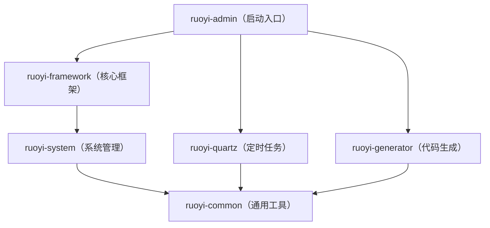

# 若依项目根 pom.xml 完整解析文档

---

## 前置知识：在开始之前，先搞懂这些关键术语

在逐行解释 pom.xml 之前，需要先了解以下关键术语。这些概念贯穿整个文件，理解了它们，后面的内容才能看得懂。

| 术语 | 英文全称 | 通俗解释 | 生活类比 |
|------|---------|---------|---------|
| **Maven** | — | Java 世界的"项目管理与构建工具"。它帮你自动下载项目需要的第三方代码库，帮你把源代码编译、打包成可以运行的程序。类似于前端的 npm、Python 的 pip | 就像一个"全能管家"——你说"我需要面粉、鸡蛋、奶油"（依赖），它帮你去超市买回来；然后你说"帮我做成蛋糕"（构建），它帮你把原料加工成成品 |
| **POM** | Project Object Model（项目对象模型） | 就是当前这个 `pom.xml` 文件。它是 Maven 的配置文件，告诉 Maven 这个项目叫什么、需要什么依赖、怎么编译打包 | 就像一份"产品需求说明书"——告诉工厂（Maven）要生产什么东西、需要什么原料、用什么工艺 |
| **依赖（Dependency）** | — | 你的项目需要用到别人写好的代码库。比如你想操作 Excel，不需要自己从零写代码，直接引入一个别人写好的 Excel 处理库就行 | 就像手机上的 App——你的手机（项目）需要安装微信（依赖）才能聊天，需要安装支付宝（依赖）才能付款 |
| **Artifact（制品）** | — | 项目经过编译、打包后最终生成的文件（通常是一个 `.jar` 或 `.war` 文件）。你写的是源代码（.java），经过构建后变成机器能执行的程序文件（.class），再打包成一个压缩文件，这个最终产物就是 artifact | 就像你做了一个蛋糕，蛋糕就是 artifact。面粉、鸡蛋是依赖（dependency），烤箱是插件（plugin），做蛋糕的过程是构建（build） |
| **模块（Module）** | — | 一个大项目拆分成多个小项目，每个小项目就是一个"模块"。各模块各司其职，最后组合在一起 | 就像一个公司拆分成多个部门——人事部、财务部、技术部，每个部门各司其职，但都属于同一家公司 |
| **构建（Build）** | — | 把你写的源代码（.java 文件）经过编译、打包等处理，变成可以运行的程序的过程 | 就像做菜的过程——买菜（下载依赖）→ 洗菜切菜（编译）→ 炒菜装盘（打包）→ 上桌（运行） |
| **插件（Plugin）** | — | Maven 自身的功能有限，通过安装"插件"来扩展能力。编译代码有编译插件，打包有打包插件 | 就像浏览器的扩展插件——浏览器本身只能浏览网页，装了广告拦截插件就能拦截广告，装了翻译插件就能翻译网页 |
| **GAV 坐标** | GroupId, ArtifactId, Version | Maven 用这三个值来唯一标识世界上的任何一个项目，就像身份证号码唯一标识一个人 | GroupId = 哪个厂家；ArtifactId = 产品叫什么；Version = 什么型号 |
| **BOM** | Bill of Materials（物料清单） | 一份"兼容配件清单"——列出所有相关依赖的兼容版本号，一次性导入，避免你手动去查每个依赖之间是否兼容 | 就像组装电脑时的"兼容配置单"——告诉你选了 i7 处理器就配这块主板，不用自己研究兼容性 |
| **Release** | — | 正式版，经过测试、稳定发布的版本，可以放心使用 | 正式上市的商品，通过了质检 |
| **Snapshot** | — | 快照版，开发者提交的未正式发布的测试版本，可能包含 bug | 工厂试生产还没通过质检的产品，不稳定 |
| **镜像仓库** | Mirror Repository | 中央仓库的"国内分身"，内容和中央仓库完全一样，但在国内访问速度快得多 | 美国的总仓库发货慢，阿里云在国内建了分仓库，发货快得多 |
| **序列化/反序列化** | Serialization / Deserialization | 序列化：把 Java 对象变成 JSON 字符串（给前端看）；反序列化：把 JSON 字符串变回 Java 对象（后端处理） | 序列化 = 把中文书翻译成英文；反序列化 = 把英文书翻译回中文 |
| **ORM** | Object-Relational Mapping（对象关系映射） | 帮你把 Java 对象和数据库表自动对应起来，操作对象就等于操作数据库表，不用手写复杂的 SQL | 就像自动翻译器——你说中文（Java 操作），它自动翻译成英文（SQL 语句）发给外国人（数据库） |
| **连接池** | Connection Pool | 每次查询数据库都要先"建立连接"（像打电话要先拨号），连接池就是预先建好一批连接放在那里，用的时候直接拿，用完放回去，避免反复拨号的开销 | 就像公司的公车——不用每次出门都去买一辆（建连接），而是公司预先买了几辆放在停车场（连接池），谁需要谁开走，用完停回来 |
| **JWT** | JSON Web Token | 一种用户认证方式——用户登录成功后，服务器生成一个加密的"通行证"（Token）发给浏览器，之后浏览器每次请求都带上这个通行证，服务器验证后就知道你是谁，不用每次都输密码 | 就像游乐场的"手环"——入园时买一个手环戴在手上，之后玩每个项目刷手环就行，不用每次都买票 |
| **模板引擎** | Template Engine | 你预先写好一个"模板文件"（像填空题），里面有一些占位符，引擎把真实数据填进去，就生成了最终文件 | 就像写信的模板——"尊敬的___先生/女士：您的___申请已通过"，把空白处填上真实信息就行 |
| **Fat JAR** | — | 把所有依赖的 jar 包都打包进一个文件里的超级 jar 包。拿到任何有 Java 环境的机器上直接运行，不需要额外配置 | 普通 jar 像需要自己配齐配件的"裸机"；Fat JAR 像装好所有软件的"一体机"，开机就能用 |

---

## 第一部分：文件头声明（第 1-5 行）

### 对应代码

```xml
<?xml version="1.0" encoding="UTF-8"?>
<project xmlns="http://maven.apache.org/POM/4.0.0"
         xmlns:xsi="http://www.w3.org/2001/XMLSchema-instance"
         xsi:schemaLocation="http://maven.apache.org/POM/4.0.0 
         http://maven.apache.org/xsd/maven-4.0.0.xsd">
    <modelVersion>4.0.0</modelVersion>
```


### 逐行解释

- **第 1 行** `<?xml version="1.0" encoding="UTF-8"?>`
  - 这是 XML 文件的"开场白"，每一个 XML 文件都必须以这一行开头。它告诉所有读取它的软件两件事：①我使用的是 XML 1.0 版本的语法；②文件里的文字用 UTF-8 编码（一种国际通用的字符编码，支持中文、日文、韩文等多国文字，不会出现乱码）。

- **第 2 行** `<project xmlns="http://maven.apache.org/POM/4.0.0">`
  - `<project>` 是整个 pom.xml 的"根标签"——所有其他配置都嵌套在它里面，它是最外层的容器。
  - `xmlns` 是"XML Namespace"（XML 命名空间）的缩写。它的作用就像给这个文件贴上一个标签："我是 Maven POM 格式的文件，请按照 Maven 的规则来理解我。"后面的网址 `http://maven.apache.org/POM/4.0.0` 是 Maven 官方定义的规则地址。

- **第 3 行** `xmlns:xsi="http://www.w3.org/2001/XMLSchema-instance"`
  - 引入另一个"标准"——XML Schema Instance。有了它，第 4 行的 `schemaLocation` 才能生效。你可以理解为："我不仅要声明我遵守哪个标准，还要引入验证标准的工具。"

- **第 4 行** `xsi:schemaLocation="..."`
  - 这行告诉你的编程软件（如 IntelliJ IDEA）："如果你想检查这个 pom.xml 写得对不对，请去这个网址下载检查规则（XSD 文件），然后按照规则来校验。"
  - 有了它，IDEA 才能在你写错标签名时画红线提醒，才能在你输入时自动弹出候选项。没有它，IDEA 就不知道该怎么校验这个文件。

- **第 5 行** `<modelVersion>4.0.0</modelVersion>`
  - 指明这个 pom.xml 遵循的是 Maven POM 模型 4.0.0 版本的格式规范。这个值从 Maven 2 开始就一直是 4.0.0，从未变过。就像你填表格时看到"表格版本号：V4"——告诉你手里拿的是第四版表格，按第四版的规则填写。

### 可修改项分析

> **这一部分在实际开发中需要修改吗？**
>
> ❌ **完全不需要修改。** 这 5 行是所有 Maven 项目的"标准模板开头"，全世界每一个 Maven 项目的 pom.xml 都以几乎相同的这几行开头。你不需要改任何一个字符。

### 📝 通俗总结

> 这 5 行代码组成了 Maven 项目配置文件（pom.xml）最基础、最固定的开头。
>
> `project` 标签是整个文件的根节点，就像一个大盒子，里面装着所有项目配置。
>
> 里面的 `xmlns`、`xsi` 和 `schemaLocation` 这三行，作用就是给这个盒子贴上标签、指明它遵守的行业标准、并附上检验说明书。
>
> `modelVersion` 则指明这个盒子的设计图纸版本是 4.0.0。
>
> 没有这些声明，Maven 工具和你的编程软件就无法正确识别、解析和校验这个文件。这是 Maven 项目配置的"头文件"或"标准模板"，**每个 pom.xml 文件都必须以这几行开头，而且永远不需要修改**。

---

## 第二部分：项目身份证——GAV 坐标与基本信息（第 7-13 行）

### 对应代码

```xml
<groupId>com.ruoyi</groupId>
<artifactId>ruoyi</artifactId>
<version>3.9.2</version>

<name>ruoyi</name>
<url>http://www.ruoyi.vip</url>
<description>若依管理系统</description>
```


### 逐行解释

- **第 7 行** `<groupId>com.ruoyi</groupId>`
  - **groupId** 是"组织/公司标识符"。它回答的问题是："这个项目属于谁？"
  - 惯例是用公司域名的反写。比如若依的域名是 `ruoyi.com`，反过来就是 `com.ruoyi`。
  - 类比：就像身份证上的"地址"——标明你归哪个省市管辖。在 Java 世界里，`com.ruoyi` 就意味着"这个项目归属于 ruoyi.com 这个组织"。

- **第 8 行** `<artifactId>ruoyi</artifactId>`
  - **artifactId** 是"项目名称"。它回答的问题是："这个项目叫什么？"
  - **Artifact**（制品）指的是项目经过编译打包后生成的文件（比如一个 .jar 包）。`artifactId` 就是给这个制品起的名字。
  - 类比：如果 groupId 是"哪个厂家生产的"，那 artifactId 就是"产品叫什么名字"。比如同一厂家（com.ruoyi）可以生产多个产品（ruoyi-admin、ruoyi-common 等）。

- **第 9 行** `<version>3.9.2</version>`
  - **version** 是"版本号"。它回答的问题是："这是第几个版本？"
  - 版本号格式通常是 `主版本.次版本.修订号`。`3.9.2` 表示第 3 大版的第 9 次小更新的第 2 个修正版。
  - 类比：就像手机型号——iPhone 16 Pro Max 中的"16"是主版本，"Pro"是次版本，"Max"是修订。

- **第 11 行** `<name>ruoyi</name>`
  - 项目的显示名称，用于 Maven 生成文档或报告时展示。

- **第 12 行** `<url>http://www.ruoyi.vip</url>`
  - 项目的官方网站地址。

- **第 13 行** `<description>若依管理系统</description>`
  - 项目的一句话描述。

### 可修改项分析与举例

#### groupId：从 `com.ruoyi` 改成你自己的公司标识

```xml
<!-- 修改前 -->
<groupId>com.ruoyi</groupId>

<!-- 修改后（假设你的公司叫"星辰科技"，域名是 xingchen.com） -->
<groupId>com.xingchen</groupId>
```


**影响：**
- 所有 Java 源代码的包名都要从 `com.ruoyi.xxx` 改成 `com.xingchen.xxx`，涉及项目中**每一个 .java 文件**的 `package` 声明和 `import` 语句
- 子模块中所有引用 `com.ruoyi` 的地方都要同步修改
- 本地 Maven 仓库中 jar 包的存储路径从 `~/.m2/repository/com/ruoyi/` 变成 `~/.m2/repository/com/xingchen/`
- **外观界面：** 无直接外观变化，但如果前端请求的后端接口路径中包含了包名相关的配置，可能导致接口 404
- **代码运行：** 如果改了一半漏改了，编译直接报错 `package com.ruoyi.xxx does not exist`

**实际产品开发中需要改吗？** ✅ **需要。** 这是项目初始化时第一件事——把 `com.ruoyi` 改成你自己公司的标识。通常在拿到若依源码后、开始业务开发之前完成，改一次之后就不再动了。

#### artifactId：改成你自己的项目名

```xml
<!-- 修改前 -->
<artifactId>ruoyi</artifactId>

<!-- 修改后（假设项目叫"档案管理系统"） -->
<artifactId>archive</artifactId>
```


**影响：**
- 构建后生成的 jar 文件名从 `ruoyi-3.9.2.jar` 变成 `archive-3.9.2.jar`
- 启动命令从 `java -jar ruoyi.jar` 变成 `java -jar archive.jar`
- **外观界面：** 无直接外观变化
- **代码运行：** 部署脚本（如 `bin/run.bat`、`ry.sh`）中引用的 jar 文件名需要同步修改，否则启动失败

**实际产品开发中需要改吗？** ✅ **需要。** 一般和 groupId 一起在项目初始化时改。

#### version：改成你自己的版本号

```xml
<!-- 修改前 -->
<version>3.9.2</version>

<!-- 修改后（从零开始） -->
<version>1.0.0</version>
```


**影响：**
- 构建产物文件名从 `ruoyi-3.9.2.jar` 变成 `ruoyi-1.0.0.jar`
- `<properties>` 中的 `<ruoyi.version>` 也要同步修改，否则子模块版本不一致会报错
- **外观界面：** 无
- **代码运行：** 如果其他项目引用了你的 jar 包，版本号变了，它们也需要同步更新引用版本

**实际产品开发中需要改吗？** ✅ **需要。** 一般改成 `1.0.0-SNAPSHOT`（`SNAPSHOT` 表示开发中版本）或 `1.0.0`。产品上线后按版本迭代递增。

#### name / url / description：改成你自己的项目信息

```xml
<!-- 修改前 -->
<name>ruoyi</name>
<url>http://www.ruoyi.vip</url>
<description>若依管理系统</description>

<!-- 修改后 -->
<name>archive-management</name>
<url>http://archive.xingchen.com</url>
<description>星辰档案管理系统</description>
```


**影响：**
- **外观界面：** 如果使用了 Springdoc 生成 API 文档，文档页面的标题和描述会显示新值
- **代码运行：** 不影响任何代码运行

**实际产品开发中需要改吗？** ⚠️ **可选。** 改了更规范，不改也不影响功能。

### 📝 通俗总结

> 这 7 行代码相当于这个项目的"身份证"和"名片"。
>
> `groupId`、`artifactId`、`version` 三个合称 **GAV 坐标**，就像身份证号一样，在全世界所有 Maven 项目中唯一标识了这一个项目。不会有任何两个项目拥有完全相同的 GAV 组合。
>
> `name`、`url`、`description` 则是名片上的额外信息——项目叫什么、网址在哪、做什么用的。它们不影响程序运行，但在生成文档、发布到共享仓库时会显示出来。
>
> 在实际开发中，拿到若依源码后，**第一件事就是把 `com.ruoyi` 改成自己公司的标识**，把 `ruoyi` 改成自己的项目名，把版本号改成 `1.0.0`。改完之后，这些值在项目生命周期中很少再动。

---

## 第三部分：版本号变量中心 `<properties>`（第 15-34 行）

### 对应代码

```xml
<properties>
    <ruoyi.version>3.9.2</ruoyi.version>
    <project.build.sourceEncoding>UTF-8</project.build.sourceEncoding>
    <project.reporting.outputEncoding>UTF-8</project.reporting.outputEncoding>
    <java.version>17</java.version>
    <spring-boot.version>4.1.0</spring-boot.version>
    <mybatis-spring-boot.version>4.1.0</mybatis-spring-boot.version>
    <druid.version>1.2.28</druid.version>
    <yauaa.version>8.2.0</yauaa.version>
    <kaptcha.version>2.3.3</kaptcha.version>
    <pagehelper.boot.version>4.1.1</pagehelper.boot.version>
    <fastjson.version>2.0.64</fastjson.version>
    <oshi.version>7.4.4</oshi.version>
    <commons.io.version>2.22.0</commons.io.version>
    <poi.version>5.5.1</poi.version>
    <velocity.version>2.3</velocity.version>
    <jwt.version>0.9.1</jwt.version>
    <jaxb-api.version>2.3.1</jaxb-api.version>
    <springdoc.version>3.1.0</springdoc.version>
</properties>
```


### 逐行解释

`<properties>` 标签就像一个"变量表"或"价格标签墙"。它把后面要用到的所有第三方库（依赖）的版本号集中定义在这里。后面引用时只需写 `${变量名}`，就像在 Excel 里用单元格引用一样。

#### 基础配置类（第 16-19 行）

| 行   | 变量名                                | 值     | 通俗解释                                                                         |
| --- | ---------------------------------- | ----- | ---------------------------------------------------------------------------- |
| 16  | `ruoyi.version`                    | 3.9.2 | 若依自身各子模块互相引用时统一的版本号。类比：连锁店所有分店统一用同一个供应商编号                                    |
| 17  | `project.build.sourceEncoding`     | UTF-8 | 编译时用什么编码读取源代码。UTF-8 是国际通用编码，支持中文。如果不设这个，Windows 默认用 GBK 编码，代码里的中文注释和字符串可能变乱码 |
| 18  | `project.reporting.outputEncoding` | UTF-8 | Maven 生成报告（如测试报告）时的输出编码                                                      |
| 19  | `java.version`                     | 17    | 告诉编译器"用 Java 17 的语法标准来编译代码"。Java 有很多版本（8、11、17、21...），新版本有新语法，必须告诉编译器用哪个版本   |

#### 第三方库版本类（第 20-33 行）

| 行   | 变量名                           | 值      | 这个库是做什么的（通俗解释）                                                                                                                                    |
| --- | ----------------------------- | ------ | ------------------------------------------------------------------------------------------------------------------------------------------------- |
| 20  | `spring-boot.version`         | 4.1.0  | **Spring Boot**——Java 最流行的 Web 开发框架。它帮你快速搭建网站后端，不用从零开始配置。相当于装修房子时的"全包方案"，水电、墙面、地板都帮你配好了                                                           |
| 21  | `mybatis-spring-boot.version` | 4.1.0  | **MyBatis**——数据库操作框架。帮你用 Java 代码操作数据库（增删改查），而不用手写复杂的数据库连接代码。类比：不用自己造轮子，MyBatis 就是一个帮你轻松驾驶数据库的"自动挡变速箱"                                             |
| 22  | `druid.version`               | 1.2.28 | **Druid**——阿里巴巴的数据库连接池。每次查询数据库都要先"建立连接"（像打电话要先拨号），连接池就是预先建好一批连接放在那里，用的时候直接拿，用完放回去。Druid 还附带监控页面，能看到哪些 SQL 执行得慢                                    |
| 23  | `yauaa.version`               | 8.2.0  | **YAUAA**（Yet Another UserAgent Analyzer）——浏览器信息解析器。每个浏览器访问网站时都会带上一段"自我介绍"（User-Agent），比如"我是 Chrome 浏览器，运行在 Windows 10 上"。YAUAA 负责把这段文字翻译成人类可读的信息 |
| 24  | `kaptcha.version`             | 2.3.3  | **Kaptcha**——图形验证码生成器。登录时让你输入那些歪歪扭扭的字母数字图片，就是它生成的。作用是防止机器人自动暴力破解密码                                                                                |
| 25  | `pagehelper.boot.version`     | 4.1.1  | **PageHelper**——分页插件。数据库里有 1000 条数据，不可能一次全显示，要分成每页 10 条、共 100 页。PageHelper 帮你自动在 SQL 后面加上"只取第 11-20 条"这样的限制语句                                     |
| 26  | `fastjson.version`            | 2.0.64 | **FastJSON2**——阿里巴巴的 JSON 格式转换器。前后端之间传递数据用 JSON 格式（如 `{"name":"张三","age":25}`）。FastJSON 负责把 Java 对象变成 JSON（给前端看），以及把 JSON 变回 Java 对象（后端处理）        |
| 27  | `oshi.version`                | 7.4.4  | **OSHI**（Operating System and Hardware Information）——服务器硬件信息读取器。能获取 CPU 使用率、内存占用、磁盘空间等信息。若依首页的"服务器监控"功能就靠它                                        |
| 28  | `commons.io.version`          | 2.22.0 | **Commons IO**——Apache 的文件操作工具箱。提供大量便捷方法，比如一行代码读取文件全部内容、复制文件、获取文件大小等                                                                              |
| 29  | `poi.version`                 | 5.5.1  | **Apache POI**——Excel 操作库。若依的"数据导出为 Excel"和"从 Excel 批量导入数据"功能就是用它实现的                                                                              |
| 30  | `velocity.version`            | 2.3    | **Velocity**——模板引擎。你预先写好一个代码模板（像填空题），它把数据库表名、字段名等真实数据填进去，自动生成 Java 代码。若依的"代码生成"功能就靠它                                                              |
| 31  | `jwt.version`                 | 0.9.1  | **JJWT**——JWT 令牌工具。用户登录成功后，服务器生成一个加密的"通行证"（Token）发给浏览器，之后浏览器每次请求都带上这个通行证，服务器验证后就知道你是谁                                                             |
| 32  | `jaxb-api.version`            | 2.3.1  | **JAXB API**——Java 对象与 XML 互转的工具。Java 17 把它从内置库中移除了，但 JWT 库内部依赖它，所以要手动补上                                                                          |
| 33  | `springdoc.version`           | 3.1.0  | **Springdoc**——API 文档自动生成器。扫描你写的所有接口代码，自动生成一个网页文档（Swagger UI），前端开发人员打开就能看到所有接口的用法、参数、返回值说明                                                        |

### 可修改项分析与举例

#### java.version：Java 版本（第 19 行）

```xml
<!-- 修改前 -->
<java.version>17</java.version>

<!-- 修改后（假设降级到 8） -->
<java.version>8</java.version>
```


**影响：**
- **修改前：** 可以使用 Java 17 的新语法，比如文本块 `"""`、switch 表达式等
- **修改后：** 编译器会报错 `switch expressions are not supported in -source 8`，所有 Java 17 特有语法全部编译失败。同时 Spring Boot 4.x **要求最低 Java 17**，改了直接启动失败
- **外观界面：** 项目无法启动，浏览器访问任何页面都是"无法连接"
- **代码运行：** 编译失败或启动失败

**实际产品开发中需要改吗？** ❌ **不需要。** Spring Boot 4.x 强制要求 Java 17+。

#### spring-boot.version：影响最大的配置（第 20 行）⭐

```xml
<!-- 修改前 -->
<spring-boot.version>4.1.0</spring-boot.version>

<!-- 修改后（降级到 3.x） -->
<spring-boot.version>3.3.0</spring-boot.version>
```


**影响：**
- **修改前：** 使用 Spring Framework 7 + Jakarta EE 10 的 API（如 `jakarta.servlet.http.HttpServletRequest`）
- **修改后：**
  - Spring Boot 3.x 使用 Spring Framework 6，很多类的包名、方法签名可能不同
  - 所有 `spring-boot-4-starter` 后缀的依赖（如 `druid-spring-boot-4-starter`）都要换成 `spring-boot-3-starter`，否则不兼容
  - `springdoc` 版本也要降级到 2.x（3.x 是给 Spring Boot 4 用的）
  - **外观界面：** 如果版本不兼容导致启动失败，所有页面无法访问
  - **代码运行：** 大量编译错误，如 `package jakarta.servlet does not exist`

**实际产品开发中需要改吗？** ⚠️ **一般不改。** 除非升级 Spring Boot 到更新的版本以获取安全补丁。升级步骤：①修改版本号 → ②检查所有 starter 依赖是否兼容 → ③运行 `mvn clean compile` 看有没有编译错误 → ④启动项目测试核心功能

#### druid.version：数据库连接池版本（第 22 行）

```xml
<!-- 修改前 -->
<druid.version>1.2.28</druid.version>

<!-- 修改后（升级小版本） -->
<druid.version>1.2.30</druid.version>
```


**影响：**
- 小版本升级通常是修 bug，**外观界面上看不到变化**
- Druid 内置的 SQL 监控页面（`/druid/index.html`）可能有细微 UI 更新
- **代码运行：** 数据库连接池行为不变，但可能修复了某些连接泄漏的 bug
- **风险：** 大版本升级（如 1.x → 2.x）可能导致配置不兼容

**实际产品开发中需要改吗？** ⚠️ **偶尔需要。** 当发现数据库连接池有 bug 或安全漏洞时升级。

#### jwt.version：JWT 令牌库版本（第 31 行）

```xml
<!-- 修改前 -->
<jwt.version>0.9.1</jwt.version>

<!-- 修改后（升级到新版，API 大变） -->
<jwt.version>0.12.6</jwt.version>
```


**影响：**
- jjwt 0.9.x 和 0.12.x 的 API **完全不同**：
```java
  // 修改前（0.9.x 的写法）
  String token = Jwts.builder()
      .setSubject("admin")
      .signWith(SignatureAlgorithm.HS512, secret)
      .compact();
  
  // 修改后（0.12.x 的写法，API 全变了）
  String token = Jwts.builder()
      .subject("admin")
      .signWith(Keys.hmacShaKeyFor(secretKeyBytes), Jwts.SIG.HS512)
      .compact();
```

- **修改后：** 所有使用 `setSubject()`、`setExpiration()` 等旧 API 的代码全部编译报错
- **外观界面：** 如果代码不兼容导致启动失败，登录页面可以打开，但登录时返回 500 错误
- **代码运行：** 用户登录、Token 验证、Token 刷新等所有认证功能失效

**实际产品开发中需要改吗？** ⚠️ **有时会。** 0.9.1 版本较老，安全审计可能要求升级。但升级需要同时修改 `TokenService.java` 中所有 JWT 相关代码。

#### fastjson.version：JSON 库版本（第 26 行）

```xml
<!-- 修改前 -->
<fastjson.version>2.0.64</fastjson.version>

<!-- 修改后（假设换成 Jackson，Spring Boot 默认 JSON 库） -->
<!-- 不是改版本号，而是整个替换依赖 -->
```


**影响：**
- FastJSON 负责所有 Java 对象和 JSON 之间的转换
- 如果换成 Jackson：
  - Redis 中存储的数据格式可能变化——**修改前** Redis 中存的：`{"@type":"com.ruoyi.system.domain.SysUser","userName":"admin"}`（FastJSON 会加 `@type`）；**修改后** Redis 中存的：`{"userName":"admin"}`（Jackson 不加 `@type`）
  - 如果 Redis 中有旧数据，反序列化可能失败
  - **外观界面：** 前端收到的 JSON 字段顺序可能不同，但功能不受影响
  - **代码运行：** 所有使用 `JSON.toJSONString()` 和 `JSON.parseObject()` 的代码都要改成 Jackson 的 API

**实际产品开发中需要改吗？** ⚠️ **看情况。** 若依已经封装好了 JSON 工具类，一般不需要替换。但有些公司安全审计要求统一使用 Jackson，就会做这个替换。

#### project.build.sourceEncoding：编码设置（第 17 行）

```xml
<!-- 修改前 -->
<project.build.sourceEncoding>UTF-8</project.build.sourceEncoding>

<!-- 修改后（反面教材） -->
<project.build.sourceEncoding>GBK</project.build.sourceEncoding>
```


**影响：**
- **修改前：** 源代码中的中文（如 `throw new ServiceException("用户不存在")`）编译后正常显示
- **修改后：** 如果源代码文件本身是 UTF-8 保存的（IDEA 默认就是），但编译时用 GBK 去读取，所有中文注释和字符串都会变成乱码
- **外观界面：** 接口返回的错误提示变成乱码、页面弹出的消息变成乱码
- **代码运行：** 编译可能不报错，但运行时所有中文字符串都是乱码

**实际产品开发中需要改吗？** ❌ **不需要。** 永远保持 `UTF-8`。

### 📝 通俗总结

> `<properties>` 区域就像一面"价格标签墙"或"通讯录"，把所有第三方库的版本号集中记录在这里。
>
> 它的好处是"一处定义，到处引用"。比如后面有 3 个地方要用到 Spring Boot 的版本号，不需要写 3 遍 `4.1.0`，而是写 `${spring-boot.version}`。将来升级时，只需要把这面墙上的一处 `4.1.0` 改成 `4.2.0`，3 个地方自动全部更新。
>
> 这就像超市里的价签系统——你在总部系统里把"可乐"的价格从 3 元改成 3.5 元，所有分店的电子价签会自动同步更新，不用一家一家跑着去换。
>
> 在实际开发中，**升级某个依赖的版本号时，只需要改这里的数字**。但要注意：很多库之间有兼容性要求（比如 MyBatis 的版本必须和 Spring Boot 的版本匹配），不能随意乱改。

---

## 第四部分：依赖管理 `<dependencyManagement>`（第 36-174 行）

### 对应代码

```xml
<!-- 依赖声明 -->
<dependencyManagement>
    <dependencies>
        <!-- ... 各种依赖声明 ... -->
    </dependencies>
</dependencyManagement>
```


### 整体解释

`<dependencyManagement>` 是一个"目录"或"菜单价目表"。它**只是声明**"这些依赖可以用、版本号是多少"，但**并不会真正下载**这些依赖。

类比：就像一本"产品目录"——你把所有商品和价格列在上面，但只有当客户（子模块）真正下单时，才会发货（下载依赖）。

每个依赖的格式都一样：

```xml
<dependency>
    <groupId>com.alibaba</groupId>                              <!-- 谁开发的 -->
    <artifactId>druid-spring-boot-4-starter</artifactId>        <!-- 叫什么名字 -->
    <version>${druid.version}</version>                          <!-- 哪个版本（引用上面的变量） -->
</dependency>
```


### 4.1 Spring Boot BOM 导入（第 40-47 行）

```xml
<!-- SpringBoot的依赖配置 -->
<dependency>
    <groupId>org.springframework.boot</groupId>
    <artifactId>spring-boot-dependencies</artifactId>
    <version>${spring-boot.version}</version>
    <type>pom</type>
    <scope>import</scope>
</dependency>
```


**专有名词解释：**
- **BOM（Bill of Materials，物料清单）**：一份"兼容配件清单"——列出所有相关依赖的兼容版本号，一次性导入，避免你手动去查每个依赖之间是否兼容。类比：你要组装一台电脑，CPU、显卡、主板之间要兼容。BOM 就像一份"兼容配置单"——告诉你"选了 Intel i7 处理器，就配这块主板、这个散热器"，不用自己去研究兼容性。
- **`<type>pom</type>`**：告诉 Maven"我导入的不是一个普通的 jar 包，而是一份 pom 格式的清单文件"。
- **`<scope>import</scope>`**：告诉 Maven"把这份清单里的所有内容全部搬进我的项目里"。这两个标签是固定搭配，永远一起出现。

**影响：**
- 它把 Spring Boot 所有官方依赖的版本号一次性导入，子模块引用 Spring Boot 相关依赖时不需要写版本号
- **好处：** 你不需要手动去查"Spring Boot 4.1.0 应该搭配哪个版本的 Spring MVC"，BOM 已经帮你配好了所有兼容版本

### 4.2 第三方依赖列表（第 49-136 行）

按功能分类介绍每个依赖在实际开发中的具体用途：

#### 🗄️ 数据库相关

| 依赖 | 通俗解释 | 实际用途 |
|------|---------|---------|
| **druid-spring-boot-4-starter**（第 49-54 行） | 阿里巴巴的数据库连接池。后缀 `spring-boot-4-starter` 表示它适配 Spring Boot 4.x，`starter` 是 Spring Boot 的"开箱即用"包，自动帮你完成配置 | 管理数据库连接、监控 SQL 执行性能、检测慢查询、防止 SQL 注入攻击 |
| **mybatis-spring-boot-starter**（第 70-74 行） | MyBatis 与 Spring Boot 的集成包。MyBatis 是一个 ORM 框架——ORM 帮你把 Java 对象和数据库表自动对应起来，操作对象就等于操作数据库表 | 所有的数据库增删改查操作都通过它实现 |
| **pagehelper-spring-boot-starter**（第 63-68 行） | MyBatis 的分页插件。它会自动拦截你的查询 SQL，在 SQL 后面自动加上 `LIMIT` 子句来实现分页 | 用户列表、数据表格等需要翻页显示的功能 |

#### 🔐 安全与认证

| 依赖 | 通俗解释 | 实际用途 |
|------|---------|---------|
| **jjwt**（第 124-129 行） | JWT 令牌工具库。负责三件事：①用户登录成功后生成一个加密的令牌字符串；②解析浏览器传来的令牌；③验证令牌是否过期、是否被篡改 | 用户登录认证，接口权限校验 |
| **kaptcha**（第 131-136 行） | 图形验证码生成库。在登录页生成一张带有扭曲文字的图片，防止机器人自动暴力破解密码 | 登录页面的验证码图片 |
| **jaxb-api**（第 76-80 行） | Java 对象与 XML 互转的 API。Java 17 移除了它，但 jjwt 库内部依赖它，所以必须手动补上，否则运行时会报错 | JWT 令牌内部处理 XML 格式数据时需要 |

#### 📊 监控与系统信息

| 依赖 | 通俗解释 | 实际用途 |
|------|---------|---------|
| **oshi-core**（第 82-87 行） | 操作系统和硬件信息获取库。它通过调用操作系统的底层接口来获取 CPU、内存、磁盘等信息 | 若依管理后台首页的"服务器监控"功能——显示 CPU 使用率、内存占用、JVM 状态等 |
| **yauaa**（第 56-61 行） | 浏览器 User-Agent 解析库。User-Agent 是浏览器发送请求时附带的一长串字符，人眼看懂不，需要工具解析 | 记录用户登录日志时，显示"该用户使用 Chrome 浏览器，Windows 10 系统" |

#### 📄 文档与工具

| 依赖 | 通俗解释 | 实际用途 |
|------|---------|---------|
| **springdoc-openapi-starter-webmvc-ui**（第 89-94 行） | API 文档自动生成工具。它会扫描你写的所有接口代码，自动生成一个漂亮的网页文档（Swagger UI），前端开发人员打开这个网页就能看到所有接口的用法 | 在线 API 文档，方便前后端协作 |
| **fastjson2**（第 117-122 行） | 阿里巴巴的 JSON 序列化/反序列化库。**序列化**就是把 Java 对象变成 JSON 字符串（给前端用）；**反序列化**就是把 JSON 字符串变回 Java 对象（接收前端传来的数据） | 几乎所有接口响应的数据格式转换、Redis 中存储 JSON 数据 |
| **commons-io**（第 96-101 行） | Apache 的 IO 操作工具库。提供了很多便捷方法，比如一行代码读取文件全部内容、复制文件、获取文件扩展名等 | 文件上传/下载、配置文件读取等场景 |
| **poi-ooxml**（第 103-108 行） | Apache 的 Excel 操作库。`ooxml` 表示支持 `.xlsx` 格式（Office 2007 之后的新格式） | "导出用户数据为 Excel"、"从 Excel 批量导入数据"等功能 |
| **velocity-engine-core**（第 110-115 行） | 模板引擎。你预先写好一个代码模板文件（里面有占位符），它把真实数据填入占位符，生成最终的代码文件 | 若依的"代码生成"功能——选择一张数据表，自动生成对应的增删改查代码 |

### 4.3 若依内部子模块依赖（第 138-171 行）

```xml
<!-- 定时任务 -->
<dependency>
    <groupId>com.ruoyi</groupId>
    <artifactId>ruoyi-quartz</artifactId>
    <version>${ruoyi.version}</version>
</dependency>
```


这些是若依项目**自己的子模块**。注意 `groupId` 都是 `com.ruoyi`，版本号都用 `${ruoyi.version}`（即 3.9.2）。它们被列在这里，供子模块之间互相引用。
**只有“被其他模块依赖”的模块，才需要在根 pom.xml 的 `<dependencyManagement>` 中声明其依赖版本。**

| 模块名 | 通俗解释 | 实际用途 |
|--------|---------|---------|
| **ruoyi-quartz**（第 138-143 行） | 定时任务模块。**Quartz** 是 Java 的定时任务框架，可以设定"每天凌晨 2 点自动备份数据"、"每隔 30 分钟清理过期缓存"等定时执行的任务 | 管理后台的"定时任务"管理功能 |
| **ruoyi-generator**（第 145-150 行） | 代码生成器模块。根据数据库中的表结构，自动生成对应的 Java 代码和前端 Vue 页面 | 新建一个数据表后，一键生成基础代码，省去手写重复的 CRUD 代码 |
| **ruoyi-framework**（第 152-157 行） | 核心框架模块。包含整个项目的核心配置——Spring Security 安全框架、AOP（面向切面编程，用于记录操作日志等）、拦截器等 | 所有模块的底层支撑，提供安全认证、日志记录等通用能力 |
| **ruoyi-system**（第 159-164 行） | 系统管理模块。包含系统最基础的业务功能——用户管理、角色管理、菜单管理、部门管理、岗位管理等 | 管理后台的"系统管理"菜单下的所有功能 |
| **ruoyi-common**（第 166-171 行） | 通用工具模块。包含所有模块都可能用到的公共代码——工具类、常量定义、异常类、注解、过滤器等 | 被所有其他模块依赖，提供基础工具方法 |

### 可修改项分析与举例

#### 删除某个依赖（以 oshi-core 为例）

```xml
<!-- 修改前：有 oshi-core -->
<dependency>
    <groupId>com.github.oshi</groupId>
    <artifactId>oshi-core</artifactId>
    <version>${oshi.version}</version>
</dependency>

<!-- 修改后：删掉整个 dependency 块 -->
```


**影响：**
- **外观界面：** 管理后台首页的"服务器监控"区域全部显示为空或报错：
```
  修改前：
  ┌──────────────────────────────────┐
  │ CPU 使用率    ████████░░  78%    │
  │ 内存占用      ██████░░░░  56%    │
  │ 磁盘使用      ████░░░░░░  35%    │
  │ JVM 堆内存    █████░░░░░  45%    │
  └──────────────────────────────────┘
  
  修改后：
  ┌──────────────────────────────────┐
  │ CPU 使用率    --  获取失败        │
  │ 内存占用      --  获取失败        │
  │ 磁盘使用      --  获取失败        │
  │ JVM 堆内存    --  获取失败        │
  └──────────────────────────────────┘
```

- **代码运行：** `ServerController.java` 中调用 OSHI 的代码会报 `ClassNotFoundException`

**实际产品开发中需要改吗？** ⚠️ **看情况。** 如果你的项目不需要服务器监控功能（比如部署在云上，用云厂商的监控），可以删除。

#### 新增一个依赖（以引入 Redis 为例）

```xml
<!-- 在 </dependencies> 前新增 -->
<dependency>
    <groupId>org.springframework.boot</groupId>
    <artifactId>spring-boot-starter-data-redis</artifactId>
    <!-- 不需要写 version，因为 Spring Boot BOM 已经管理了 -->
</dependency>
```


**影响：**
- Maven 会自动下载 Spring Data Redis 和 Lettuce（Redis 客户端）的 jar 包
- **外观界面：** 无直接变化
- **代码运行：** 还需要在 `application.yml` 中配置 Redis 连接信息才能使用

**实际产品开发中需要改吗？** ✅ **经常需要。** 添加新功能是开发常态。

#### 替换某个依赖（把 Druid 换成 HikariCP 为例）

```xml
<!-- 修改前：使用 Druid -->
<dependency>
    <groupId>com.alibaba</groupId>
    <artifactId>druid-spring-boot-4-starter</artifactId>
    <version>${druid.version}</version>
</dependency>

<!-- 修改后：删掉 Druid，不需要显式引入 HikariCP -->
<!-- 因为 spring-boot-starter-jdbc 自带 HikariCP -->
```


**影响：**
- **外观界面：** Druid 自带的监控页面 `http://localhost:8080/druid/index.html` 消失了，变成 404
```
  修改前：
  访问 /druid → 看到 Druid 监控台（SQL 监控、URI 监控、Session 监控等）
  
  修改后：
  访问 /druid → 404 Not Found
```

- **代码运行：** `DruidConfig.java` 中所有 Druid 相关的配置代码报错；`application-druid.yml` 中的配置项全部失效
- **性能：** HikariCP 性能实际比 Druid 更好，但失去了 Druid 的 SQL 监控功能

**实际产品开发中需要改吗？** ⚠️ **少数情况。** 有些公司技术栈要求统一用 HikariCP，但大多数若依项目保留 Druid，因为它的监控功能很实用。

### 📝 通俗总结

> `<dependencyManagement>` 区域就像一本"公司采购目录"。
>
> 它做了两件事：
> 1. **列出了所有需要用的第三方库**（如 Spring Boot、MyBatis、Druid 等），并统一指定了版本号。
> 2. **列出了自己的 5 个子模块**，方便它们之间互相引用。
>
> 但注意：这里只是"列目录"，并没有真正"下单购买"（下载依赖）。真正要用某个库的是下面的各个子模块（ruoyi-admin、ruoyi-system 等），它们在自己的 pom.xml 中声明"我需要这个库"，版本号自动从这里的目录中继承，不需要再写一遍。
>
> 这样做的好处是：假设项目有 6 个子模块都用到了 FastJSON，版本号统一由父 pom 管理。升级 FastJSON 时，只需要在这一个地方改版本号，6 个子模块自动全部更新。如果没有这个机制，你就得跑到 6 个子模块里分别修改，漏改一个就可能导致版本冲突。
>
> 在实际开发中，**当你需要给项目引入一个新的第三方库时**，需要在这个区域添加对应的依赖声明，然后到具体使用的子模块中去引用它。

---

## 第五部分：模块声明与打包方式（第 176-184 行）

### 对应代码

```xml
<modules>
    <module>ruoyi-admin</module>
    <module>ruoyi-framework</module>
    <module>ruoyi-system</module>
    <module>ruoyi-quartz</module>
    <module>ruoyi-generator</module>
    <module>ruoyi-common</module>
</modules>
<packaging>pom</packaging>
```


### 逐行解释

- **`<modules>` 标签**（第 176-183 行）：列出这个项目包含的 6 个子模块。
  - 类比：就像一个集团下面有 6 个子公司。当你对集团说"全部开工"（执行 `mvn install`），Maven 会自动通知这 6 个子公司依次干活。
  - Maven 还会自动分析依赖关系——比如 `ruoyi-common` 被其他所有模块依赖，所以 Maven 会先构建 `ruoyi-common`，再构建依赖它的模块。

- **`<packaging>pom</packaging>`**（第 184 行）：声明这个父项目自身的打包方式。
  - `packaging` 有三种取值：
    - `jar`：打包成 `.jar` 文件（普通的 Java 程序包）
    - `war`：打包成 `.war` 文件（Web 应用包，可以部署到 Tomcat 等 Web 服务器上）
    - `pom`：不打包，只作为管理者存在
  - 设为 `pom` 是因为这个父项目里没有 Java 源代码，它的职责是管理子模块，不需要生成任何文件。

**6 个子模块的分工与依赖关系：**

```
ruoyi-admin        → 启动入口（程序从这里跑起来）
  ├── ruoyi-framework  → 核心框架（安全、日志、拦截器）
  │     └── ruoyi-system   → 系统业务（用户、角色、菜单）
  │           └── ruoyi-common → 通用工具（工具类、常量、异常）
  ├── ruoyi-quartz     → 定时任务
  │     └── ruoyi-common
  └── ruoyi-generator  → 代码生成
        └── ruoyi-common
```

下面这张图展示了各模块之间的依赖关系（箭头方向表示"依赖于"，即 A → B 表示"A 需要 B 才能工作"）：


可以看到 ruoyi-common 是最底层的模块，被所有其他模块依赖；ruoyi-admin 是最顶层的模块，是程序的启动入口。

#### 新增一个模块（以新增"档案管理"模块为例）

```xml
<!-- 修改后 -->
<modules>
    <module>ruoyi-admin</module>
    <module>ruoyi-framework</module>
    <module>ruoyi-system</module>
    <module>ruoyi-quartz</module>
    <module>ruoyi-generator</module>
    <module>ruoyi-common</module>
    <module>ruoyi-archive</module>   ← 新增的档案管理模块
</modules>
```


**影响：**
- 需要在项目根目录下创建 `ruoyi-archive` 文件夹，里面包含自己的 `pom.xml`、`src/main/java` 等目录结构
- `ruoyi-archive/pom.xml` 中需要声明自己的 `parent` 指向根 pom
- `ruoyi-admin/pom.xml` 中需要添加对 `ruoyi-archive` 的依赖，这样启动时才会加载它
- **外观界面：** 新增的档案管理页面和接口通过 `ruoyi-admin` 统一对外提供
- **代码运行：** Maven 构建时会自动编译这个新模块

**实际产品开发中需要改吗？** ✅ **经常需要。** 业务模块越来越多时，拆分成独立模块便于管理。

#### packaging 打包方式（第 184 行）

```xml
<!-- 修改前 -->
<packaging>pom</packaging>

<!-- 修改后（反面教材） -->
<packaging>jar</packaging>
```


**影响：**
- **修改前：** `mvn package` 不生成任何文件，只负责聚合构建子模块
- **修改后：** `mvn package` 会尝试编译这个父项目本身并生成 jar，但因为父项目没有 Java 源代码，生成的 jar 是空的，且子模块的构建流程可能被打乱
- **外观界面：** 无
- **代码运行：** 整个多模块构建流程被破坏

**实际产品开发中需要改吗？** ❌ **绝对不改。** 父项目必须是 `pom` 类型。只有最终要启动的 `ruoyi-admin` 子模块才会设为 `jar`。

### 📝 通俗总结

> `<modules>` 区域就像一份"团队成员名单"，告诉 Maven："我这个大项目由这 6 个小项目组成，请你把它们一起管理、一起构建。"
>
> 当你在项目根目录执行构建命令时，Maven 会按照这份名单，自动分析谁依赖谁，然后按正确的顺序依次编译打包。
>
> `<packaging>pom</packaging>` 则是在说："我这个父项目本身不产出任何东西（不生成 jar 也不生成 war），我的存在只是为了管理和协调这 6 个子模块。"就像一个项目经理自己不写代码，但负责协调所有程序员的工作。
>
> 在实际开发中，**当你需要新增一个业务模块时**（比如新增"档案管理"模块 `ruoyi-archive`），需要在 `<modules>` 中添加一行，同时创建对应的文件夹和配置文件。如果某个模块不再需要，可以删掉对应的 `<module>` 行。

---

## 第六部分：构建插件配置 `<build>`（第 186-205 行）

### 对应代码

```xml
<build>
    <plugins>
        <plugin>
            <groupId>org.apache.maven.plugins</groupId>
            <artifactId>maven-compiler-plugin</artifactId>
            <version>3.13.0</version>
            <configuration>
                <parameters>true</parameters>
                <source>${java.version}</source>
                <target>${java.version}</target>
                <encoding>${project.build.sourceEncoding}</encoding>
            </configuration>
        </plugin>
        <plugin>
            <groupId>org.springframework.boot</groupId>
            <artifactId>spring-boot-maven-plugin</artifactId>
            <version>${spring-boot.version}</version>
        </plugin>
    </plugins>
</build>
```


### 逐行解释

`<build>` 标签里面配置的是"插件"——Maven 干活时用的"工具"。Maven 自身只是一个管理框架，具体的编译、打包等工作都是由插件完成的。

#### 插件一：maven-compiler-plugin（编译插件，第 188-198 行）

这个插件负责把 `.java` 源代码文件"翻译"成 Java 虚拟机（JVM）能理解的 `.class` 字节码文件。就像你把一本中文书翻译成英文，让只懂英文的人（JVM）也能读懂。

| 配置项                      | 通俗解释                                                                                                                                     |
| ------------------------ | ---------------------------------------------------------------------------------------------------------------------------------------- |
| `version=3.13.0`         | 编译插件自身的版本号                                                                                                                               |
| `parameters=true`        | 编译时在字节码中保留方法的参数名称。默认情况下，Java 编译后会丢失参数名——比如 `setName(String name)` 编译后参数名 `name` 就没了。开启后，Spring 框架能自动识别参数名，比如 `@RequestParam` 不写参数时也能正确绑定 |
| `source=${java.version}` | 源代码兼容 Java 17 的语法。如果用了 Java 17 的新语法（如文本块 `"""`），必须设为 17 才能编译通过                                                                           |
| `target=${java.version}` | 生成的字节码目标为 Java 17 的 JVM。意思是"这个程序要在 Java 17 或更高版本上运行"                                                                                     |
| `encoding=UTF-8`         | 编译时以 UTF-8 编码读取源代码，确保中文注释和字符串不乱码                                                                                                         |

#### 插件二：spring-boot-maven-plugin（Spring Boot 插件，第 199-203 行）

这个插件提供两个核心能力：
- `mvn spring-boot:run`：一条命令直接启动项目，开发时非常方便
- `mvn package`：打出一个"Fat JAR"——把所有依赖的 jar 包都打包进一个文件里。类比：普通 jar 包像一个需要配齐配件才能用的"裸机"，Fat JAR 像一台装好所有软件的"一体机"，拿到任何有 Java 环境的机器上直接 `java -jar xxx.jar` 就能运行

### 可修改项分析与举例

#### parameters 参数（第 193 行）

```xml
<!-- 修改前 -->
<parameters>true</parameters>

<!-- 修改后 -->
<parameters>false</parameters>
```


**影响：**
- **修改前：** 代码中可以这样写，Spring 自动把参数名 `userId` 映射到请求参数：
```java
  @GetMapping("/user")
  public AjaxResult getUser(@RequestParam Long userId) {
      // Spring 自动把 ?userId=1 中的值绑定到 userId 参数
  }
```

- **修改后：** 上面的代码仍然能编译，但运行时 `userId` 可能获取不到值（变成 `null`），必须显式写 `@RequestParam("userId")` 才行
- **外观界面：** 所有没写 `value` 的 `@RequestParam`、`@PathVariable` 注解对应的接口参数全部获取不到值，页面报"参数错误"
- **代码运行：** 大量接口参数绑定失败

**实际产品开发中需要改吗？** ❌ **绝对不改。** 设成 `false` 会导致大量隐蔽的运行时 bug。

#### maven-compiler-plugin 版本（第 191 行）

```xml
<!-- 修改前 -->
<version>3.13.0</version>

<!-- 修改后（降级） -->
<version>3.8.1</version>
```


**影响：**
- 旧版本可能不支持 Java 17 的编译，报 `invalid target release: 17`
- **外观界面：** 无
- **代码运行：** 编译失败

**实际产品开发中需要改吗？** ❌ **不需要。** 保持最新版即可。

#### source 和 target（第 194-195 行）

这里引用了 `java.version`（即 17）。修改影响已在第三部分的 `java.version` 中详细说明。

**实际产品开发中需要改吗？** ❌ **不需要单独改。** 它们引用的是 `java.version` 变量，改那个变量就行了。

### 📝 通俗总结

> `<build>` 区域就像工厂的"生产设备清单"。
>
> 这里配置了两台核心"设备"（插件）：
> 1. **编译设备**（maven-compiler-plugin）：负责把你写的 Java 源代码"翻译"成机器能懂的字节码。它里面的配置告诉设备"用 Java 17 标准翻译、用 UTF-8 编码阅读原文、保留参数名称"。
> 2. **打包设备**（spring-boot-maven-plugin）：负责把翻译好的字节码和所有依赖打包成一个可以直接运行的文件。
>
> 没有编译设备，你的代码无法被计算机执行；没有打包设备，你无法生成可以部署到服务器上的程序文件。
>
> 在实际开发中，这个区域**一般不需要修改**。除非你要添加特殊的构建步骤（比如在打包前自动运行测试、自动生成版本号等），才需要添加新的插件。

---

## 第七部分：依赖下载仓库 `<repositories>`（第 207-216 行）

### 对应代码

```xml
<repositories>
    <repository>
        <id>public</id>
        <name>aliyun nexus</name>
        <url>https://maven.aliyun.com/repository/public</url>
        <releases>
            <enabled>true</enabled>
        </releases>
    </repository>
</repositories>
```


### 逐行解释

- **`<repositories>`**：告诉 Maven "去哪里下载依赖"。
  - 类比：就像告诉采购员"去哪里进货"。Maven 就是采购员，依赖就是商品，仓库就是供应商。

- **`<repository>`**：一个具体的供应商。
  - `id=public`：给这个供应商起的编号，只要不重复就行。
  - `name=aliyun nexus`：供应商的显示名称。**Nexus** 是一种"仓库管理软件"，阿里云用它搭建了 Maven 镜像。
  - `url`：供应商的"地址"——阿里云镜像的网址。Maven 会去这个网址下载依赖。

- **`<releases><enabled>true</enabled></releases>`**：允许下载"正式版"（Release）的依赖。
  - **Release（正式版）**：经过测试、稳定发布的版本，可以放心使用。类比：正式上市的商品，通过了质检。

### 可修改项分析与举例

#### 更换镜像源

```xml
<!-- 修改前：阿里云镜像 -->
<repositories>
    <repository>
        <id>public</id>
        <name>aliyun nexus</name>
        <url>https://maven.aliyun.com/repository/public</url>
        <releases><enabled>true</enabled></releases>
    </repository>
</repositories>

<!-- 修改后：换成华为云镜像 -->
<repositories>
    <repository>
        <id>huaweicloud</id>
        <name>huaweicloud nexus</name>
        <url>https://repo.huaweicloud.com/repository/maven/</url>
        <releases><enabled>true</enabled></releases>
    </repository>
</repositories>
```


**影响：**
- **修改前：** 下载依赖走阿里云服务器，速度约 5-20 MB/s
- **修改后：** 下载依赖走华为云服务器，速度可能更快或更慢（取决于你所在地区）
- 第一次执行 `mvn clean install` 时，下载依赖的速度有明显差异
- **外观界面：** 无
- **代码运行：** 不影响代码运行，只影响构建速度

**实际产品开发中需要改吗？** ⚠️ **看网络环境。** 国内开发一般配阿里云或华为云镜像。如果公司有私服 Nexus，则改成公司内网地址。如果在国外开发，直接删掉这段用 Maven 默认中央仓库即可。

### 📝 通俗总结

> `<repositories>` 区域就是给 Maven 指定"下载依赖的地址"。
>
> 默认情况下，Maven 会去国外的"中央仓库"下载依赖，在国内访问速度很慢（可能只有几十 KB/s）。这里配置了阿里云的国内镜像服务器，它同步了中央仓库的所有内容，但在国内访问速度快得多（可以达到几 MB/s 甚至更快）。
>
> 打个比方：Maven 中央仓库就像一个在美国的"总仓库"，阿里云镜像就像在国内的"分仓库"。分仓库里的货和总仓库完全一样，但从国内分仓库发货，到你手上快得多。
>
> 在实际开发中，**如果公司搭建了内部的私服**（比如用 Nexus 软件自建一个仓库，把公司内部的 jar 包也放上去），就需要把这里的 url 改成公司内网地址。如果在国外开发，可以直接删掉这段，用 Maven 默认的中央仓库。

---

## 第八部分：插件下载仓库 `<pluginRepositories>`（第 218-230 行）

### 对应代码

```xml
<pluginRepositories>
    <pluginRepository>
        <id>public</id>
        <name>aliyun nexus</name>
        <url>https://maven.aliyun.com/repository/public</url>
        <releases>
            <enabled>true</enabled>
        </releases>
        <snapshots>
            <enabled>false</enabled>
        </snapshots>
    </pluginRepository>
</pluginRepositories>
```


### 逐行解释

这个区域和上面的 `<repositories>` 几乎一样，但用途不同：
- `<repositories>`：下载**依赖库**（你的代码运行需要的 jar 包）
- `<pluginRepositories>`：下载**Maven 插件**（Maven 构建时需要的工具）

Maven 下载依赖和下载插件走的是两个不同的"通道"，所以要分别配置。

- **`<snapshots><enabled>false</enabled></snapshots>`**：
  - **Snapshot（快照版）** 是开发者提交的未正式发布的测试版本，可能包含 bug。设为 `false` 表示不下载这种不稳定的插件版本。
  - 类比：Release 是"正式上市的商品"，Snapshot 是"工厂试生产还没通过质检的产品"。

### 可修改项分析与举例

#### 开启 Snapshots 下载

```xml
<!-- 修改前 -->
<snapshots><enabled>false</enabled></snapshots>

<!-- 修改后 -->
<snapshots><enabled>true</enabled></snapshots>
```


**影响：**
- **修改前：** 只下载正式版依赖，稳定可靠
- **修改后：** 也会下载 SNAPSHOT 版本（开发中的测试版本），可能引入不稳定的 bug
- **外观界面：** 无
- **代码运行：** 可能因为引入了不稳定的依赖版本而出现莫名其妙的运行时错误

**实际产品开发中需要改吗？** ❌ **不需要。** 生产项目永远只用正式版。只有你在开发某个依赖库本身时，才可能需要快照版。

### 📝 通俗总结

> `<pluginRepositories>` 区域是给 Maven 指定"去哪里下载插件（构建工具）"。
>
> 它和前面的 `<repositories>` 是一对"兄弟"——一个管下载"依赖库"（程序运行需要的东西），另一个管下载"插件"（程序构建需要的工具）。两者都指向阿里云镜像，目的都是加速下载。
>
> 注意这里多了一个 `<snapshots><enabled>false</enabled></snapshots>`，意思是"拒绝下载不稳定的测试版插件"。这就像买菜时只买"经过检疫的正规产品"，不买"还没通过检测的试验品"，保证构建过程的稳定性。
>
> 在实际开发中，这个区域**一般不需要修改**。它和 `<repositories>` 保持一致即可。

---

## 第九部分：文件结尾（第 232 行）

```xml
</project>
```


### 📝 通俗总结

> 这一行就是关闭最开始的 `<project>` 标签。就像打开一个盒子后，最后要把盒盖盖上。
>
> 每个 XML 标签都必须有"开"有"关"——`<project>` 打开了，`</project>` 关闭。没有这个结尾，整个文件就是无效的。

---

## 全文总览速查表

### 一、整体结构一览

把整个 pom.xml 比作一家公司的管理文件：

| 区域 | 对应行号 | 类比 | 核心作用 |
|------|---------|------|---------|
| 文件头 | 第 1-5 行 | 文件的"红头"和"编号" | 声明文件格式标准 |
| GAV 坐标 | 第 7-13 行 | 公司的"营业执照" | 唯一标识项目身份 |
| Properties | 第 15-34 行 | 办公室墙上的"通讯录" | 集中管理所有版本号 |
| dependencyManagement | 第 36-174 行 | 采购部的"供应商目录" | 统一规定依赖版本 |
| modules | 第 176-184 行 | 组织架构图 | 列出所有子模块 |
| build | 第 186-205 行 | 工厂的"设备清单" | 配置编译和打包工具 |
| repositories | 第 207-216 行 | 采购的"进货渠道" | 指定依赖下载地址 |
| pluginRepositories | 第 218-230 行 | 工具采购的"进货渠道" | 指定插件下载地址 |

### 二、可修改项速查表

| 可修改项 | 修改频率 | 风险等级 | 影响范围 |
|---------|---------|---------|---------|
| `groupId` | 项目初始化改一次 | 🔴 高（需改所有包名） | 全部 Java 文件 |
| `artifactId` | 项目初始化改一次 | 🟡 中（需改部署脚本） | 构建产物名、启动脚本 |
| `version` | 每次发版改 | 🟡 中（需同步子模块） | 构建产物名 |
| `java.version` | 一般不改 | 🔴 高（可能编译失败） | 全部代码编译 |
| `spring-boot.version` | 偶尔升级 | 🔴 高（可能大面积不兼容） | 全部依赖、部分代码 |
| `druid.version` | 偶尔升级 | 🟢 低（小版本兼容） | 数据库连接池 |
| `fastjson.version` | 偶尔升级 | 🟡 中（序列化行为可能变） | 所有 JSON 处理 |
| `jwt.version` | 升级需改代码 | 🔴 高（API 大变） | 登录认证全部代码 |
| `modules` | 新增/删除模块时改 | 🟡 中（需配套操作） | 构建流程 |
| `parameters` | 绝对不改 | 🔴 高（接口参数失效） | 所有接口 |
| `packaging` | 绝对不改 | 🔴 高（构建流程破坏） | 整个构建 |
| 仓库地址 | 按网络环境改 | 🟢 低（只影响下载速度） | 构建速度 |