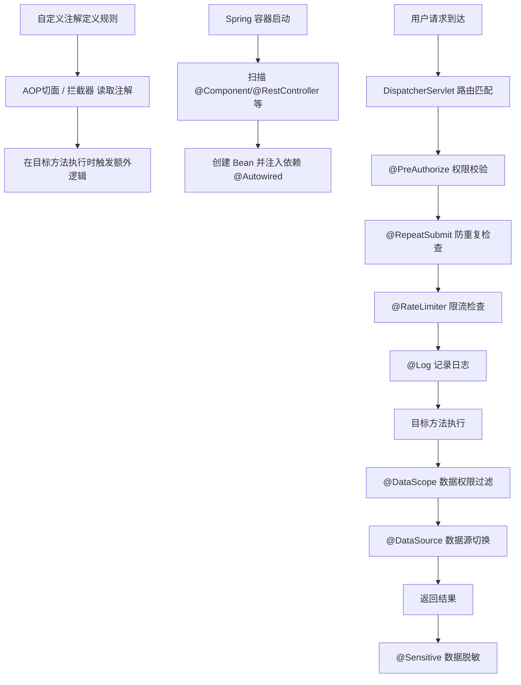

# 若依（RuoYi）项目注解全解析

## 一、先搞懂"注解"到底是什么？

**注解（Annotation）** 就像贴在代码上的"便利贴"。代码本身是干活的工人，注解就是贴在工人胸口的标签，告诉不同的人（编译器、框架、运行时）该怎么对待这个工人。

Java 注解有一个关键属性——**作用时间（Retention）**，决定了这张"便利贴"什么时候有效：

| 作用时间 | 通俗理解 | 举例 |
|---|---|---|
| `SOURCE` | 只在写代码时有效，编译完就丢了 | `@Override` — 编译器检查你方法名写对了没，编译完就没它事了 |
| `CLASS` | 编译后留在 `.class` 文件里，但运行时JVM不读 | 一些字节码增强工具用 |
| `RUNTIME` | 程序运行时还能读到这张"便利贴" | `@Log`、`@DataScope` — 程序跑起来后，框架要读它来决定行为 |

---

## 二、Java 元注解（"制造注解的注解"）

元注解就是**贴在"自定义注解"上的注解**，用来规定自定义注解的行为。就像"生产便利贴的模具"。

### 1. `@Target` — 这个注解能贴在哪？

**通俗解释**：规定这张"便利贴"只能贴在什么东西上面。

| 值 | 能贴在哪 | 项目中的例子 |
|---|---|---|
| `ElementType.METHOD` | 方法上 | `@Log`、`@DataScope`、`@RateLimiter`、`@RepeatSubmit` |
| `ElementType.TYPE` | 类/接口上 | `@Anonymous`、`@DataSource` |
| `ElementType.FIELD` | 字段（属性）上 | `@Excel`、`@Sensitive` |
| `ElementType.PARAMETER` | 方法参数上 | `@Log` |
| `ElementType.CONSTRUCTOR` | 构造方法上 | `@Xss` |

### 2. `@Retention` — 这张便利贴什么时候有效？

**通俗解释**：规定注解的"保质期"。

| 值 | 含义 | 项目中的例子 |
|---|---|---|
| `RetentionPolicy.SOURCE` | 只在源码阶段有效，编译后丢弃 | （项目未自定义，Java内置的 `@Override` 就是这种） |
| `RetentionPolicy.CLASS` | 保留到 `.class` 文件，运行时不读 | （项目未使用） |
| `RetentionPolicy.RUNTIME` | 运行时还能读到 | **项目中所有自定义注解都是这种** |

### 3. `@Documented` — 会不会写进 JavaDoc 文档？

**通俗解释**：被标记的注解，在生成 API 文档时，会把注解信息也带上。就像在说明书里也注明这个零件贴了什么标签。

项目中 `@Log`、`@DataScope`、`@DataSource`、`@Anonymous`、`@RateLimiter`、`@RepeatSubmit` 都加了 `@Documented`。

### 4. `@Inherited` — 子类能不能继承父类的注解？

**通俗解释**：如果父类上贴了这个注解，子类自动继承，不用重复贴。

项目中有两个用了：
- `@DataSource` — 父类标注了用"主库"，子类默认也用"主库"
- `@RepeatSubmit` — 父类方法标了防重复提交，子类也生效

---

## 三、项目自定义注解（10个）

### 1. `@Anonymous` — "免检通道"

```
贴在：方法 / 类上
生效时间：运行时
```

**通俗解释**：就像商场里的"员工免检通道"。 normally 所有请求都要经过"保安"（Spring Security 权限校验），但贴了 `@Anonymous` 的方法，保安直接放行，不需要登录就能访问。

**典型场景**：登录接口、验证码接口——用户还没登录呢，当然不能拦着。

### 2. `@Log` — "监控摄像头"

```
贴在：方法上
生效时间：运行时
```

**通俗解释**：就像在某个操作窗口上面装了个"监控摄像头"。谁在这个窗口干了什么（新增用户、删除角色），摄像头都会自动录像，记录到数据库的"操作日志"表里。

**可配置的参数**：

| 参数 | 含义 | 通俗理解 |
|---|---|---|
| `title` | 模块名称 | 这是哪个窗口的摄像头？比如"用户管理" |
| `businessType` | 业务类型 | 干了什么事？新增(INSERT)、修改(UPDATE)、删除(DELETE)、导出(EXPORT)等 |
| `operatorType` | 操作人类别 | 谁干的？后台管理员(MANAGE)还是手机端用户(MOBILE) |
| `isSaveRequestData` | 是否保存请求参数 | 要不要记录他提交了什么数据？ |
| `isSaveResponseData` | 是否保存响应参数 | 要不要记录系统返回了什么结果？ |
| `excludeParamNames` | 排除的参数名 | 哪些数据不记录？（比如密码这种敏感信息） |

**工作原理**：`LogAspect`（切面类）会拦截所有贴了 `@Log` 的方法，在方法执行前记录开始时间，执行完后收集信息，异步写入数据库。

### 3. `@DataScope` — "数据围栏"

```
贴在：方法上
生效时间：运行时
```

**通俗解释**：就像给每个用户建了一个"数据围栏"，你只能看到围栏里面的数据。

- 超级管理员：没有围栏，所有数据都能看
- 部门领导：围栏画在自己部门及下属部门
- 普通员工：围栏只画在自己脚下，只能看自己的

**可配置的参数**：

| 参数 | 含义 | 通俗理解 |
|---|---|---|
| `userAlias` | 用户表别名 | SQL里用户表叫什么名？ |
| `deptAlias` | 部门表别名 | SQL里部门表叫什么名？ |
| `userField` | 用户字段名 | 用户表里用哪个字段匹配？默认 `user_id` |
| `deptField` | 部门字段名 | 部门表里用哪个字段匹配？默认 `dept_id` |
| `permission` | 权限字符 | 按哪个权限来匹配角色？ |

**工作原理**：`DataScopeAspect` 在方法执行前，根据当前登录用户的角色权限，自动在 SQL 后面拼接一段过滤条件（比如 `AND dept_id IN (...)`），实现"不同人查出来不同范围的数据"。

### 4. `@DataSource` — "数据库切换开关"

```
贴在：方法 / 类上
生效时间：运行时
```

**通俗解释**：就像水管工手里的"阀门开关"，决定当前操作去哪个数据库取水。

- `MASTER`（主库）：用来写数据的（增删改）
- `SLAVE`（从库）：用来读数据的（查询），分担主库压力

**规则**：方法上的注解优先于类上的。就像"具体指令覆盖通用指令"。

**工作原理**：`DataSourceAspect` 在方法执行前切换数据源，执行后恢复。

### 5. `@Excel` — "Excel 表格模板"

```
贴在：字段（属性）上
生效时间：运行时
```

**通俗解释**：告诉系统"这个字段要导出到 Excel 里，而且长这样"。就像给每个字段发了一张"表格名片"，规定了它在 Excel 里的名字、位置、样式。

**常用参数**：

| 参数 | 含义 | 通俗理解 |
|---|---|---|
| `name` | 列名 | 在 Excel 表头写什么？比如 `name = "用户名"` |
| `sort` | 排序 | 这一列排在第几个？ |
| `dateFormat` | 日期格式 | 日期怎么显示？比如 `yyyy-MM-dd` |
| `dictType` | 字典类型 | 数字要翻译成文字吗？比如 `0=男, 1=女` |
| `readConverterExp` | 转换表达式 | 自定义翻译规则 |
| `width` / `height` | 宽高 | 单元格多大？ |
| `defaultValue` | 默认值 | 空了显示什么？ |
| `suffix` | 后缀 | 比如加个 `%`，90 变成 90% |
| `type` | 类型 | 是只导出(EXPORT)、只导入(IMPORT)、还是都能(ALL)？ |
| `cellType` | 单元格类型 | 内容是数字(NUMERIC)、文字(STRING)、还是图片(IMAGE)？ |
| `handler` | 自定义处理器 | 想自己处理数据格式？交给谁？ |

### 6. `@Excels` — "Excel 注解的集合"

```
贴在：字段（属性）上
生效时间：运行时
```

**通俗解释**：一个字段想贴多个 `@Excel` 注解时用。就像一个人可以同时拥有多张名片（不同的导出场景）。Java 规定同一个注解不能重复贴，所以用 `@Excels` 把它们"打包"起来。

### 7. `@RateLimiter` — "流量门卫"

```
贴在：方法上
生效时间：运行时
```

**通俗解释**：就像景区的"限流措施"——在一定时间内，只允许一定数量的游客进入。超过限额？对不起，请稍后再来。

**参数**：

| 参数 | 含义 | 通俗理解 |
|---|---|---|
| `key` | 限流标识 | 给这个限流规则起个名字 |
| `time` | 时间窗口（秒） | 在多长时间内限制？默认 60 秒 |
| `count` | 最大次数 | 最多允许多少次请求？默认 100 次 |
| `limitType` | 限流类型 | 是所有人一起限(DEFAULT)，还是按 IP 单独限(IP)？ |

**工作原理**：`RateLimiterAspect` 利用 Redis 的计数器来统计请求次数。就像景区门口的计数器，进一个人加一，到时间自动清零。

### 8. `@RepeatSubmit` — "防重复提交卫士"

```
贴在：方法上
生效时间：运行时
```

**通俗解释**：就像电梯里的"关门按钮"——你按一次有效，狂按也不会多开门。用户如果手快连点了两次"提交"按钮，第二次会被拦住。

**参数**：

| 参数 | 含义 | 通俗理解 |
|---|---|---|
| `interval` | 间隔时间（毫秒） | 多快算重复？默认 5000ms（5秒内再点就算重复） |
| `message` | 提示消息 | 被拦住时提示什么？默认"不允许重复提交，请稍候再试" |

**工作原理**：`RepeatSubmitInterceptor` 拦截器在请求到达 Controller 之前检查：这个用户最近有没有对同一个接口发过请求？间隔时间够不够？不够就拒绝。

### 9. `@Sensitive` — "马赛克处理器"

```
贴在：字段 / 方法上
生效时间：运行时
```

**通俗解释**：就像新闻里给当事人脸上打"马赛克"。数据是真的，但不能完整显示给所有人看。

**脱敏类型（`DesensitizedType`）**：

| 类型 | 效果 | 举例 |
|---|---|---|
| `USERNAME` | 姓名脱敏 | 张三 → 张\*三 |
| `PASSWORD` | 密码全部遮挡 | abc123 → \*\*\*\*\*\* |
| `ID_CARD` | 身份证中间遮挡 | 110101199001011234 → 1101\*\* \*\*\*\* \*\*\*\*1234 |
| `PHONE` | 手机号中间遮挡 | 13812345678 → 138\*\*\*\*5678 |
| `EMAIL` | 邮箱遮挡 | test@example.com → t\*\*\*@example.com |
| `BANK_CARD` | 银行卡号遮挡 | 只保留最后4位 |
| `CAR_LICENSE` | 车牌号遮挡 | 包含普通车、新能源车 |

### 10. `@Xss` — "安全安检员"

```
贴在：方法、字段、构造方法、参数上
生效时间：运行时
```

**通俗解释**：XSS（跨站脚本攻击）就是坏人往你的输入框里塞一段恶意 JavaScript 代码。`@Xss` 就像一个"安检员"，在数据进入系统之前检查：这里面有没有恶意脚本？有就拒绝。

**特殊之处**：它实现了 JSR 校验规范（`@Constraint`），由 `XssValidator` 类来执行具体的检查逻辑。可以配合 `@Validated` 一起使用。

---

## 四、Spring / Spring MVC 框架注解

这些是 Spring 框架提供的注解，不是项目自己写的。

### 11. `@RestController` — "对外服务窗口"

**通俗解释**：告诉 Spring："我是一个对外提供 API 接口的控制器"。就像商店的"营业柜台"，专门接待外面的请求。它是 `@Controller` + `@ResponseBody` 的组合，意味着所有方法的返回值直接作为 JSON 数据返回，而不是跳转页面。

### 12. `@RequestMapping` — "门牌号"

**通俗解释**：给控制器分配一个"地址"。就像商店的"门牌号"，告诉顾客"要找我，来这个地址"。

- `@RequestMapping("/system/config")` → 访问这个 Controller 的接口，URL 都以 `/system/config` 开头

它的"缩小版"更常用：

| 注解 | 等价于 | 用途 |
|---|---|---|
| `@GetMapping` | `@RequestMapping(method = GET)` | 查询数据 |
| `@PostMapping` | `@RequestMapping(method = POST)` | 新增数据 |
| `@PutMapping` | `@RequestMapping(method = PUT)` | 修改数据 |
| `@DeleteMapping` | `@RequestMapping(method = DELETE)` | 删除数据 |

### 13. `@Autowired` — "自动装配工"

**通俗解释**：告诉 Spring："这个变量你帮我找对应的实现类，自动塞进来"。就像你不需要自己去找工具，喊一声"把扳手给我"，Spring 就自动把合适的扳手递到你手上。

### 14. `@Component` — "通用零件注册"

**通俗解释**：告诉 Spring："把这个类管起来"。Spring 启动时会扫描所有贴了 `@Component` 的类，创建实例并放入"容器"（就像一个工具柜，需要时随时取用）。

`@RestController`、`@Service`、`@Repository` 本质上都是 `@Component` 的"马甲"，只是语义更明确。

### 15. `@Service` — "业务层标记"

**通俗解释**：和 `@Component` 功能一样，但语义上表示"这是一个业务逻辑类"。就像同一款工服，写着"Service"的就是业务部门的人。

### 16. `@PreAuthorize` — "权限门卫"

**通俗解释**：Spring Security 提供的注解。就像"VIP通道"，只有持有特定"通行证"（权限标识）的人才能进入。

```java
@PreAuthorize("@ss.hasPermi('system:user:list')")
```

意思是：调用 `@ss`（自定义的权限校验服务）的 `hasPermi` 方法，检查当前用户是否拥有 `system:user:list`（查看用户列表）这个权限。

### 17. `@RequestBody` — "请求体接收器"

**通俗解释**：告诉 Spring："把 HTTP 请求体里的 JSON 数据自动转换成 Java 对象"。就像快递员把包裹（JSON）拆开，自动把东西（数据）摆放到对应的位置（对象属性）。

### 18. `@RequestParam` — "URL参数接收器"

**通俗解释**：从 URL 的查询参数里取值。比如 `/api/list?pageNum=1`，`@RequestParam("pageNum")` 就能拿到 `1`。

### 19. `@PathVariable` — "路径参数接收器"

**通俗解释**：从 URL 路径里取值。比如 `/api/user/123`，`@PathVariable("id")` 就能拿到 `123`。

### 20. `@Validated` / `@Valid` — "数据体检员"

**通俗解释**：告诉 Spring："在数据进入方法之前，先做个体检"。配合 `@NotNull`、`@Size` 等校验注解使用，不合格就报错。

- `@Validated`：Spring 提供的，支持分组校验
- `@Valid`：JSR 标准提供的，基础校验

---

## 五、JSR 数据校验注解

这些是 Java Bean Validation 规范（JSR 380）提供的标准注解，配合 `@Validated` 使用。

| 注解 | 作用 | 通俗解释 |
|---|---|---|
| `@NotNull` | 不能为 null | "这个格子不能空着" |
| `@NotBlank` | 不能为 null 且去掉空格后长度 > 0 | "这个格子不能空着，也不能只写空格" |
| `@NotEmpty` | 不能为 null 且长度 > 0 | "这个格子必须有内容" |
| `@Size(min, max)` | 长度在范围内 | "字数必须在 2 到 20 之间" |
| `@Max` / `@Min` | 数值最大/最小值 | "年龄不能超过 150" |
| `@Email` | 必须是合法邮箱格式 | "必须符合 xxx@xxx.xxx 的格式" |

---

## 六、AOP / AspectJ 注解（"拦截器"相关）

这些注解用于定义"切面"——在不修改原有代码的情况下，给方法"加戏"。

**通俗理解**：就像工厂流水线上的"质检站"。产品（数据）正常流过流水线，质检站（切面）会自动拦下来做一些额外工作（记日志、查权限、限流等），然后放行。

| 注解 | 含义 | 通俗理解 |
|---|---|---|
| `@Aspect` | 声明这是一个"切面类" | "我是一个质检站" |
| `@Component` | 注册到 Spring 容器 | "让 Spring 管理我" |
| `@Before` | 方法执行**前**触发 | "产品到达之前，先做这个检查" |
| `@AfterReturning` | 方法正常返回**后**触发 | "产品合格出厂后，做个记录" |
| `@AfterThrowing` | 方法抛异常**后**触发 | "产品出问题了，记录事故" |
| `@Around` | 把方法**包裹**起来，前后都能控制 | "我全程盯着，之前之后都归我管" |
| `@Pointcut` | 定义"拦截规则" | "哪些产品需要检查？" |
| `@Order(1)` | 多个切面的执行优先级 | "多个质检站谁先谁后？数字越小越先" |

---

## 七、Jackson 序列化注解

| 注解 | 含义 | 通俗理解 |
|---|---|---|
| `@JsonSerialize(using = ...)` | 自定义 JSON 序列化方式 | "这个字段转成 JSON 时，用我指定的方式处理" |
| `@JacksonAnnotationsInside` | 标记"我是一个组合注解" | "我身上贴的其他 Jackson 注解也一起生效" |

`@Sensitive` 就用了这两个：当对象转成 JSON 返回给前端时，`SensitiveJsonSerializer` 会自动把敏感字段打上"马赛克"。

---

## 八、总结速查表

| 注解 | 来源 | 贴在哪 | 一句话解释 |
|---|---|---|---|
| `@Anonymous` | 自定义 | 方法/类 | 免登录访问 |
| `@Log` | 自定义 | 方法 | 记录操作日志 |
| `@DataScope` | 自定义 | 方法 | 控制能看到哪些数据 |
| `@DataSource` | 自定义 | 方法/类 | 切换主库/从库 |
| `@Excel` | 自定义 | 字段 | 定义 Excel 导出/导入规则 |
| `@Excels` | 自定义 | 字段 | 多个 @Excel 的集合 |
| `@RateLimiter` | 自定义 | 方法 | 限制访问频率 |
| `@RepeatSubmit` | 自定义 | 方法 | 防止重复提交 |
| `@Sensitive` | 自定义 | 字段/方法 | 敏感数据打马赛克 |
| `@Xss` | 自定义 | 字段/参数 | 防 XSS 脚本注入 |
| `@RestController` | Spring | 类 | 对外提供 JSON 接口 |
| `@RequestMapping` | Spring | 类/方法 | 定义 URL 路径 |
| `@Autowired` | Spring | 字段/方法 | 自动注入依赖 |
| `@Component` | Spring | 类 | 注册为 Spring 管理的 Bean |
| `@PreAuthorize` | Spring Security | 方法 | 接口权限校验 |
| `@Aspect` | AspectJ | 类 | 声明切面（拦截器） |
| `@Before` | AspectJ | 方法 | 目标方法前执行 |
| `@AfterReturning` | AspectJ | 方法 | 目标方法成功后执行 |
| `@AfterThrowing` | AspectJ | 方法 | 目标方法异常后执行 |
| `@Around` | AspectJ | 方法 | 包裹目标方法，前后都能控制 |
| `@Validated` | Spring | 方法/参数 | 触发数据校验 |
| `@NotNull` / `@NotBlank` | JSR 校验 | 字段/参数 | 非空校验 |

**核心关系图**：



这样就完整覆盖了项目中从自定义注解到框架注解的全部体系。每个注解本质上就是一个"标签"，告诉程序的不同环节——"看到这个标签，就按标签上说的做"。