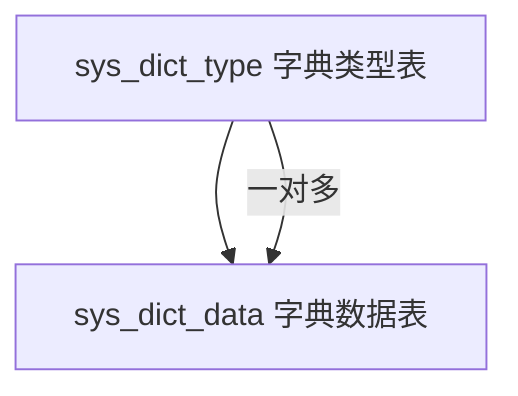
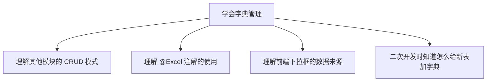

# 字典管理是什么？为什么从它开始学？

## 一、先搞懂"字典"到底是什么？

**通俗理解**：字典就是一个**"翻译对照表"**。

想象一下，数据库里存的用户性别是 `0`、`1`、`2`，但前端页面上要显示"男"、"女"、"未知"。这个"数字 → 文字"的对应关系，就存在字典里。

### 实际数据长什么样？

项目中已经预置了这些字典：

| 字典名称 | 字典类型（编码） | 说明 |
|---|---|---|
| 用户性别 | `sys_user_sex` | 0=男, 1=女, 2=未知 |
| 菜单状态 | `sys_show_hide` | 0=显示, 1=隐藏 |
| 系统开关 | `sys_normal_disable` | 0=正常, 1=停用 |
| 任务状态 | `sys_job_status` | 0=正常, 1=暂停 |
| 通知类型 | `sys_notice_type` | 1=通知, 2=公告 |
| 操作类型 | `sys_oper_type` | 1=新增, 2=修改, 3=删除... |
| ... | ... | ... |

### 它由两张表组成



**字典类型表**（`sys_dict_type`）—— 定义"有哪些字典"

| dict_id | dict_name（名称） | dict_type（类型编码） | status |
|---|---|---|---|
| 1 | 用户性别 | sys_user_sex | 0（正常） |
| 2 | 菜单状态 | sys_show_hide | 0 |
| 3 | 系统开关 | sys_normal_disable | 0 |

**字典数据表**（`sys_dict_data`）—— 定义"每个字典里有哪些选项"

| dict_code | dict_label（标签） | dict_value（值） | dict_type（属于哪个字典） |
|---|---|---|---|
| 1 | 男 | 0 | sys_user_sex |
| 2 | 女 | 1 | sys_user_sex |
| 3 | 未知 | 2 | sys_user_sex |
| 4 | 显示 | 0 | sys_show_hide |
| 5 | 隐藏 | 1 | sys_show_hide |

**一句话总结**：类型表是"文件夹"，数据表是"文件夹里的文件"。通过 `dict_type`（字典类型编码）把它们关联起来。

---

## 二、字典管理在哪里用？（到处都是！）

字典不是独立存在的功能，它**渗透在系统的每一个角落**。举几个例子：

### 场景 1：用户管理页面

用户列表里"性别"这一列，数据库存的是 `0`、`1`、`2`，但页面上显示的是"男"、"女"、"未知"。这个翻译就是靠 `sys_user_sex` 字典完成的。

### 场景 2：新增用户时的下拉框

新增用户时，性别那里不是让你手打的，而是一个下拉选择框，选项就是字典数据：
```
请选择 ▼
  男
  女
  未知
```

### 场景 3：操作日志

操作日志里"操作类型"列显示的"新增"、"修改"、"删除"，也是字典翻译过来的。

### 场景 4：各种开关、状态

系统里几乎所有"状态"、"类型"、"是否"这种**固定选项**的字段，都走字典。

**所以**：你以后做二次开发，新增一个业务表，里面有"状态"、"类型"之类的字段，**一定需要用到字典**。不懂字典，就做不了完整的业务。

---

## 三、为什么从零开始学要先看字典管理？

### 原因 1：它是最标准的 CRUD，没有之一

看 `SysDictTypeController` 的代码，一个接口一个功能，清清楚楚：

| 接口 | URL | 方法 | 干什么 |
|---|---|---|---|
| 查询列表 | `GET /system/dict/type/list` | `list()` | 分页查询 |
| 查询详情 | `GET /system/dict/type/{dictId}` | `getInfo()` | 根据 ID 查一条 |
| 新增 | `POST /system/dict/type` | `add()` | 新增一条 |
| 修改 | `PUT /system/dict/type` | `edit()` | 修改一条 |
| 删除 | `DELETE /system/dict/type/{dictIds}` | `remove()` | 批量删除 |
| 导出 | `POST /system/dict/type/export` | `export()` | 导出 Excel |

这就是若依里**每个模块都有的标准六件套**。你看懂了字典管理，就等于看懂了所有模块的骨架。

### 原因 2：代码量最少，逻辑最简单

对比一下各模块的复杂度：

| 模块 | 涉及表 | 特殊逻辑 | 代码量 |
|---|---|---|---|
| **字典管理** | **2 张表，各管各的** | **无** | **最少** |
| 部门管理 | 1 张表 | 树形结构（递归查询） | 中等 |
| 菜单管理 | 1 张表 | 树形结构 + 路由 | 中等 |
| 用户管理 | 3+ 张表关联 | 多表关联 + 密码加密 + 角色分配 | 很多 |
| 角色管理 | 3+ 张表关联 | 权限分配 + 数据权限 | 很多 |

字典管理就是**纯粹的一张表对应一套 CRUD**，没有树形结构、没有多表关联、没有复杂的业务逻辑。

### 原因 3：它涵盖了你需要学的**所有基础知识点**

虽然简单，但它**该有的都有**：

| 知识点             | 在字典管理中的体现                                                  |
| --------------- | ---------------------------------------------------------- |
| Controller 怎么写  | `SysDictTypeController` 完整示范                               |
| Service 接口 + 实现 | `ISysDictTypeService` + `SysDictTypeServiceImpl`           |
| Mapper 接口 + XML | `SysDictTypeMapper` + `SysDictTypeMapper.xml`              |
| 实体类（Domain）     | `SysDictType extends BaseEntity`                           |
| 权限控制            | `@PreAuthorize("@ss.hasPermi('system:dict:list')")`        |
| 操作日志            | `@Log(title = "字典类型", businessType = BusinessType.INSERT)` |
| 参数校验            | `@NotBlank`、`@Size`、`@Pattern`                             |
| 分页查询            | `startPage()` + `getDataTable(list)`                       |
| Excel 导出        | `@Excel(name = "字典名称")` + `ExcelUtil`                      |
| 数据校验（唯一性）       | `checkDictTypeUnique()`                                    |
| 缓存刷新            | `resetDictCache()`                                         |

**一个模块就把所有"零件"都认全了**，而且每个零件只出现一次，不会像用户管理那样各种东西搅在一起让你看花眼。

### 原因 4：它是后续学习的"前置知识"



你后面学部门管理、用户管理时，看到代码里 `@Excel(readConverterExp = "0=正常,1=停用")` 这种字典翻译的写法，你就不会陌生了。

---

## 四、学习字典管理的具体步骤

建议按这个顺序读代码：

### 第 1 步：看数据库表（5 分钟）
打开 Navicat，看 `sys_dict_type` 和 `sys_dict_data` 两张表的结构和数据，理解"类型"和"数据"的一对多关系。

### 第 2 步：看实体类（10 分钟）
看 `SysDictType.java`，注意：
- 它继承了 `BaseEntity`（所有实体类都继承它）
- `@Excel` 注解怎么用的
- `@NotBlank`、`@Size`、`@Pattern` 校验注解怎么用的

### 第 3 步：看 Controller（15 分钟）
看 `SysDictTypeController.java`，注意：
- 6 个标准接口（增删改查 + 导出 + 详情）
- 每个接口上的注解（权限、日志、校验）
- 它继承了 `BaseController`（分页和返回结果的方法都在这里）

### 第 4 步：看 Service（15 分钟）
看 `ISysDictTypeService` 接口和实现类，注意业务逻辑：
- 查询列表时怎么拼条件
- 新增时怎么检查唯一性
- 修改时怎么刷新缓存

### 第 5 步：看 Mapper XML（10 分钟）
看 `SysDictTypeMapper.xml`，注意：
- `<select>`、`<insert>`、`<update>`、`<delete>` 四种标签
- `<if test="...">` 动态 SQL 怎么拼条件

### 第 6 步：自己跑一遍（10 分钟）
启动项目，在"字典管理"页面上把增删改查、导出都点一遍，同时用 IDEA 断点跟踪代码执行流程。

**总共大约 1 小时**，你就能完全理解若依的标准 CRUD 模式了。然后再去看部门管理、用户管理，就是在简单模式的基础上加"树形结构"、"多表关联"这些新东西，理解起来就轻松了。