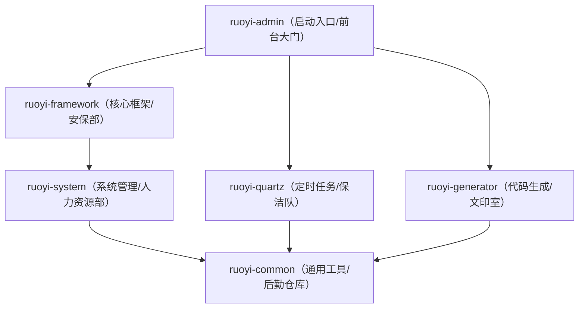

# 若依后端工程深度解析与二次开发指南

---

## 维度一：前置知识术语表

| 术语 | 英文全称 | 通俗解释 | 生活类比 |
|------|---------|---------|---------|
| **Spring Boot** | — | Java 最流行的 Web 开发框架，帮你快速搭建网站后端 | 装修房子的"全包方案"——水电、墙面、地板都帮你配好了 |
| **Maven** | — | Java 的项目管理和构建工具，帮你下载依赖、编译代码、打包程序 | 全能管家——你说需要什么原料，它帮你买；你说要做成什么，它帮你做 |
| **依赖（Dependency）** | — | 项目需要用到别人写好的代码库 | 手机需要安装 App 才能用微信、支付宝 |
| **模块（Module）** | — | 大项目拆分成的小项目，各司其职 | 公司拆分成多个部门——人事部、财务部、技术部 |
| **Controller** | — | 接收浏览器请求的"接待员"，决定把请求交给谁处理 | 前台接待——客人来了，前台问"你要办什么事"，然后引导到对应部门 |
| **Service** | — | 业务逻辑层，处理具体的业务规则 | 业务部门——前台把客人引导过来后，业务部门负责具体办理 |
| **Mapper/DAO** | — | 数据访问层，负责和数据库打交道（增删改查） | 档案管理员——业务部门说"帮我查一下张三的资料"，档案管理员去柜子里找 |
| **Entity/Domain** | — | 实体类，对应数据库中的一张表 | 表格模板——数据库的"用户表"对应 Java 的"SysUser 类"，表的每一列对应类的一个属性 |
| **DTO** | Data Transfer Object | 数据传输对象，用于在不同层之间传递数据 | 快递包裹——把数据打包好，从一层传到另一层 |
| **VO** | View Object | 视图对象，专门用于返回给前端展示的数据 | 展示用照片——实体类是"原始档案"，VO 是"整理好后给客人看的摘要" |
| **AOP** | Aspect-Oriented Programming | 面向切面编程——在不修改原有代码的情况下，自动给程序加上额外功能（如日志、权限检查） | 大楼的监控系统——每个房间的进出都会被自动记录，但房间本身不需要知道摄像头的存在 |
| **注解（Annotation）** | — | 代码上的"标签"，告诉框架"这个类/方法有特殊用途" | 便利贴——在文件上贴个标签"这是机密文件"，看到标签的人就知道该怎么处理 |
| **JWT** | JSON Web Token | 用户登录后服务器发的"电子通行证"，之后每次请求都带上它证明身份 | 游乐场手环——入园时买一个，之后玩每个项目刷手环就行 |
| **Redis** | — | 内存数据库，读写速度极快，常用来做缓存 | 办公桌——常用文件放手边（Redis），不常用的放档案室（MySQL） |
| **BOM** | Bill of Materials | 物料清单，列出所有兼容依赖的版本号 | 电脑兼容配置单——选了 i7 处理器就配这块主板 |
| **Fat JAR** | — | 把所有依赖打包进一个文件里的超级 jar 包 | 装好所有软件的"一体机"，开机就能用 |

---

## 维度二：整体架构与关系图解

### 模块依赖关系图




### 逐层解读

**第一层（最顶层）：ruoyi-admin —— "公司大门"**
- 整个项目的启动入口，程序从这里跑起来
- 所有外部请求（前端页面的访问）都要先经过这里
- 它引入了 framework、quartz、generator 三个模块，把它们的能力汇聚在一起

**第二层：三大业务支撑部门**
- **ruoyi-framework（核心框架）**：安全认证（Spring Security）、操作日志记录（AOP）、权限控制、数据库连接管理（Druid）、验证码生成（Kaptcha）、服务器监控（OSHI）
- **ruoyi-quartz（定时任务）**：设定"每天凌晨 2 点自动清理日志"这类定时执行的任务
- **ruoyi-generator（代码生成）**：选择一张数据表，一键生成增删改查代码

**第三层：ruoyi-system —— "业务核心"**
- 用户管理、角色管理、菜单管理、部门管理、岗位管理、字典管理、参数配置、通知公告

**第四层（最底层）：ruoyi-common —— "地基"**
- 所有模块都可能用到的公共代码——工具类、常量定义、异常类、自定义注解、过滤器

### 构建顺序

```
第 1 步：ruoyi-common      （地基，没有内部依赖，最先构建）
第 2 步：ruoyi-system       （依赖 ruoyi-common）
第 3 步：ruoyi-framework    （依赖 ruoyi-system）
第 3 步：ruoyi-quartz       （依赖 ruoyi-common，与 framework 可并行）
第 3 步：ruoyi-generator    （依赖 ruoyi-common，与 framework 可并行）
第 4 步：ruoyi-admin        （依赖以上所有模块，最后构建）
```


> 类比：盖楼时必须先盖 1 楼（common），再盖 2 楼（system），再盖 3 楼（framework/quartz/generator，这三层互不依赖可以同时施工），最后盖顶楼（admin）。

### 整体架构总结

> 整个若依后端工程就像一家**公司**：
>
> - **ruoyi-common** 是"后勤仓库"——在最底层，为所有部门提供工具。它不依赖任何部门，但所有部门都离不开它。
> - **ruoyi-system** 是"人力资源部"——建在仓库之上，管理员工信息，需要从仓库领取工具。
> - **ruoyi-framework** 是"行政部 + 安保部"——建在人力资源部之上，需要 HR 提供员工数据才能做权限控制。
> - **ruoyi-quartz** 是"保洁团队"——直接从仓库领工具，到点自动干活。
> - **ruoyi-generator** 是"文印室"——直接从仓库领工具，帮你批量出文件。
> - **ruoyi-admin** 是"公司大门"——在最顶层，把以上所有部门串联在一起。外部访客（前端请求）从大门进来，被引导到对应的部门处理。

---

## 维度三：核心文件/模块深度剖析

### 3.1 启动入口：RuoYiApplication.java

**位置：** `ruoyi-admin/src/main/java/com/ruoyi/RuoYiApplication.java`

**角色定位：** 整个程序的"点火开关"——双击运行它，整个系统就启动了。

**核心代码：**
```java
@SpringBootApplication(exclude = { DataSourceAutoConfiguration.class })
public class RuoYiApplication {
    public static void main(String[] args) {
        SpringApplication.run(RuoYiApplication.class, args);
    }
}
```


- `@SpringBootApplication`：告诉 Spring Boot"这是一个 Spring Boot 应用，请自动配置所有组件"
- `exclude = { DataSourceAutoConfiguration.class }`：排除 Spring Boot 默认的数据源自动配置。因为若依用的是 Druid 连接池（在 `DruidConfig.java` 中手动配置），不需要 Spring Boot 默认的
- `SpringApplication.run()`：启动 Spring Boot 应用，加载所有配置、创建所有 Bean、启动内嵌 Tomcat

**修改影响：** 一般不需要修改。如果要添加启动时的初始化逻辑（如加载缓存），可以在这里添加 `@PostConstruct` 方法或实现 `CommandLineRunner` 接口。

### 3.2 安全配置：SecurityConfig.java

**位置：** `ruoyi-framework/src/main/java/com/ruoyi/framework/config/SecurityConfig.java`

**角色定位：** 整个系统的"门禁规则制定者"——决定哪些接口需要登录才能访问，哪些可以匿名访问。

**核心逻辑：**
```java
@Bean
protected SecurityFilterChain filterChain(HttpSecurity httpSecurity) throws Exception {
    return httpSecurity
        .csrf(csrf -> csrf.disable())                          // 禁用 CSRF（因为用 Token 不用 Session）
        .sessionManagement(session -> session
            .sessionCreationPolicy(SessionCreationPolicy.STATELESS))  // 无状态（不用 Session）
        .authorizeHttpRequests((requests) -> {
            requests.requestMatchers("/login", "/register", "/captchaImage").permitAll()  // 登录注册验证码允许匿名
                .requestMatchers("/swagger-ui.html", "/v3/api-docs/**").permitAll()       // API 文档允许匿名
                .anyRequest().authenticated();                                            // 其他所有请求需要认证
        })
        .addFilterBefore(authenticationTokenFilter, ...)  // 添加 JWT 认证过滤器
        .build();
}
```


**应用场景：** 当你新增一个接口需要允许匿名访问时（比如"公开查询接口"），需要在这里添加 `.requestMatchers("/your/api").permitAll()`。

**修改影响：** 如果配错了，可能导致接口全部 401（未认证）或者安全漏洞（敏感接口被匿名访问）。

### 3.3 通用响应：AjaxResult.java

**位置：** `ruoyi-common/src/main/java/com/ruoyi/common/core/domain/AjaxResult.java`

**角色定位：** 所有接口返回数据的"标准信封"——无论什么接口，返回给前端的数据都装在这个信封里。

**核心逻辑：**
```java
public class AjaxResult extends HashMap<String, Object> {
    public static final String CODE_TAG = "code";   // 状态码
    public static final String MSG_TAG = "msg";     // 返回内容
    public static final String DATA_TAG = "data";   // 数据对象

    public static AjaxResult success() { ... }       // 返回成功
    public static AjaxResult error(String msg) { ... } // 返回失败
}
```


返回给前端的数据格式统一为：
```json
{
    "code": 200,        // 200=成功，500=失败
    "msg": "操作成功",
    "data": { ... }     // 实际数据
}
```


**修改影响：** 如果修改了字段名（如把 `code` 改成 `status`），前端所有接口调用都要同步修改。

### 3.4 控制器基类：BaseController.java

**位置：** `ruoyi-common/src/main/java/com/ruoyi/common/core/controller/BaseController.java`

**角色定位：** 所有 Controller 的"父类"——提供分页、返回结果、获取当前用户等通用方法。

**核心方法：**
```java
protected void startPage() { ... }          // 开启分页
protected TableDataInfo getDataTable(List<?> list) { ... }  // 返回分页数据
public AjaxResult success() { ... }         // 返回成功
public AjaxResult error(String message) { ... }  // 返回失败
protected AjaxResult toAjax(int rows) { ... }  // 根据影响行数返回成功/失败
public LoginUser getLoginUser() { ... }     // 获取当前登录用户
public Long getUserId() { ... }             // 获取当前用户ID
```


**应用场景：** 你写的每个 Controller 都继承它，然后直接调用 `startPage()`、`getDataTable()`、`success()` 等方法。

### 3.5 全局异常处理：GlobalExceptionHandler.java

**位置：** `ruoyi-framework/src/main/java/com/ruoyi/framework/web/exception/GlobalExceptionHandler.java`

**角色定位：** 系统的"急救中心"——任何地方抛出异常，都会被这里统一捕获并返回友好的错误信息给前端。

**核心逻辑：**
```java
@RestControllerAdvice  // 全局异常处理器
public class GlobalExceptionHandler {
    @ExceptionHandler(ServiceException.class)      // 捕获业务异常
    public AjaxResult handleServiceException(ServiceException e) { ... }

    @ExceptionHandler(AccessDeniedException.class) // 捕获权限异常
    public AjaxResult handleAccessDeniedException(AccessDeniedException e) { ... }

    @ExceptionHandler(RuntimeException.class)      // 捕获未知异常
    public AjaxResult handleRuntimeException(RuntimeException e) { ... }
}
```


**修改影响：** 如果你新增了自定义异常类型，需要在这里添加对应的 `@ExceptionHandler` 方法。

### 3.6 自定义注解体系

若依定义了一套丰富的自定义注解，是二次开发中**最常复用**的机制：

| 注解 | 位置 | 作用 | 使用方式 |
|------|------|------|---------|
| `@Log` | `common/annotation/Log.java` | 操作日志记录 | 在 Controller 方法上加 `@Log(title = "用户管理", businessType = BusinessType.INSERT)` |
| `@DataScope` | `common/annotation/DataScope.java` | 数据权限过滤 | 在 Service 方法上加 `@DataScope(deptAlias = "d", userAlias = "u")` |
| `@RepeatSubmit` | `common/annotation/RepeatSubmit.java` | 防重复提交 | 在 Controller 方法上加 `@RepeatSubmit(interval = 5000)` |
| `@RateLimiter` | `common/annotation/RateLimiter.java` | 接口限流 | 在 Controller 方法上加 `@RateLimiter(time = 60, count = 10)` |
| `@Anonymous` | `common/annotation/Anonymous.java` | 匿名访问 | 在 Controller 方法上加 `@Anonymous`，无需登录即可访问 |
| `@Excel` | `common/annotation/Excel.java` | Excel 导入导出 | 在实体类字段上加 `@Excel(name = "用户名")` |
| `@Sensitive` | `common/annotation/Sensitive.java` | 数据脱敏 | 在实体类字段上加 `@Sensitive(strategy = SensitiveStrategy.PHONE)` |

---

## 维度四：二次开发快速上手指南

### 4.1 核心目录/文件速查字典

> 以下是后续开发中最常需要修改的文件夹和核心文件，按"你要做什么"来索引：

| 你要做什么 | 去改哪个文件/目录 |
|-----------|-----------------|
| **修改登录逻辑** | `ruoyi-framework/src/main/java/com/ruoyi/framework/security/` 目录下的文件 |
| **调整数据库连接** | `ruoyi-admin/src/main/resources/application-druid.yml` |
| **修改端口号** | `ruoyi-admin/src/main/resources/application.yml` 中的 `server.port` |
| **修改 Redis 配置** | `ruoyi-admin/src/main/resources/application.yml` 中的 `spring.data.redis` |
| **新增业务接口** | `ruoyi-admin/src/main/java/com/ruoyi/web/controller/` 下新建 Controller |
| **新增业务逻辑** | `ruoyi-system/src/main/java/com/ruoyi/system/service/` 下新建 Service |
| **新增数据库操作** | `ruoyi-system/src/main/java/com/ruoyi/system/mapper/` 下新建 Mapper 接口 + XML |
| **新增实体类** | `ruoyi-system/src/main/java/com/ruoyi/system/domain/` 下新建 Java 类 |
| **修改 SQL 语句** | `ruoyi-system/src/main/resources/mapper/system/` 下的 XML 文件 |
| **修改权限配置** | `ruoyi-framework/src/main/java/com/ruoyi/framework/config/SecurityConfig.java` |
| **修改返回格式** | `ruoyi-common/src/main/java/com/ruoyi/common/core/domain/AjaxResult.java` |
| **新增全局异常处理** | `ruoyi-framework/src/main/java/com/ruoyi/framework/web/exception/GlobalExceptionHandler.java` |
| **修改文件上传路径** | `ruoyi-admin/src/main/resources/application.yml` 中的 `ruoyi.profile` |
| **关闭 Swagger** | `ruoyi-admin/src/main/resources/application.yml` 中的 `springdoc.swagger-ui.enabled` |
| **修改 Token 配置** | `ruoyi-admin/src/main/resources/application.yml` 中的 `token` 部分 |
| **新增定时任务** | `ruoyi-quartz/src/main/java/com/ruoyi/quartz/` 目录下操作 |
| **使用代码生成** | 启动项目后访问管理后台 → 系统工具 → 代码生成 |

### 4.2 典型业务链路追踪：用户登录

以"用户登录"为例，完整梳理数据流转过程：

```
前端请求 → 拦截器/过滤器 → Controller → Service → Mapper → 数据库
  ↓            ↓              ↓          ↓         ↓        ↓
输入用户名    JWT过滤器      login()   login()   selectUser  查询
和密码       检查Token      接收参数   验证密码   byName()   sys_user表
            ↓              ↓          ↓         ↓        ↓
            无Token        调用       查询用户   返回用户  返回
            放行(登录接口   Service    信息      对象     用户记录
            允许匿名)       ↓          ↓         ↓        ↓
                          验证       验证密码   生成      写入
                          验证码     是否正确   Token    登录日志
                          ↓          ↓         ↓        ↓
                          通过       通过       返回     写入
                                     ↓         Token    sys_logininfor
                                  生成Token            表
                                     ↓
                                  返回给前端
```


**每一层的具体职责：**

| 层级 | 文件 | 职责 |
|------|------|------|
| **过滤器** | `JwtAuthenticationTokenFilter.java` | 检查请求头中有没有 Token。登录接口不需要 Token（在 SecurityConfig 中配置了 permitAll），所以放行 |
| **Controller** | `SysLoginController.java` | 接收前端传来的用户名、密码、验证码，调用 Service 的 `login()` 方法 |
| **Service** | `SysLoginService.java` | ①验证验证码 → ②查询用户 → ③验证密码（BCrypt 加密比对）→ ④生成 Token → ⑤记录登录日志 |
| **Mapper** | `SysUserMapper.java` + `SysUserMapper.xml` | 根据用户名查询 `sys_user` 表，返回用户记录 |
| **数据库** | `sys_user` 表 | 存储用户信息（用户名、加密后的密码、角色、部门等） |

**Token 生成后的流程：**
1. 服务器用 JWT 算法生成一个加密字符串（Token）
2. Token 返回给前端，前端存在 localStorage 中
3. 之后每次请求，前端在请求头中带上 `Authorization: Bearer <Token>`
4. `JwtAuthenticationTokenFilter` 拦截每个请求，解析 Token，验证是否过期
5. 验证通过后，把用户信息放入 Security 上下文，后续代码通过 `SecurityUtils.getLoginUser()` 获取

### 4.3 新增业务模块标准 SOP：以"档案管理"为例

假设你需要新增一个"档案管理"模块，以下是从 0 到 1 的标准步骤：

#### 步骤 1：数据库表设计

在 MySQL 中创建表：

```sql
CREATE TABLE `archive_info` (
    `archive_id`   bigint(20)   NOT NULL AUTO_INCREMENT COMMENT '档案ID',
    `archive_name` varchar(200) NOT NULL COMMENT '档案名称',
    `archive_type` varchar(50)  DEFAULT NULL COMMENT '档案类型',
    `archive_no`   varchar(100) DEFAULT NULL COMMENT '档案编号',
    `status`       char(1)      DEFAULT '0' COMMENT '状态（0正常 1停用）',
    `create_by`    varchar(64)  DEFAULT '' COMMENT '创建者',
    `create_time`  datetime     DEFAULT NULL COMMENT '创建时间',
    `update_by`    varchar(64)  DEFAULT '' COMMENT '更新者',
    `update_time`  datetime     DEFAULT NULL COMMENT '更新时间',
    `remark`       varchar(500) DEFAULT NULL COMMENT '备注',
    PRIMARY KEY (`archive_id`)
) ENGINE=InnoDB COMMENT='档案信息表';
```


#### 步骤 2：使用代码生成器（推荐）

1. 启动项目，登录管理后台
2. 进入"系统工具 → 代码生成 → 导入"
3. 选择刚才创建的 `archive_info` 表
4. 点击"生成代码"，下载生成的 zip 文件
5. 解压后，将 Java 文件复制到对应模块，Vue 文件复制到前端项目

> 代码生成器会自动生成：Entity、Mapper、Service、ServiceImpl、Controller、Mapper XML、Vue 页面

#### 步骤 3：手动调整（如果不用代码生成器）

**3.1 创建实体类（Entity）**

位置：`ruoyi-system/src/main/java/com/ruoyi/system/domain/`

```java
public class ArchiveInfo extends BaseEntity {
    private Long archiveId;
    private String archiveName;
    private String archiveType;
    private String archiveNo;
    private String status;
    // getter/setter 省略
}
```


> **注意：** 继承 `BaseEntity`，自动获得 `createBy`、`createTime`、`updateBy`、`updateTime`、`remark`、`params` 字段。

**3.2 创建 Mapper 接口**

位置：`ruoyi-system/src/main/java/com/ruoyi/system/mapper/`

```java
public interface ArchiveInfoMapper {
    List<ArchiveInfo> selectArchiveInfoList(ArchiveInfo archiveInfo);
    ArchiveInfo selectArchiveInfoById(Long archiveId);
    int insertArchiveInfo(ArchiveInfo archiveInfo);
    int updateArchiveInfo(ArchiveInfo archiveInfo);
    int deleteArchiveInfoByIds(Long[] archiveIds);
}
```


**3.3 创建 Mapper XML**

位置：`ruoyi-system/src/main/resources/mapper/system/`

```xml
<?xml version="1.0" encoding="UTF-8" ?>
<!DOCTYPE mapper PUBLIC "-//mybatis.org//DTD Mapper 3.0//EN" "http://mybatis.org/dtd/mybatis-3-mapper.dtd">
<mapper namespace="com.ruoyi.system.mapper.ArchiveInfoMapper">
    <resultMap type="ArchiveInfo" id="ArchiveInfoResult">
        <result property="archiveId" column="archive_id"/>
        <result property="archiveName" column="archive_name"/>
        <!-- 其他字段映射 -->
    </resultMap>
    
    <select id="selectArchiveInfoList" parameterType="ArchiveInfo" resultMap="ArchiveInfoResult">
        select archive_id, archive_name, archive_type, archive_no, status,
               create_by, create_time, update_by, update_time, remark
        from archive_info
        <where>
            <if test="archiveName != null and archiveName != ''">
                and archive_name like concat('%', #{archiveName}, '%')
            </if>
            <if test="status != null and status != ''">
                and status = #{status}
            </if>
        </where>
    </select>
    <!-- 其他 SQL 省略 -->
</mapper>
```


**3.4 创建 Service 接口**

位置：`ruoyi-system/src/main/java/com/ruoyi/system/service/`

```java
public interface IArchiveInfoService {
    List<ArchiveInfo> selectArchiveInfoList(ArchiveInfo archiveInfo);
    ArchiveInfo selectArchiveInfoById(Long archiveId);
    int insertArchiveInfo(ArchiveInfo archiveInfo);
    int updateArchiveInfo(ArchiveInfo archiveInfo);
    int deleteArchiveInfoByIds(Long[] archiveIds);
}
```


**3.5 创建 Service 实现类**

位置：`ruoyi-system/src/main/java/com/ruoyi/system/service/impl/`

```java
@Service
public class ArchiveInfoServiceImpl implements IArchiveInfoService {
    @Autowired
    private ArchiveInfoMapper archiveInfoMapper;

    @Override
    public List<ArchiveInfo> selectArchiveInfoList(ArchiveInfo archiveInfo) {
        return archiveInfoMapper.selectArchiveInfoList(archiveInfo);
    }
    // 其他方法省略
}
```


**3.6 创建 Controller**

位置：`ruoyi-admin/src/main/java/com/ruoyi/web/controller/` 下新建 `archive/` 目录

```java
@RestController
@RequestMapping("/archive/info")
public class ArchiveInfoController extends BaseController {
    @Autowired
    private IArchiveInfoService archiveInfoService;

    @PreAuthorize("@ss.hasPermi('archive:info:list')")
    @GetMapping("/list")
    public TableDataInfo list(ArchiveInfo archiveInfo) {
        startPage();
        List<ArchiveInfo> list = archiveInfoService.selectArchiveInfoList(archiveInfo);
        return getDataTable(list);
    }

    @PreAuthorize("@ss.hasPermi('archive:info:add')")
    @Log(title = "档案管理", businessType = BusinessType.INSERT)
    @PostMapping
    public AjaxResult add(@RequestBody ArchiveInfo archiveInfo) {
        return toAjax(archiveInfoService.insertArchiveInfo(archiveInfo));
    }
    // 其他接口省略
}
```


> **关键注解说明：**
> - `@PreAuthorize("@ss.hasPermi('archive:info:list')")`：权限校验，只有拥有 `archive:info:list` 权限的用户才能访问
> - `@Log(title = "档案管理", businessType = BusinessType.INSERT)`：操作日志记录
> - `startPage()`：开启分页（来自 BaseController）
> - `getDataTable(list)`：返回分页数据（来自 BaseController）
> - `toAjax(rows)`：根据影响行数返回成功/失败（来自 BaseController）

**3.7 配置菜单权限**

在管理后台的"系统管理 → 菜单管理"中新增菜单：
- 菜单名称：档案管理
- 路由地址：archive
- 组件路径：archive/info/index
- 权限标识：archive:info:list

#### 步骤 4：命名规范总结

| 类型 | 命名规范 | 示例 |
|------|---------|------|
| 数据库表 | `模块名_业务名` | `archive_info` |
| 实体类 | 大驼峰，与表名对应 | `ArchiveInfo` |
| Mapper 接口 | `实体类名 + Mapper` | `ArchiveInfoMapper` |
| Mapper XML | `实体类名 + Mapper.xml` | `ArchiveInfoMapper.xml` |
| Service 接口 | `I + 实体类名 + Service` | `IArchiveInfoService` |
| Service 实现 | `实体类名 + ServiceImpl` | `ArchiveInfoServiceImpl` |
| Controller | `实体类名 + Controller` | `ArchiveInfoController` |
| 权限标识 | `模块:业务:操作` | `archive:info:list` |
| 请求路径 | `/模块/业务` | `/archive/info` |

### 4.4 核心机制与避坑指南

#### 4.4.1 自定义数据权限注解 `@DataScope`

**机制说明：** 若依的数据权限机制可以根据用户的角色，自动在 SQL 后面拼接过滤条件，实现"不同角色看到不同数据"。

**使用方式：**
```java
@DataScope(deptAlias = "d", userAlias = "u")
public List<SysUser> selectUserList(SysUser user) {
    return userMapper.selectUserList(user);
}
```


**效果：** SQL 会自动变成：
```sql
-- 普通员工（只能看自己的数据）
SELECT * FROM sys_user u LEFT JOIN sys_dept d ON u.dept_id = d.dept_id
WHERE u.user_id = 当前用户ID

-- 部门经理（能看本部门的数据）
SELECT * FROM sys_user u LEFT JOIN sys_dept d ON u.dept_id = d.dept_id
WHERE d.dept_id = 当前用户部门ID

-- 超级管理员（看所有数据，不过滤）
SELECT * FROM sys_user u LEFT JOIN sys_dept d ON u.dept_id = d.dept_id
-- 没有 WHERE 条件
```


**避坑：**
- `deptAlias` 和 `userAlias` 必须和 SQL 中的表别名一致
- 实体类必须继承 `BaseEntity`（因为数据权限条件存在 `params` 中）
- Mapper XML 中必须引用 `${params.dataScope}`：
```xml
  <select id="selectUserList" resultMap="SysUserResult">
      select ... from sys_user u
      left join sys_dept d on u.dept_id = d.dept_id
      <where>
          ... 其他条件 ...
          ${params.dataScope}    ← 必须有这一行！
      </where>
  </select>
  ```


#### 4.4.2 全局异常处理

**机制说明：** 所有未被捕获的异常都会被 `GlobalExceptionHandler` 统一处理，返回标准格式的 JSON 给前端。

**使用方式：** 在 Service 层抛出业务异常：
```java
if (user == null) {
    throw new ServiceException("用户不存在");
}
```


前端会收到：
```json
{ "code": 500, "msg": "用户不存在" }
```


**避坑：**
- 不要用 `throw new RuntimeException()` 抛业务异常——虽然也能被捕获，但无法自定义错误码
- `ServiceException` 支持自定义错误码：`throw new ServiceException("余额不足", 4001)`
- 事务方法中抛异常才会回滚——如果异常被 try-catch 吞掉了，事务不会回滚

#### 4.4.3 操作日志 AOP

**机制说明：** 在 Controller 方法上加 `@Log` 注解，AOP 自动记录操作日志到 `sys_oper_log` 表。

**使用方式：**
```java
@Log(title = "用户管理", businessType = BusinessType.INSERT)
@PostMapping
public AjaxResult add(@RequestBody SysUser user) {
    return toAjax(userService.insertUser(user));
}
```


**避坑：**
- 日志记录是**异步**的（通过 `AsyncManager`），不会阻塞主流程
- 敏感字段（password、oldPassword 等）会自动排除，不会记录到日志中
- 如果方法执行时间很长，日志中的 `costTime` 会很大

#### 4.4.4 防重复提交 `@RepeatSubmit`

**机制说明：** 防止用户短时间内多次点击提交按钮，导致重复数据。

**使用方式：**
```java
@RepeatSubmit(interval = 5000, message = "请勿重复提交")
@PostMapping
public AjaxResult add(@RequestBody SysUser user) { ... }
```


**避坑：**
- 基于 Redis 实现，确保 Redis 正常运行
- `interval` 单位是毫秒，默认 5000ms（5 秒）

#### 4.4.5 接口限流 `@RateLimiter`

**机制说明：** 限制某个接口在指定时间内的访问次数，防止被恶意刷接口。

**使用方式：**
```java
@RateLimiter(time = 60, count = 10)  // 60 秒内最多访问 10 次
@GetMapping("/export")
public void export(SysUser user) { ... }
```


**避坑：**
- 基于 Redis 实现，确保 Redis 正常运行
- 限流是全局的（所有用户共享计数），如果需要按用户限流，需要自定义 key

#### 4.4.6 事务失效场景

**常见坑：**

| 场景 | 原因 | 解决方案 |
|------|------|---------|
| 方法不是 public | Spring AOP 只能代理 public 方法 | 改为 public |
| 同类内部方法调用 | 绕过代理对象，直接调用目标方法 | 注入自身 Bean 或通过 ApplicationContext 获取 |
| 异常被 try-catch 吞掉 | 事务管理器感知不到异常，不会回滚 | catch 后重新 throw，或手动 `TransactionAspectSupport.currentTransactionStatus().setRollbackOnly()` |
| 数据库引擎不是 InnoDB | MyISAM 不支持事务 | 改为 InnoDB |

#### 4.4.7 缓存一致性

**机制说明：** 若依使用 Redis 缓存字典数据、参数配置等。修改数据库后需要清除缓存。

**使用方式：**
```java
// 修改字典后清除缓存
@CacheEvict(cacheNames = "sys_dict", key = "#dictType")
public int updateDict(SysDict dict) { ... }
```


**避坑：**
- 修改了数据库数据但没清缓存 → 前端看到的还是旧数据
- 若依的字典缓存有专门的清除方法：`dictDataService.clearDictCache()`

#### 4.4.8 权限拦截绕过

**常见坑：**

| 场景 | 风险 | 解决方案 |
|------|------|---------|
| 新增接口忘记加 `@PreAuthorize` | 任何人都能访问 | 默认所有接口都需要认证，但建议显式加权限注解 |
| 在 SecurityConfig 中误加了 `permitAll` | 敏感接口被匿名访问 | 定期检查 SecurityConfig 的 permitAll 列表 |
| 使用 `@Anonymous` 注解 | 接口无需登录即可访问 | 只在确实需要匿名访问的接口上使用 |

---

## 全文总览速查表

### 工程结构一览

```
backend/
├── pom.xml                          ← 父 POM（版本管理、模块聚合）
├── ruoyi-admin/                     ← 启动入口
│   ├── pom.xml                      ← 依赖声明 + 打包配置
│   └── src/main/
│       ├── java/com/ruoyi/
│       │   ├── RuoYiApplication.java    ← 启动类
│       │   └── web/controller/          ← 所有 Controller
│       └── resources/
│           ├── application.yml          ← 主配置文件
│           └── application-druid.yml    ← 数据库配置
├── ruoyi-framework/                 ← 核心框架
│   └── src/main/java/com/ruoyi/framework/
│       ├── aspectj/                     ← AOP（日志、数据权限）
│       ├── config/                      ← 各种配置类
│       ├── security/                    ← 安全认证（JWT、Spring Security）
│       └── web/exception/               ← 全局异常处理
├── ruoyi-system/                    ← 系统业务
│   └── src/main/
│       ├── java/com/ruoyi/system/
│       │   ├── domain/                    ← 实体类
│       │   ├── mapper/                    ← Mapper 接口
│       │   ── service/                   ← Service 接口 + 实现
│       └── resources/mapper/system/       ← Mapper XML
├── ruoyi-common/                    ← 通用工具
│   └── src/main/java/com/ruoyi/common/
│       ├── annotation/                  ← 自定义注解
│       ├── core/                        ← 核心类（BaseController、AjaxResult 等）
│       ├── exception/                   ← 异常类
│       ├── utils/                       ← 工具类
│       ── config/                      ← 通用配置
── ruoyi-quartz/                    ← 定时任务
├── ruoyi-generator/                 ← 代码生成
└── sql/                             ← 数据库脚本
```


### 二次开发核心原则

| 原则 | 说明 |
|------|------|
| **新增业务先建表** | 先在数据库中创建表，再用代码生成器生成基础代码 |
| **Controller 放 admin** | 所有 Controller 放在 `ruoyi-admin/web/controller/` 下 |
| **业务逻辑放 system** | Entity、Mapper、Service 放在 `ruoyi-system` 下 |
| **通用工具放 common** | 如果多个模块都要用的工具，放在 `ruoyi-common` 下 |
| **继承 BaseController** | 所有 Controller 继承 BaseController，获得分页、返回结果等通用方法 |
| **使用自定义注解** | 操作日志用 `@Log`，数据权限用 `@DataScope`，防重复提交用 `@RepeatSubmit` |
| **异常用 ServiceException** | 业务异常统一抛 `ServiceException`，由全局异常处理器统一处理 |
| **权限用 @PreAuthorize** | 所有接口加 `@PreAuthorize("@ss.hasPermi('模块:业务:操作')")` |