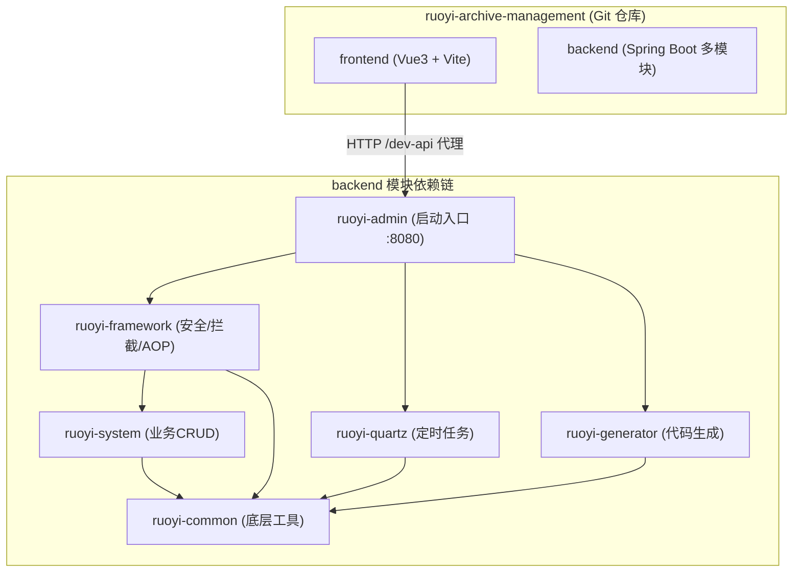
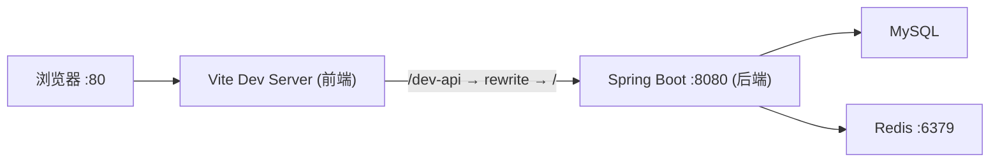

## 一、项目整体工程深度解析

你的项目是一个典型的 **若依（RuoYi-Vue）前后端分离** 架构，整体结构如下：




### 如何在 Qoder CN 中进行深度解析

由于前后端分别在两个 IDE 中，你需要 **分而治之、关联理解**：

#### 1. 在 IntelliJ IDEA 的 Qoder 中（后端）

可以直接对后端进行深度解析，你可以这样提问：

| 目标 | 提示词示例 |
|------|-----------|
| 整体架构 | "帮我解析整个后端项目的模块职责和依赖关系" |
| 单模块分析 | "深度解析 ruoyi-system 模块的领域模型和 Service 层设计" |
| 接口梳理 | "帮我梳理所有 Controller 的 REST API 清单" |
| 数据模型 | "分析所有 domain 实体类，生成数据库表关系图" |
| 安全链路 | "解析 JWT 认证 + Spring Security 的完整请求过滤链" |

#### 2. 在 VSCode 的 Qoder CN 中（前端）

对前端进行深度解析：

| 目标 | 提示词示例 |
|------|-----------|
| 路由结构 | "帮我梳理前端完整的路由树和权限路由加载逻辑" |
| API 调用层 | "分析 src/api 目录下所有接口调用，生成接口清单" |
| 状态管理 | "解析 Pinia store 的设计和数据流" |
| 组件架构 | "分析 src/components 和 src/views 的组件层次关系" |

#### 3. 跨端关联分析（关键！）

这是统一理解的核心——**前后端接口映射**。你可以在任一端的 Qoder 中这样问：

> "帮我对比前端 `src/api/` 下的接口调用和后端 Controller 的接口定义，检查是否有不匹配的地方"

要做到这一点，你需要把前端 API 文件的内容作为上下文提供给后端的 Qoder，反之亦然。具体方法：
- **使用 `@file` 或 `@folder`**：在 Qoder 对话中引用另一端的文件
- **使用选中代码**：选中前端的 API 调用代码，在后端 Qoder 中提问

---

## 二、统一联调方案

根据你项目的配置，联调链路已经基本就绪：

### 当前联调架构




**关键配置已就绪：**
- 前端 Vite 开发服务器端口：**80**（`vite.config.js` 第45行）
- 前端 API 请求前缀：`/dev-api`（`.env.development`）
- Vite 代理：`/dev-api` → `http://localhost:8080`，并去除 `/dev-api` 前缀
- 后端服务端口：**8080**

### 联调启动步骤

#### 第一步：确保基础设施运行
```powershell
# 确保 MySQL 和 Redis 已启动
# MySQL 中导入 sql/ry_20260417.sql 和 sql/quartz.sql
```


#### 第二步：启动后端（IntelliJ IDEA）
```powershell
# 方式1：直接运行主类
# 右键 RuoYiApplication.java → Run

# 方式2：Maven 命令
cd E:\WorkSpace\ruoyi-archive-management\backend
mvn clean install -DskipTests
java -jar ruoyi-admin/target/ruoyi-admin.jar
```


#### 第三步：启动前端（VSCode 终端）
```powershell
cd E:\WorkSpace\ruoyi-archive-management\frontend
npm run dev
```


#### 第四步：验证联调
- 浏览器访问 `http://localhost`（端口80）
- 打开浏览器 DevTools → Network 面板，确认 API 请求正确代理到 `localhost:8080`
- 后端日志级别已设为 `debug`（`application.yml` 第37行），可观察详细请求日志

### 联调中的调试技巧

#### 1. 后端调试
在 IntelliJ IDEA 中：
- 在 Controller/Service 中打断点 → 使用 **Debug 模式** 启动
- 查看 `application.yml` 中 `logging.level.com.ruoyi: debug` 已开启

#### 2. 前端调试
在 VSCode 中：
- 安装 **Vue DevTools** 浏览器扩展
- 在 `vite.config.js` 中已配置 `sourcemap: 'inline'`（开发环境），支持源码级调试
- 在浏览器 DevTools 的 Sources 面板中可直接看到 Vue 组件源码

#### 3. 接口联调排查清单

| 问题现象     | 排查方向                                    |
| -------- | --------------------------------------- |
| 前端请求 404 | 检查 Vite 代理配置是否正确，后端是否启动                 |
| 跨域错误     | 确认走的是 Vite 代理而非直连后端                     |
| 401 未授权  | 检查 Token 是否正确传递（`Authorization` Header） |
| 数据不返回    | 检查后端 `application-druid.yml` 数据库连接配置    |

### 跨 IDE 的统一开发工作流

```
┌─────────────────────────────────────────────────┐
│                 日常开发流程                      │
├─────────────────────────────────────────────────┤
│                                                   │
│  1. IntelliJ IDEA (后端)                          │
│     ├── 修改 Controller/Service/Mapper            │
│     ├── Debug 模式启动 :8080                      │
│     └── Qoder: 后端逻辑分析、SQL优化              │
│                                                   │
│  2. VSCode (前端)                                 │
│     ├── 修改 Vue 组件/API 调用                    │
│     ├── npm run dev :80                          │
│     └── Qoder: 前端逻辑分析、样式调整             │
│                                                   │
│  3. 浏览器                                        │
│     ├── http://localhost 访问                     │
│     ├── DevTools Network: 查看代理请求            │
│     └── Vue DevTools: 组件状态调试               │
│                                                   │
│  4. Git 统一提交                                   │
│     └── 同一仓库，前后端一起 commit/push          │
│                                                   │
└─────────────────────────────────────────────────┘
```


### 进阶：如果需要更紧密的联调

如果你希望在 **一个 IDE 中同时看到前后端代码**，有两种方案：

**方案 A：在 VSCode 中打开整个项目根目录**
```
E:\WorkSpace\ruoyi-archive-management\
```

这样 VSCode 可以同时看到 `frontend/` 和 `backend/`，Qoder CN 也能同时理解两端代码。Java 开发可以用 **Extension Pack for Java** 插件支持。

**方案 B：在 IntelliJ IDEA 中关联前端目录**
在 IDEA 中将 `frontend` 目录标记为模块，但 IDEA 对 Vue 的支持不如 VSCode。

---

### 总结建议

1. **深度解析**：分别在两个 IDE 的 Qoder 中提问，利用记忆中的架构知识做关联分析
2. **联调**：当前配置已就绪，先启动后端 `:8080`，再 `npm run dev` 启动前端 `:80`，Vite 代理自动打通
3. **日常开发**：双 IDE 各有所长，保持 IntelliJ 管后端 + VSCode 管前端的分工即可
4. **如需全局视角**：可以在 VSCode 中打开项目根目录，让 Qoder 同时理解前后端全貌

有什么具体模块需要我先帮你深入解析的吗？