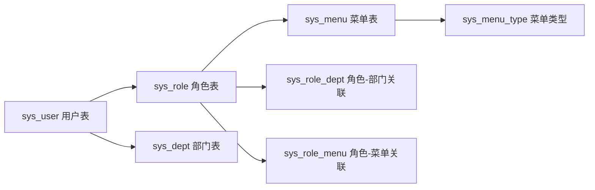
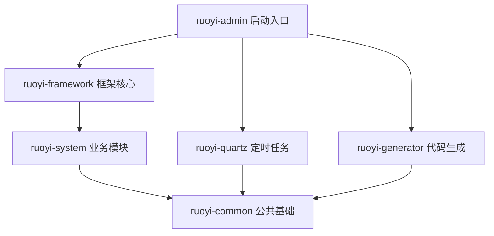

# 若依（RuoYi-Vue）项目零基础学习路径

## 整体路线图（7个阶段）


---

## 阶段 1：Java 语言基础（1~2 周）

> **目标**：能看懂 Java 代码，理解类、对象、方法、继承这些概念。

### 必须掌握的内容

| 知识点            | 学到什么程度                      | 在若依中的体现                                           |
| -------------- | --------------------------- | ------------------------------------------------- |
| 基本语法           | 变量、条件、循环、数组                 | 所有代码的基础                                           |
| 面向对象（OOP）      | 类、对象、继承、接口                  | `BaseEntity` 是所有实体类的父类；`BaseController` 是所有控制器的父类 |
| 集合框架           | List、Map、Set 的区别和用法         | 查询结果返回 `List<SysUser>`，参数传递用 `Map`                |
| 异常处理           | try-catch、自定义异常             | 项目里统一抛 `ServiceException`                         |
| 注解（Annotation） | 理解注解是什么、能干什么                | 项目中大量自定义注解（`@Log`、`@DataScope` 等）                 |
| 泛型             | 理解 `List<T>`、`Class<?>` 的含义 | 通用返回类型 `AjaxResult`，分页对象 `Page<T>`                |

### 学习建议
- 不需要从零学，如果已经会其他语言（Python/JS），重点看 Java 的**类、接口、继承**就够了
- 推荐资源：B站搜"Java 零基础入门"，挑一个 2~3 天的快速教程

---

## 阶段 2：数据库基础（3~5 天）

> **目标**：能写基本的 SQL，理解表结构。

### 必须掌握的内容

| 知识点    | 学到什么程度                            | 在若依中的体现                           |
| ------ | --------------------------------- | --------------------------------- |
| SQL 基础 | SELECT / INSERT / UPDATE / DELETE | MyBatis 的 XML 映射文件里全是 SQL         |
| 表关系    | 一对一、一对多、多对多                       | 用户-角色（多对多）、角色-菜单（多对多）、用户-部门（多对一）  |
| 建表语句   | 看懂字段类型、主键、外键                      | `sql/ry_20260417.sql` 就是整个系统的建表脚本 |

### 实操建议
- 把项目 `sql/` 目录下的 SQL 文件导入 MySQL，然后用 Navicat 或 IDEA 的数据库工具**浏览每一张表**
- 重点看这几张核心表的关系：



---

## 阶段 3：核心框架学习（2~3 周）

> **目标**：理解若依用到的每个技术"零件"是干什么的。

### 3.1 Spring Boot（核心中的核心）

| 概念        | 通俗理解                       | 在若依中的体现                                                |
| --------- | -------------------------- | ------------------------------------------------------ |
| IoC（控制反转） | 你不用 new 对象，Spring 帮你创建并管理  | `@Autowired` 自动注入                                      |
| DI（依赖注入）  | Spring 把需要的东西"送"到你手上       | Service 注入 Mapper，Controller 注入 Service                |
| Bean      | 被 Spring 管理的对象             | `@Component`、`@Service`、`@RestController` 标注的类都是 Bean  |
| 自动配置      | Spring Boot 帮你配好大部分东西，开箱即用 | `application.yml` 里只需少量配置                              |
| 配置文件      | 项目的"设置面板"                  | `application.yml`（通用配置）、`application-druid.yml`（数据库配置） |
在 Spring 框架的官方定义和绝大多数开发场景中，**被 Spring IoC（控制反转）容器所管理的对象，都统称为 Bean**。

### 3.2 Spring MVC（处理 HTTP 请求）

| 概念                | 通俗理解                | 在若依中的体现                           |
| ----------------- | ------------------- | --------------------------------- |
| Controller        | 接待员，接收前端请求          | `SysUserController` 处理用户相关的请求     |
| `@RequestMapping` | 门牌号，定义 URL 路径       | `@RequestMapping("/system/user")` |
| `@RequestBody`    | 拆包裹，JSON → Java 对象  | 前端发来的 JSON 自动变成 `SysUser` 对象      |
| `@ResponseBody`   | 打包回寄，Java 对象 → JSON | `@RestController` 自带此功能           |

### 3.3 MyBatis（操作数据库）

| 概念        | 通俗理解           | 在若依中的体现                                  |
| --------- | -------------- | ---------------------------------------- |
| Mapper 接口 | 定义"要做什么操作"     | `SysUserMapper` 定义了用户的所有数据库操作            |
| XML 映射文件  | 写"具体怎么做"的 SQL  | `SysUserMapper.xml` 里写着每条 SQL 语句         |
| 动态 SQL    | SQL 可以按需拼装     | `<if test="userName != null">` 有名字就加名字条件 |
| 结果映射      | 数据库行 → Java 对象 | `<resultMap>` 把表的列映射到对象属性                |

### 3.4 Spring Security + JWT（安全认证）

| 概念                 | 通俗理解            | 在若依中的体现                         |
| ------------------ | --------------- | ------------------------------- |
| 认证（Authentication） | "你是谁？" → 登录验证   | 用户名+密码 → 校验 → 返回 JWT Token      |
| 授权（Authorization）  | "你能干什么？" → 权限校验 | `@PreAuthorize` 检查是否有某个权限       |
| JWT Token          | 登录后的"通行证"       | 前端每次请求带上 Token，后端验证身份           |
| 过滤器链               | 层层安检            | 请求进来 → 过滤器链逐层检查 → 到达 Controller |

### 3.5 Redis（缓存）

| 概念 | 通俗理解 | 在若依中的体现 |
|---|---|---|
| 键值存储 | 一个"超级快的临时记事本" | 缓存验证码、Token、字典数据 |
| 过期时间 | 自动清理 | Token 30分钟后过期，需要重新登录 |

---

## 阶段 4：读懂若依的骨架结构（1 周）

> **目标**：理解项目的模块划分和请求处理全流程。

### 4.1 先搞清 6 个模块各自的角色

把若依想象成一个**公司**：

```
ruoyi-admin     → 公司大门（启动入口 + 所有对外的"窗口"Controller）
ruoyi-framework → 公司规章制度（安全、配置、切面、拦截器等核心机制）
ruoyi-system    → 业务部门（用户、角色、部门、菜单等业务的 Service + Mapper）
ruoyi-common    → 后勤仓库（通用工具类、基础实体、自定义注解，被所有模块依赖）
ruoyi-quartz    → 值班室（定时任务，比如每天凌晨清理日志）
ruoyi-generator → 文印室（代码生成器，根据数据库表自动生成增删改查代码）
```

**依赖关系**（谁依赖谁）：



### 4.2 追踪一个请求的完整旅程

以"查询用户列表"为例，理解请求从前端到数据库的完整链路：

```
前端点击"用户管理"
    ↓ HTTP GET /system/user/list
    ↓
【ruoyi-admin】SysUserController.list()
    ↓ @PreAuthorize 检查权限
    ↓ @Log 记录日志
    ↓
【ruoyi-system】ISysUserService.selectUserList()
    ↓
【ruoyi-system】SysUserMapper.selectUserList
    ↓
【ruoyi-system/resources/mapper】SysUserMapper.xml 里的 SQL
    ↓ SQL 经过 DataScope 拼接权限过滤条件
    ↓
MySQL 执行查询 → 返回数据 → 原路返回给前端
```

**实操建议**：打开 IDEA，在 `SysUserController.list()` 方法上打断点，启动项目，前端点击用户列表，**单步调试跟踪整个流程**。这是理解项目最有效的方式。

---

## 阶段 5：吃透核心业务代码（1~2 周）

> **目标**：能看懂每个功能模块的代码在做什么。

### 5.1 按这个顺序阅读代码（由简到难）

| 顺序  | 模块   | 重点看什么                      | 难度    |
| --- | ---- | -------------------------- | ----- |
| 1   | 字典管理 | 最简单的增删改查，理解标准 CRUD 模式      | ⭐     |
| 2   | 参数管理 | 同上，巩固 CRUD 模式              | ⭐     |
| 3   | 部门管理 | 树形结构（parent_id），理解递归查询     | ⭐⭐    |
| 4   | 菜单管理 | 树形结构 + 路由，理解前后端如何关联        | ⭐⭐    |
| 5   | 用户管理 | 涉及多表关联（用户-角色-部门），最复杂的 CRUD | ⭐⭐⭐   |
| 6   | 角色管理 | 权限分配，角色与菜单/部门的关联           | ⭐⭐⭐   |
| 7   | 登录认证 | JWT 生成/验证、Security 过滤器链    | ⭐⭐⭐⭐  |
| 8   | 数据权限 | `@DataScope` 切面如何动态拼接 SQL  | ⭐⭐⭐⭐⭐ |

### 5.2 每个模块都遵循同一套分层模式

不管哪个模块，代码都按这个结构组织：

```
Controller（接收请求）
    ↓ 调用
Service（业务逻辑）
    ↓ 调用
Mapper（数据库操作）
    ↓ 对应
XML 映射文件（SQL 语句）
```

**一旦你看懂了一个模块（推荐从"字典管理"开始），其他模块都是同样的套路，只是业务逻辑不同。**

---

## 阶段 6：上手二次开发（核心目标）

> **目标**：能独立新增一个完整的业务功能模块。

### 6.1 先用代码生成器（最快路径）

若依自带了代码生成器，能帮你自动生成 80% 的代码：

```
步骤：
1. 在 MySQL 中建好你的业务表（比如"档案信息表"）
2. 在若依的"代码生成"功能中导入这张表
3. 配置生成选项（模块名、包路径、菜单等）
4. 点击"生成" → 下载 ZIP 包
5. 解压后把代码复制到对应模块目录
6. 导入 SQL 菜单脚本
7. 重启项目 → 自动出现新功能的页面
```

### 6.2 理解生成的代码结构

生成的代码包含：

| 文件                    | 位置                     | 作用              |
| --------------------- | ---------------------- | --------------- |
| `XxxController.java`  | ruoyi-admin            | 接口入口，定义 URL 和权限 |
| `IXxxService.java`    | ruoyi-system           | 业务接口，定义方法签名     |
| `XxxServiceImpl.java` | ruoyi-system           | 业务实现，写具体逻辑      |
| `XxxMapper.java`      | ruoyi-system           | 数据库操作接口         |
| `XxxMapper.xml`       | ruoyi-system/resources | SQL 语句          |
| `Xxx.java`（domain）    | ruoyi-system           | 实体类，对应数据库表      |
| `index.vue`           | 前端                     | 列表页面            |
| `xxx.js`              | 前端 API                 | 接口调用            |
| SQL 菜单脚本              | sql/                   | 菜单和权限数据         |

### 6.3 二次开发常见场景

| 场景          | 需要改什么                                                          |
| ----------- | -------------------------------------------------------------- |
| 新增一个业务表的管理  | 建表 → 代码生成 → 微调                                                 |
| 给已有功能加字段    | 改表 → 改 domain → 改 Mapper XML → 改前端页面                           |
| 加一个新接口      | Controller 加方法 → Service 加方法 → Mapper 加 SQL                    |
| 加一个新的权限点    | 数据库 `sys_menu` 表加记录 → Controller 方法加 `@PreAuthorize`           |
| 加一个不需要登录的接口 | Controller 或方法上加 `@Anonymous`                                  |
| 给接口加操作日志    | 方法上加 `@Log(title = "xxx", businessType = BusinessType.INSERT)` |

---

## 阶段 7：进阶能力提升

> 当你已经能熟练做 CRUD 后，逐步深入这些方向：

| 方向       | 内容                | 对应项目中的实现                                          |
| -------- | ----------------- | ------------------------------------------------- |
| AOP 切面编程 | 自定义注解 + 切面拦截      | `LogAspect`、`DataScopeAspect`、`RateLimiterAspect` |
| 多数据源     | 动态切换主从库           | `@DataSource` + `DynamicDataSource`               |
| 异步任务     | 不阻塞主流程的后台操作       | `AsyncManager` 异步记录日志                             |
| 过滤器链     | Security 过滤器的工作原理 | `SecurityConfig`、`JwtAuthenticationTokenFilter`   |
| 定时任务     | Quartz 框架的使用      | `ruoyi-quartz` 模块                                 |
| 前端 Vue   | 页面开发、组件通信、路由      | 前端项目的 `views/` 和 `api/` 目录                        |

---

## 实操建议总结

| 方法 | 说明 |
|---|---|
| **打断点调试** | 这是理解代码最快的方式。在关键方法上打断点，看请求怎么一步步走完 |
| **先看生成代码，再看手写代码** | 代码生成器的输出是标准模板，看懂它就看懂了 80% 的项目 |
| **模仿 → 修改 → 创造** | 先照着已有模块抄一个新模块 → 改改字段和逻辑 → 完全自己写 |
| **不要试图一次全看懂** | 按上面的顺序，一次只攻一个模块 |
| **结合数据库看代码** | 打开 Navicat 对照着表结构看 Mapper XML 里的 SQL，事半功倍 |

**一句话总结**：Java 基础 → SQL 基础 → Spring Boot/MyBatis/Security 核心概念 → 读懂若依模块结构 → 从"字典管理"开始逐个击破业务代码 → 用代码生成器快速上手二次开发 → 逐步深入 AOP、安全、异步等高级主题。