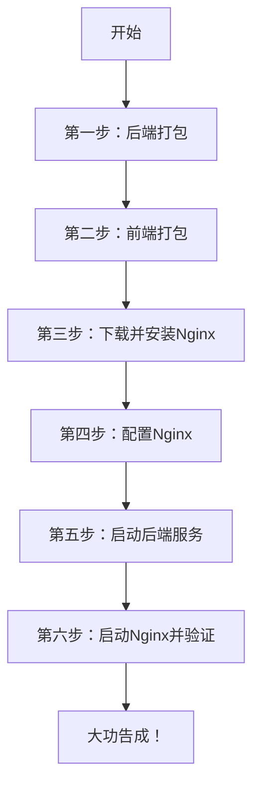

好的！我来为你整理一份**从零开始、在本机部署若依项目**的完整步骤指南。这份指南会整合我们整个对话中所有的操作和踩过的坑，你可以把它当作一份可执行的“操作手册”。

---

# 📘 若依项目本机部署完整指南（Windows版）

## 一、整体流程概览



---

## 二、详细操作步骤

### 第一步：后端打包

**目标**：将SpringBoot项目打成可执行的 `.jar` 文件。

1. **修改配置文件**
   - 打开 `ruoyi-admin` 模块下的 `application-druid.yml`
   - 确认数据库连接信息正确（本机部署用 `127.0.0.1` 或 `localhost`）：
   ```yaml
   master:
       url: jdbc:mysql://127.0.0.1:3306/ry-vue?useUnicode=true&characterEncoding=utf8
       username: root
       password: 你的MySQL密码
   ```
   - 打开 `application.yml`，确认Redis配置：
   ```yaml
   redis:
       host: 127.0.0.1
       port: 6379
   ```

2. **执行打包命令**
   - 在IDEA中打开项目，点击右侧 `Maven` 面板
   - 先点击 `clean`，再点击 `package`
   - 或者在项目根目录打开命令行，执行：
   ```bash
   mvn clean package -DskipTests
   ```

3. **找到打包结果**
   - 打包完成后，进入 `ruoyi-admin/target/` 目录
   - 找到 `ruoyi-admin.jar` 文件，复制到桌面或一个专门目录备用（比如 `D:\project\`）

> **新人避坑**：打包时如果报错，检查是否所有依赖都下载完整。可以用 `mvn clean install -DskipTests` 先安装依赖再打包。

---

### 第二步：前端打包

**目标**：将Vue项目编译成纯静态的 `dist` 文件夹。

1. **修改生产环境配置**
   - 在VS Code中打开前端项目
   - 找到 `.env.production` 文件，确认以下配置：
   ```
   VITE_APP_BASE_API = '/prod-api/'
   ```
   这个配置让前端所有API请求都发给Nginx，再由Nginx转发给后端。

2. **执行打包命令**
   - 在VS Code的终端中执行：
   ```bash
   npm run build:prod
   ```

3. **找到打包结果**
   - 打包完成后，项目根目录下会出现 `dist` 文件夹
   - 这就是所有前端静态文件，稍后要放到Nginx里

> **新人避坑**：打包时报 `内存不足` 错误，可以执行 `set NODE_OPTIONS=--max-old-space-size=4096` 增加内存限制后再打包。

---

### 第三步：下载并安装Nginx

**目标**：在本机安装Nginx Web服务器。

1. **下载Nginx**
   - 访问官网：`https://nginx.org/en/download.html`
   - 找到 `nginx/Windows-1.26.3`（稳定版），点击下载 `.zip` 文件

2. **解压安装**
   - 将下载的 `.zip` 文件解压到 `D:\devTool\nginx-1.26.3\`（或其他目录）
   - 解压后目录结构如下：
   ```
   nginx-1.26.3/
   ├── conf/
   │   └── nginx.conf       ← 配置文件（需要修改）
   ├── html/                ← 存放网页文件
   ├── logs/                ← 日志目录
   └── nginx.exe            ← 启动文件
   ```

3. **测试Nginx是否可用**
   - 双击 `nginx.exe`（窗口一闪而过，正常）
   - 浏览器访问 `http://localhost`
   - 看到 **"Welcome to nginx!"** 说明安装成功

> **新人避坑**：如果访问不了，检查Windows防火墙是否拦截了Nginx，允许访问即可。

---

### 第四步：配置Nginx

**目标**：让Nginx知道去哪里找前端页面，以及如何把API请求转发给后端。

1. **复制dist到Nginx目录**
   - 将第二步生成的整个 `dist` 文件夹
   - 复制到 `D:\devTool\nginx-1.26.3\html\` 目录下
   - 最终路径为：`D:\devTool\nginx-1.26.3\html\dist\`
   - 里面应该包含 `index.html` 和 `assets` 文件夹

2. **修改Nginx配置文件**
   - 用记事本打开 `D:\devTool\nginx-1.26.3\conf\nginx.conf`
   - 找到 `server { ... }` 部分，替换为以下内容：

   ```nginx
   server {
       listen       80;
       server_name  localhost;

       # 前端静态文件位置
       location / {
           root   html/dist;      # 指向dist文件夹
           index  index.html;
           try_files $uri $uri/ /index.html;   # 解决路由刷新404
       }

       # API请求转发到后端
       location /prod-api/ {
           proxy_set_header Host $http_host;
           proxy_set_header X-Real-IP $remote_addr;
           proxy_pass http://127.0.0.1:8080/;   # 转发到后端jar包
       }
   }
   ```

3. **验证配置文件语法**
   - 在Nginx目录下打开PowerShell（地址栏输入 `powershell` 回车）
   - 执行：
   ```powershell
   .\nginx -t
   ```
   - 显示 `syntax is ok` 和 `test is successful` 说明配置正确

> **新人避坑1**：`root html/dist;` 的路径是相对于Nginx安装目录的，不要写成 `D:/xxx` 这种绝对路径。
> **新人避坑2**：`proxy_pass http://127.0.0.1:8080/;` 末尾的斜杠 `/` 很重要，不能漏掉。

---

### 第五步：启动后端服务

**目标**：让后端jar包在后台运行。

1. **打开命令行**
   - Win + R，输入 `cmd`，回车
   - 进入jar包所在目录，例如：
   ```cmd
   cd D:\project
   ```

2. **启动jar包**
   - **方式一（前台运行，适合调试）**：
   ```cmd
   java -jar ruoyi-admin.jar
   ```
   看到 `Started RuoYiApplication in X seconds` 说明启动成功，**保持窗口不要关**。

   - **方式二（后台运行，关窗口也不停）**：
   ```cmd
   cd /d E:\打包部署文件
   start javaw -jar ruoyi-admin.jar
   ```

3. **验证后端是否启动成功**
   - 浏览器访问 `http://localhost:8080`（后端端口）
   - 如果看到404页面（因为没设置欢迎页），说明后端已启动
   - 或者查看日志文件 `logs.out` 中是否有启动成功的信息

> **新人避坑**：如果端口8080被占用，执行 `netstat -ano | findstr 8080` 查看占用进程，然后 `taskkill /pid 进程ID /f` 杀掉它。

---

### 第六步：启动Nginx并验证

**目标**：启动Nginx，访问完整系统。

1. **启动Nginx**
   - 在Nginx目录的PowerShell中执行：
   ```powershell
   start .\nginx.exe
   ```
   - 执行后没有任何提示，这是正常的

2. **重载配置（确保最新配置生效）**
   ```powershell
   .\nginx -s reload
   ```
   - 同样没有提示就是成功了

3. **验证访问**
   - 打开浏览器，访问 `http://localhost`
   - 应该能看到若依的登录页面
   - 输入账号 `admin`，密码 `admin123`
   - 登录成功后看到后台管理界面

> **新人避坑：浏览器缓存问题**！
> - 如果看到的是 **"Welcome to nginx!"** 而不是若依登录页
> - 说明浏览器缓存了旧页面
> - **解决方法**：
>   1. 按 `Ctrl + Shift + R` 强制刷新
>   2. 或打开无痕模式窗口访问 `http://localhost`
>   3. 或手动清除浏览器缓存

---

## 三、常用命令速查表

| 操作           | 命令                                      | 说明          |
| :----------- | :-------------------------------------- | :---------- |
| 启动Nginx      | `start .\nginx.exe`                     | 在Nginx目录下执行 |
| 停止Nginx      | `.\nginx -s stop`                       | 立即停止        |
| 优雅停止         | `.\nginx -s quit`                       | 处理完当前请求后停止  |
| 重载配置         | `.\nginx -s reload`                     | 修改配置后执行     |
| 检查配置语法       | `.\nginx -t`                            | 验证配置文件是否正确  |
| 查看加载的配置      | `.\nginx -T`                            | 查看完整配置      |
| 强制结束所有Nginx  | `taskkill /f /im nginx.exe`             | Nginx卡死时使用  |
| 查看Nginx是否在运行 | `tasklist /fi "imagename eq nginx.exe"` | 看到进程列表说明在运行 |
| 启动后端（后台）     | `start javaw -jar ruoyi-admin.jar`      | 关窗口服务不停     |
| 启动后端（前台）     | `java -jar ruoyi-admin.jar`             | 调试时使用       |
| 查看8080端口占用   | `netstat -ano \| findstr 8080`          | 找端口冲突的进程    |
| windows下关闭进程 | `taskkill /PID 10696 /F`                |             |

---

## 四、常见问题排查清单

| 问题现象 | 可能原因 | 解决方法 |
| :--- | :--- | :--- |
| 页面显示Welcome to nginx | 配置未生效 / 浏览器缓存 | `Ctrl+Shift+R` 强制刷新；或换无痕模式 |
| 页面白屏 / 报错 | 后端没启动 | 确认jar包在运行，查看日志 |
| 验证码不显示 | Redis没连上 | 检查Redis是否启动，配置是否正确 |
| 登录后无数据 | 数据库没连上 | 检查MySQL是否启动，密码是否正确 |
| 端口被占用 | 其他程序占用了8080或80 | 杀掉占用进程或修改端口 |
| Nginx启动后立即消失 | 端口被占用 | 检查80端口是否被其他程序占用 |

---

## 五、总结

恭喜你完成本机部署！🎉 你现在已经掌握了：

1. ✅ 后端打包（`jar` 包）
2. ✅ 前端打包（`dist` 文件夹）
3. ✅ Nginx的下载、配置和启动
4. ✅ 后端服务的启动和管理
5. ✅ 浏览器缓存问题的解决方法

这套流程和你以后部署到**云服务器**的原理完全一样，只是到时候需要把 `127.0.0.1` 改成服务器的真实IP地址。

**建议你把这份指南保存下来**，下次部署到云服务器时，直接对照着操作，就能少走很多弯路了！👍


我目前是将我的电脑部署成服务器，将工程挂后台运行，同一局域网下，我用手机登录了http://172.16.21.87可以登录。
进行git测试，修改了RuoYiApplication.java，添加了一行显示代码