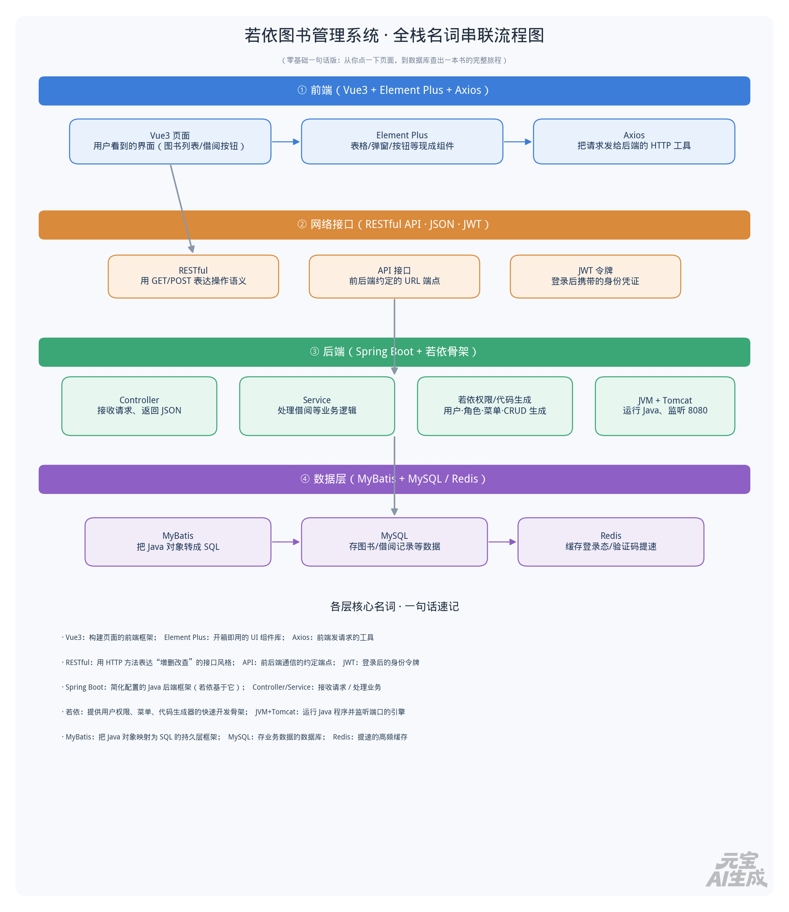

# 若依图书管理系统 · 全栈名词速查与串联

> [!TIP] 阅读指南
> 你将以若依为骨架做一个**图书管理系统**。下面把涉及的**数据库 + 后端 + 前端**名词按层拆开，每个**一句话**说清它是谁、干什么；最后用一张流程图把它们串成一次完整的“查图书”请求。

## 🖥️ 一、前端（用户看到的界面）

| 名词 | 一句话概括 |
| :--- | :--- |
| **Vue 3** | 构建若依用户界面的前端框架，负责把数据渲染成页面。 |
| **Element Plus** | 基于 Vue3 的 UI 组件库，表格、弹窗、按钮等开箱即用。 |
| **Vite** | 前端构建工具，提供 `npm run dev` 热更新和打包成 `dist`。 |
| **Axios** | 前端用来向后端 API 发请求、取数据的 HTTP 客户端。 |
| **npm** | Node.js 的包管理器，负责下载前端依赖到 `node_modules`。 |

## 🌐 二、网络接口（前后端沟通的约定）

| 名词 | 一句话概括 |
| :--- | :--- |
| **API 接口** | 后端暴露的 URL 端点，前端通过它拿到数据。 |
| **RESTful** | 用 HTTP 方法（GET/POST/PUT/DELETE）表达“增删改查”的接口风格。 |
| **JSON** | 前后端之间传输数据的通用文本格式（轻量、易读）。 |
| **JWT** | 登录后签发的加密令牌，后续请求靠它证明“我是谁”。 |
| **跨域 / 代理** | 前后端端口不同产生的限制，开发期由 Vite 的 `proxy` 转发解决。 |

## ⚙️ 三、后端（若依 + Spring Boot，跑在 JVM 上）

| 名词 | 一句话概括 |
| :--- | :--- |
| **JDK / JVM** | JDK 提供编译与运行环境，JVM 是真正执行 Java 字节码的引擎。 |
| **Spring Boot** | 简化配置的 Java 后端框架，若依整体基于它构建。 |
| **Tomcat（内嵌）** | Java Web 服务器，接收 HTTP 请求并交给后端处理，默认监听 8080。 |
| **Controller** | 接收前端请求、调用业务、返回 JSON 的“门面”。 |
| **Service** | 承载借阅、查询等核心业务逻辑的地方。 |
| **若依（RuoYi）** | 提供用户/角色/菜单权限、代码生成器等基础能力的快速开发骨架。 |
| **CRUD** | 增删改查，图书管理系统的核心功能组合。 |

## 🗄️ 四、数据层（数据库 + 缓存）

| 名词 | 一句话概括 |
| :--- | :--- |
| **MyBatis** | 数据访问框架，把 Java 对象映射成 SQL 去操作数据库。 |
| **MySQL** | 关系型数据库，持久化存储图书、借阅记录等核心数据。 |
| **Redis** | 内存缓存数据库，缓存登录态、验证码等，提升响应速度。 |

## 🔄 五、一次“查图书”的完整旅程（流程图）

> [!EXAMPLE] 请求串联
> 你在页面点“查询” → Axios 发请求 → API 进入 Controller → Service 处理业务 → MyBatis 执行 SQL → MySQL 返回数据 → 原路回到页面渲染。

## 🎯 六、给零基础的学习顺序建议

1. **先跑通若依**：用若依代码生成器生成一张“图书表”的 CRUD，建立全局概念。
2. **再改前端**：在 `ruoyi-ui/src/views` 下找到生成的页面，改文案和字段。
3. **后改后端**：在 `ruoyi-system` 的 Service 里加业务（如“库存低于 5 本预警”）。
4. **最后碰数据**：用 IDEA/Navicat 连 MySQL，理解表结构与 MyBatis 的 SQL 映射。

> [!NOTE] 一句话总纲
> **前端（Vue）发起请求 → 后端（Spring Boot + 若依）处理业务 → MyBatis 操作 MySQL/Redis → 返回 JSON → 前端渲染**。所有代码用 Git 管理，依赖由 Maven（后端）和 npm（前端）自动下载。
