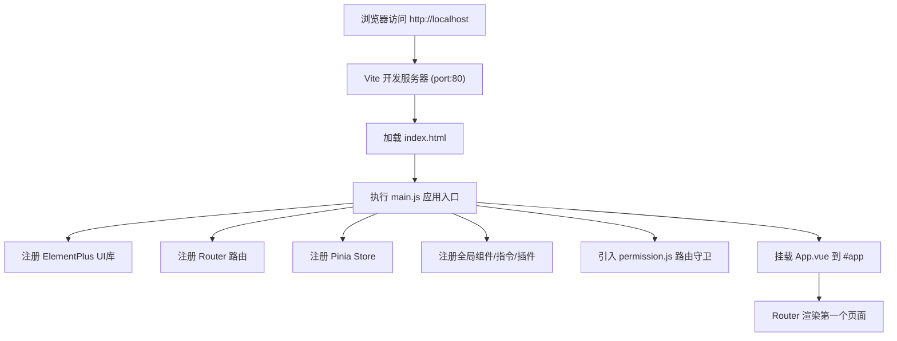
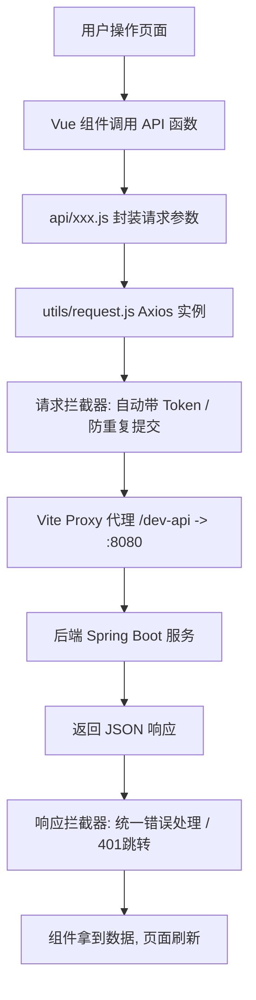
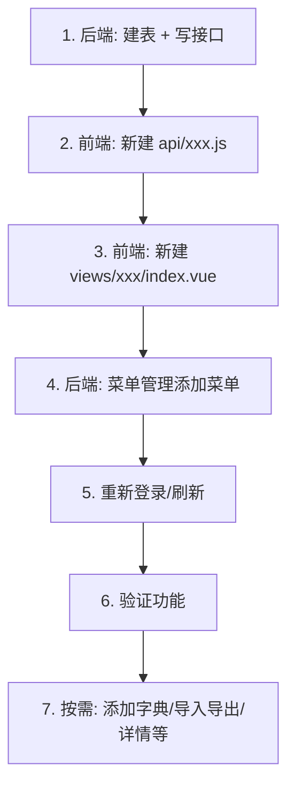
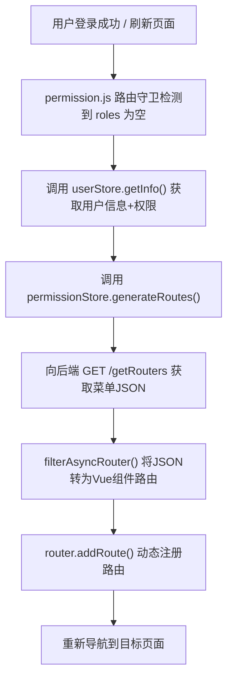

# 若依（RuoYi-Vue3）前端工程 —— 深度解析与二次开发指南

---

## 维度一：前置知识术语表

| 术语名称          | 英文全称                               | 通俗解释                                                                                | 生活类比                                                       |
| ------------- | ---------------------------------- | ----------------------------------------------------------------------------------- | ---------------------------------------------------------- |
| Vue 3         | Vue.js 3                           | 一个用来搭建网页界面的 JavaScript 框架。它帮你把页面拆成一个个可复用的"积木块"，你只需要关心每个积木块长什么样、有什么功能，Vue 帮你把它们拼在一起。 | 就像乐高积木的底板——你负责设计每块积木的形状和颜色，底板帮你把它们稳固地拼在一起。                 |
| Vite          | Vite（法语"快"）                        | 一个前端项目的"构建工具"。它负责把你写的源代码（多个文件、样式、图片等）翻译成浏览器能看懂的网页，而且速度非常快。                          | 类比：你写了一封信（源代码），Vite 就是邮局，帮你把信快速打包、投递到收件人（浏览器）手里。           |
| Vue Router    | Vue Router                         | 网页的"导航系统"。当你在浏览器地址栏输入不同路径（比如 `/login`、`/system/user`）时，它决定展示哪个页面。                   | 类比：酒店的前台导引——你说要去"301房间"（URL），前台（Router）就带你到对应的房间（页面）。      |
| Pinia         | Pinia                              | 全局的"数据仓库"。页面上有些数据（比如当前登录的用户信息）需要在很多地方用到，Pinia 就是集中存放和管理这些数据的地方。                     | 类比：公司的公告栏——公司的重要通知（用户信息、权限列表）贴在公告栏上，所有员工（页面组件）都可以去看。       |
| Axios         | Axios                              | 一个帮你发送网络请求的工具库。前端需要向后端"要数据"或"发数据"时，Axios 就是那个"快递员"。                                 | 类比：你（前端）打电话给外卖店（后端）点餐，Axios 就是那通电话——帮你传达需求，再把结果带回来。        |
| Element Plus  | Element Plus                       | 一套现成的 UI 组件库。提供了按钮、表格、对话框、输入框等"预制件"，你不需要从零开始画每个按钮和表格。                               | 类比：装修房子时用的预制柜子、预制门——你不需要自己造，直接选合适的尺寸安装上去就行。                |
| SCSS/SASS     | Syntactically Awesome Style Sheets | CSS 的"增强版"。CSS 是用来给网页"化妆上色"的语言，SCSS 在 CSS 基础上增加了变量、嵌套等更方便的功能。                       | 类比：CSS 是普通手动牙刷，SCSS 是电动牙刷——核心功能一样，但用起来更方便高效。               |
| 指令（Directive） | Directive                          | Vue 中一种特殊的"标记"，放在 HTML 元素上，可以给元素添加特殊行为。比如 `v-hasPermi` 可以控制按钮是否显示。                  | 类比：门上的"门禁卡感应器"——只有刷了对应的卡（有权限），门（按钮）才会打开。                   |
| 拦截器           | Interceptor                        | 在请求发出之前或收到响应之后，自动执行的一段"检查逻辑"。比如自动给每个请求带上 Token（身份令牌）。                               | 类比：小区门卫——你出门（请求发出）时他检查你带没带门禁卡（Token），你回来（响应收到）时他检查快递有没有问题。 |
| 代理（Proxy）     | Proxy                              | 开发环境中的一个"中间人"。前端开发时请求发给 localhost:80，代理帮你把请求转发给后端 localhost:8080，解决跨域问题。            | 类比：你在学校（前端）想给另一所学校（后端）的同学送信，但直接送不了，需要通过校际邮递员（代理）中转。        |
| 组件（Component） | Component                          | 页面中一个独立、可复用的"积木块"。一个页面由多个组件拼装而成，比如分页组件、上传组件、字典标签组件等。                                | 类比：积木玩具中的每一块——轮子、车身、车窗，各自独立，但能拼成一辆完整的汽车。                   |
| 字典（Dict）      | Dictionary                         | 系统中用来存储"固定选项"的数据。比如"性别"只有"男/女"两个选项，"状态"只有"正常/停用"，这些选项就是字典。                          | 类比：餐厅的固定菜单——菜名和编号是固定的，服务员（页面）根据菜单（字典）给客人展示选项。              |
| Token         | Token（令牌）                          | 用户登录成功后，后端发给前端的一个"身份凭证"。之后每次请求都要带上它，后端通过它确认"你是谁"。                                   | 类比：游乐场的腕带——你买了票（登录）后戴上腕带（Token），之后玩每个项目（请求接口）工作人员都看你的腕带。   |
| 路由守卫          | Navigation Guard                   | 路由的"保安"。在用户切换到某个页面之前，守卫会检查用户是否已登录、是否有权限，不满足条件就拦截。                                   | 类比：写字楼的闸机——你刷卡（Token）才能进去，没刷卡就被拦住跳转到一楼大厅（登录页）。             |
| 动态路由          | Dynamic Routes                     | 不是写死在代码里的路由，而是根据用户的权限，从后端获取菜单数据后"现场生成"的路由。不同角色看到的菜单不同。                              | 类比：VIP 俱乐部——普通会员只能进普通区域，VIP 会员能进 VIP 区域，你看到的"地图"取决于你的会员等级。 |

---

## 维度二：专有名词通俗化

> 以下术语在文档中首次出现时给出解释，后续不再重复。

- **`baseURL`（基础地址）**：所有 API 请求的"公共前缀"。比如 baseURL 是 `/dev-api`，你请求 `/login` 实际变成 `/dev-api/login`。类比：你家的地址是"XX市XX路1号"，"XX市XX路"就是 baseURL，"1号"是具体接口路径。

- **`defineStore`（定义仓库）**：Pinia 中创建一个"数据仓库"的方法。类比：在公司里开辟一个"专属文件柜"，取个名字（如 `'user'`），以后存取用户信息都去这个柜子。

- **`import.meta.glob`（批量导入）**：Vite 提供的一种"批量扫描文件"的能力。`import.meta.glob('./../../views/**/*.vue')` 意思是"把 views 文件夹下所有的 .vue 文件都找出来，准备好随时加载"。类比：图书馆把所有书架上的书都登记在册，读者要哪本就快速找到递给他。

- **`keep-alive`（缓存保活）**：Vue 的一个内置功能，切换页面时不销毁之前的页面组件，而是"冻结保存"起来。切回来时直接恢复，不用重新加载。类比：你看电视时换台（切换页面），keep-alive 就像"暂停"键——回来时从上次停的地方继续，而不是从头开始。

- **`append-to-body`（追加到 body）**：Element Plus 对话框（Dialog）的一个属性，让对话框直接挂载到网页的最外层，避免被父容器的样式遮挡。类比：你在房间里放了一个大气球（对话框），如果房间太小气球被挡住，就把它放到客厅（body）去。

- **`v-model`（双向绑定）**：Vue 的语法糖，让表单输入和数据变量自动保持同步。你在输入框里打字，变量自动更新；变量改了，输入框里的内容也自动变。类比：镜子和你的动作——你笑（改数据），镜子里的你也笑（界面更新）；你皱眉，镜子里也皱眉，完全同步。

- **`ref` / `reactive`（响应式数据）**：Vue 3 中让数据"活起来"的方法。用它们包裹的数据一旦变化，页面会自动刷新对应的部分。`ref` 适合基本类型（数字、字符串），`reactive` 适合对象。类比：给数据装了一个"电子显示屏"——数据一变，屏幕上的显示自动跟着变。

- **`computed`（计算属性）**：基于其他数据"自动计算"出来的值。当依赖的数据变化时，它会自动重新计算。类比：超市的电子秤——你放上苹果（输入数据），价格自动算出来（计算结果），换一批苹果价格自动重算。

- **`watch` / `watchEffect`（侦听器）**：监听某个数据的变化，一旦变化就执行指定的操作。类比：你设置了手机闹钟（watch），到了设定时间（数据变化），闹钟自动响（执行操作）。

- **`onMounted`（挂载完成）**：组件加载到页面上之后自动执行的"初始化钩子"。类比：店铺开业（组件挂载完成）后，第一件事就是摆货、开灯（onMounted 里的初始化逻辑）。

- **`getCurrentInstance().proxy`（当前实例代理）**：在 `<script setup>` 中获取当前组件实例的方式，通过它可以访问模板引用（`$refs`）、全局方法等。类比：你在公司里的"工位"——通过工位（proxy）你可以拿到桌上的文件（$refs）、拨打内线电话（全局方法）。

---

## 维度三：整体架构与关系图解

### 3.1 工程目录层次结构图

```mermaid
graph TD
    ROOT["frontend/ 工程根目录"]
    ROOT --> SRC["src/ 源代码目录"]
    ROOT --> VITE_CFG["vite.config.js 构建配置"]
    ROOT --> ENV[".env.* 环境变量"]
    ROOT --> PKG["package.json 依赖管理"]

    SRC --> MAIN["main.js 应用入口"]
    SRC --> APP["App.vue 根组件"]
    SRC --> PERM["permission.js 路由守卫"]
    SRC --> SETTINGS["settings.js 系统默认设置"]
    SRC --> ROUTER["router/ 路由配置"]
    SRC --> STORE["store/ 全局状态仓库"]
    SRC --> API["api/ 接口请求层"]
    SRC --> VIEWS["views/ 页面视图层"]
    SRC --> COMPONENTS["components/ 公共组件层"]
    SRC --> LAYOUT["layout/ 布局框架"]
    SRC --> UTILS["utils/ 工具函数"]
    SRC --> PLUGINS["plugins/ 全局插件"]
    SRC --> DIRECTIVE["directive/ 自定义指令"]
    SRC --> ASSETS["assets/ 静态资源"]

    STORE --> STORE_MODS["store/modules/"]
    STORE_MODS --> S_USER["user.js 用户状态"]
    STORE_MODS --> S_PERM2["permission.js 路由权限"]
    STORE_MODS --> S_APP["app.js 应用UI状态"]
    STORE_MODS --> S_SET["settings.js 系统设置"]
    STORE_MODS --> S_TAGS["tagsView.js 标签页"]
    STORE_MODS --> S_DICT["dict.js 字典缓存"]
    STORE_MODS --> S_LOCK["lock.js 锁屏状态"]

    VIEWS --> V_SYS["system/ 系统管理"]
    VIEWS --> V_MON["monitor/ 系统监控"]
    VIEWS --> V_TOOL["tool/ 系统工具"]
    VIEWS --> V_LOGIN["login.vue 登录页"]
    VIEWS --> V_INDEX["index.vue 首页"]

    API --> A_LOGIN["login.js 登录接口"]
    API --> A_MENU["menu.js 菜单接口"]
    API --> A_SYS["system/ 系统管理接口"]
    API --> A_MON["monitor/ 监控接口"]
```




### 3.2 启动与请求流转流程





### 3.3 通俗类比总结

> **整个前端工程就像一家大型酒店：**
>
> - **`main.js`** 是酒店的"开业典礼"——把所有部门、设备、系统一次性启动和注册好。
> - **`router/`** 是酒店的"楼层导引系统"——客人说要去哪个房间，导引系统带路。
> - **`permission.js`** 是酒店大门的"安保检查"——没房卡（Token）的客人只能去大堂（登录页），有房卡才能进房间。
> - **`store/`** 是酒店的"中央信息台"——所有客人的信息（谁入住了、什么权限、偏好设置）都集中存放在这里。
> - **`api/`** 是酒店的"电话总机"——需要外部服务（后端数据）时，通过总机拨出去。
> - **`utils/request.js`** 是总机的"接线员"——每次打电话前自动帮你查身份（带 Token），接到回复后帮你处理错误。
> - **`layout/`** 是酒店的"建筑框架"——大堂、走廊、电梯间、侧边栏导航，所有房间都嵌在这个框架里。
> - **`views/`** 是酒店的"一间间客房"——每个房间有不同的功能（用户管理、角色管理、日志查看等）。
> - **`components/`** 是酒店的"共享设备间"——洗衣机、投影仪、打印机（分页器、上传组件、富文本编辑器），任何房间都可以借用。
> - **`plugins/`** 是酒店的"增值服务包"——消息提醒、文件下载、权限验证等便捷服务。
> - **`directive/`** 是房间里的"智能开关"——只有刷了权限卡的人才能看到或操作某些按钮。

---

## 维度四：核心文件/模块深度剖析

### 4.1 `main.js` —— 应用入口（酒店开业典礼）

**角色定位**：整个应用的启动点。所有框架、组件、插件、指令都在这里完成注册，相当于"开业前把所有设备调试好"。

**核心逻辑**：
1. **创建 Vue 应用实例**：`createApp(App)` —— 建造酒店主体建筑。
2. **注册全局方法**：如 `useDict`（查字典）、`parseTime`（格式化时间）、`resetForm`（重置表单）等，挂到 `globalProperties` 上，让所有组件都能通过 `proxy.xxx` 调用。
3. **注册全局组件**：`Pagination`（分页器）、`DictTag`（字典标签）、`Editor`（富文本）等，在任何页面都能直接使用 `<Pagination />` 而不需要单独 import。
4. **注册 Element Plus**：UI 组件库整体引入，设置中文语言包和默认尺寸。
5. **引入 `permission.js`**：激活路由守卫。

**修改影响**：
- 如果你在这里注册了新的全局组件，所有页面都可以直接使用。
- 如果删掉了 `app.use(ElementPlus)`，所有 Element Plus 的按钮、表格等组件都会失效。
- 如果在这里挂载了新的全局方法，所有 `.vue` 文件都可以通过 `proxy.方法名` 调用。

---

### 4.2 `permission.js` —— 路由守卫（酒店安保系统）

**角色定位**：每次页面跳转前自动执行的"安检门"。

**核心逻辑**：
1. **检查 Token**：有 Token（已登录）→ 继续走流程；无 Token → 跳转到登录页。
2. **白名单放行**：`/login` 和 `/register` 不需要登录就能访问。
3. **锁屏检查**：如果用户锁了屏，所有操作都重定向到锁屏页面。
4. **首次进入拉取用户信息**：当 `roles.length === 0`（说明是刷新页面或首次登录），调用 `getInfo()` 获取用户信息和权限，再调用 `generateRoutes()` 从后端获取菜单数据，动态生成路由并注册。
5. **`NProgress`**：页面顶部蓝色进度条，提示用户"正在加载"。

**修改影响**：
- 修改 `whiteList` 可以控制哪些页面不需要登录就能访问。
- 修改权限拉取逻辑会影响所有页面的菜单显示。
- 如果这里出了 bug，整个系统的页面跳转都会出问题。

---

### 4.3 `utils/request.js` —— HTTP 请求封装（电话总机 + 接线员）

**角色定位**：所有后端请求的"必经之路"。

**核心逻辑**：
1. **创建 Axios 实例**：设置 `baseURL`（开发环境为 `/dev-api`）和超时时间（10 秒）。
2. **请求拦截器**：
   - 自动在请求头带上 `Authorization: Bearer {token}`。
   - GET 请求的参数自动拼接到 URL 上（解决某些后端框架的兼容问题）。
   - **防重复提交**：POST/PUT 请求在 1 秒内重复提交相同数据会被拦截。
3. **响应拦截器**：
   - `code === 200`：正常返回数据。
   - `code === 401`：Token 过期，弹出"重新登录"对话框。
   - `code === 500`：弹出错误提示。
   - `code === 601`：弹出警告提示。
   - 网络错误 / 超时：统一转换为友好的中文提示。
4. **`download` 方法**：封装了文件下载逻辑，带 loading 遮罩层，自动处理 blob 数据。

**修改影响**：
- 修改 `baseURL` 或代理配置会影响所有接口请求。
- 修改 Token 处理方式会影响整个认证流程。
- 修改防重复提交的 `interval` 时间会影响所有 POST/PUT 操作。

---

### 4.4 `store/modules/permission.js` —— 动态路由生成（VIP 楼层权限系统）

**角色定位**：根据后端返回的菜单数据，动态生成当前用户能访问的路由。

**核心逻辑**：
1. **`getRouters()`**：调用后端接口获取当前用户的菜单数据（JSON 格式）。
2. **`filterAsyncRouter()`**：将后端返回的"路由字符串"转换为真正的 Vue 组件。比如后端返回 `component: 'Layout'`，前端就替换为真正的 Layout 组件；返回 `component: 'system/user/index'`，就通过 `loadView()` 找到对应的 `.vue` 文件。
3. **`loadView()`**：利用 `import.meta.glob` 预扫描 `views/` 下所有 `.vue` 文件，通过路径匹配找到对应组件。
4. **`filterDynamicRoutes()`**：处理硬编码的 `dynamicRoutes`（如"分配角色"页面），根据权限过滤。

**修改影响**：
- 修改此文件会直接影响所有页面的菜单显示和路由访问。
- 如果新增的页面路径不在 `views/` 扫描范围内，路由将无法加载。

---

### 4.5 `views/system/user/index.vue` —— 典型 CRUD 页面（标准客房样板）

**角色定位**：用户管理页面，是项目中最具代表性的"增删改查"（CRUD）页面。

**核心逻辑**：
1. **搜索区域**：`el-form` + `el-input` + `el-select` 组成条件查询表单。
2. **操作按钮栏**：新增、修改、删除、导入、导出按钮，每个按钮都通过 `v-hasPermi` 控制权限。
3. **数据表格**：`el-table` 展示用户列表，支持多选、状态切换、行内操作。
4. **分页组件**：`<pagination>` 组件处理分页。
5. **对话框**：`el-dialog` 用于新增/修改用户的表单。
6. **数据流**：`onMounted` → `getList()` → `listUser()` (API) → 数据填充表格。

**这个页面展示的标准模式**：
- 用 `useDict()` 获取字典数据（如性别、状态选项）。
- 用 `proxy.addDateRange()` 处理日期范围查询。
- 用 `proxy.$modal.confirm()` 弹出确认框。
- 用 `proxy.download()` 导出 Excel。
- 用 `v-hasPermi` 控制按钮权限。

---

### 4.6 `layout/` —— 页面布局框架（酒店建筑骨架）

**角色定位**：所有业务页面的"外壳"。

**组成**：
- **`Sidebar`**（侧边栏）：左侧菜单导航，支持深色/浅色主题，支持展开/折叠。
- **`Navbar`**（顶部导航栏）：面包屑、全屏、用户头像、设置入口。
- **`TagsView`**（标签页）：顶部标签页导航，支持关闭、刷新、关闭其他/左侧/右侧。
- **`AppMain`**（主内容区）：业务页面的渲染区域，支持 `keep-alive` 缓存。
- **`Settings`**（设置面板）：右侧抽屉，可调整主题色、导航模式、标签页样式等。
- **`TopNav`**（顶部菜单）：当导航模式为"混合"或"纯顶部"时使用。

**修改影响**：
- 修改 Layout 会影响所有业务页面的外观和交互。
- 新增侧边栏功能（如消息通知角标）需要修改 Sidebar 组件。

---

## 维度五：二次开发快速上手指南（核心重点）

### 5.1 核心目录/文件速查字典

#### 5.1.1 最常修改的目录

| 目录/文件 | 修改频率 | 说明 |
|----------|---------|------|
| `src/views/` | ★★★★★ | 新增/修改业务页面都在这里 |
| `src/api/` | ★★★★★ | 新增/修改接口请求都在这里 |
| `src/router/index.js` | ★★★☆☆ | 添加公共路由或动态路由配置 |
| `src/store/modules/` | ★★★☆☆ | 需要新增全局状态管理时修改 |
| `src/components/` | ★★☆☆☆ | 新增可复用的公共组件 |
| `src/utils/` | ★★☆☆☆ | 新增工具函数 |
| `src/directive/` | ★☆☆☆☆ | 新增自定义指令（一般很少改） |
| `src/layout/` | ★☆☆☆☆ | 修改整体布局（一般很少改） |

#### 5.1.2 场景化寻址指南

| 你想做什么 | 去改哪个文件 |
|-----------|------------|
| 修改登录页面样式/逻辑 | `src/views/login.vue` |
| 修改登录接口调用 | `src/api/login.js` |
| 修改请求头 Token 格式 | `src/utils/request.js`（请求拦截器部分） |
| 修改接口超时时间 | `src/utils/request.js`（`timeout` 配置） |
| 修改后端接口地址 | `vite.config.js` 的 `baseUrl` + `.env.development` 的 `VITE_APP_BASE_API` |
| 修改防重复提交间隔 | `src/utils/request.js`（`interval` 配置，默认 1000ms） |
| 修改侧边栏菜单样式 | `src/layout/components/Sidebar/` |
| 修改顶部导航栏 | `src/layout/components/Navbar.vue` |
| 修改标签页行为 | `src/store/modules/tagsView.js` |
| 修改系统默认设置（标题、主题等） | `src/settings.js` |
| 修改全局组件（分页器、字典标签等） | `src/components/` 对应目录 |
| 修改权限按钮的显示/隐藏 | 页面中搜索 `v-hasPermi` 指令 |
| 修改页面路由守卫逻辑 | `src/permission.js` |
| 修改动态路由生成逻辑 | `src/store/modules/permission.js` |
| 新增一个全局可用的工具方法 | `src/utils/` 新建或修改文件，然后在 `main.js` 中挂载到 `globalProperties` |
| 新增一个全局可用的组件 | `src/components/` 新建组件，然后在 `main.js` 中 `app.component()` 注册 |
| 修改字典数据获取逻辑 | `src/utils/dict.js` + `src/store/modules/dict.js` |
| 修改用户信息存储 | `src/store/modules/user.js` |
| 修改 Token 存取方式 | `src/utils/auth.js` |
| 修改打包输出配置 | `vite.config.js` 的 `build` 部分 |
| 修改开发服务器端口 | `vite.config.js` 的 `server.port`（当前为 80） |

---

### 5.2 典型业务链路追踪

#### 以"用户列表分页查询"为例，完整数据流转过程：

```
用户在页面上点击"搜索"按钮
         │
         ▼
┌─────────────────────────────────────────────┐
│ ① 前端页面 views/system/user/index.vue      │
│   handleQuery() → getList()                 │
│   调用 listUser(proxy.addDateRange(         │
│     queryParams, dateRange))                │
│   queryParams = { pageNum:1, pageSize:10,   │
│     userName:'张', status:'0', ... }        │
└──────────────────┬──────────────────────────┘
                   │
                   ▼
┌─────────────────────────────────────────────┐
│ ② API 层 api/system/user.js                 │
│   listUser(query) → request({               │
│     url: '/system/user/list',               │
│     method: 'get', params: query            │
│   })                                        │
└──────────────────┬──────────────────────────┘
                   │
                   ▼
┌─────────────────────────────────────────────┐
│ ③ 请求封装 utils/request.js                  │
│   请求拦截器执行：                            │
│   - 自动添加 Authorization: Bearer {token}   │
│   - GET 参数拼接到 URL                       │
│   - 检查防重复提交                            │
└──────────────────┬──────────────────────────┘
                   │
                   ▼
┌─────────────────────────────────────────────┐
│ ④ Vite 代理 vite.config.js                   │
│   /dev-api/system/user/list                  │
│   → 代理转发 →                               │
│   http://localhost:8080/system/user/list     │
└──────────────────┬──────────────────────────┘
                   │
                   ▼
┌─────────────────────────────────────────────┐
│ ⑤ 后端 Spring Boot                          │
│   Controller → Service → Mapper → 数据库     │
│   返回 JSON: { code:200, rows:[...],         │
│                total: 56 }                   │
└──────────────────┬──────────────────────────┘
                   │
                   ▼
┌─────────────────────────────────────────────┐
│ ⑥ 响应拦截器 utils/request.js                │
│   检查 code === 200 → return Promise.resolve │
│   (res.data) 即 { code:200, rows, total }   │
│   如果 code === 401 → 弹出重新登录对话框      │
│   如果 code === 500 → 弹出错误消息            │
└──────────────────┬──────────────────────────┘
                   │
                   ▼
┌─────────────────────────────────────────────┐
│ ⑦ 前端页面拿到数据                           │
│   userList.value = res.rows                  │
│   total.value = res.total                    │
│   loading.value = false                      │
│   → el-table 自动渲染新数据                   │
│   → pagination 显示总条数                     │
└─────────────────────────────────────────────┘
```


**每一层的具体职责**：

| 层级 | 文件 | 职责 | 类比 |
|------|------|------|------|
| ① 页面层 | `views/xxx/index.vue` | 组织界面、响应用户操作、展示数据 | 餐厅服务员——接待客人、端菜上桌 |
| ② API 层 | `api/xxx.js` | 封装请求参数、指定接口地址和方法 | 点菜单——写清楚要什么菜、几号桌 |
| ③ 请求层 | `utils/request.js` | 统一加 Token、处理错误、防重复提交 | 餐厅总机——每通电话都自动录音（日志）、查身份（Token） |
| ④ 代理层 | `vite.config.js` | 开发环境转发请求到后端 | 外卖中转站——把订单从前端转到后厨 |
| ⑤ 后端层 | Spring Boot | 业务逻辑、数据库操作 | 后厨——做菜的地方 |
| ⑥ 响应层 | `utils/request.js` | 统一处理返回结果 | 质检员——检查送回来的菜有没有问题 |

---

### 5.3 新增业务模块标准 SOP（以"档案管理"为例）

假设你要新增一个"档案管理"模块，以下是从 0 到 1 的标准步骤：

#### 第一步：后端准备（前提条件）

> 假设后端同事已经完成了：
> - 数据库表 `archive_info` 已创建
> - 后端 Controller/Service/Mapper 已写好
> - 接口路径为 `/archive/info/list`（GET）、`/archive/info`（POST/PUT/DELETE）
> - 权限标识为 `archive:info:list`、`archive:info:add`、`archive:info:edit`、`archive:info:remove`、`archive:info:export`
> - 后端菜单管理已添加"档案管理"菜单

#### 第二步：新建 API 文件

**文件路径**：`src/api/archive/info.js`

**命名规范**：`src/api/{模块名}/{功能名}.js`

```javascript
import request from '@/utils/request'

export function listInfo(query) {
  return request({
    url: '/archive/info/list',
    method: 'get',
    params: query
  })
}

export function getInfo(id) {
  return request({
    url: '/archive/info/' + id,
    method: 'get'
  })
}

export function addInfo(data) {
  return request({
    url: '/archive/info',
    method: 'post',
    data: data
  })
}

export function updateInfo(data) {
  return request({
    url: '/archive/info',
    method: 'put',
    data: data
  })
}

export function delInfo(id) {
  return request({
    url: '/archive/info/' + id,
    method: 'delete'
  })
}
```


#### 第三步：新建页面目录和文件

**目录结构**：
```
src/views/archive/
  └── info/
      └── index.vue       ← 主列表页面
```


**命名规范**：`src/views/{模块名}/{功能名}/index.vue`

> **重要**：`views/` 下的路径必须与后端菜单配置中 `component` 字段的值一致。比如后端菜单配置的 component 是 `archive/info/index`，那么文件路径必须是 `src/views/archive/info/index.vue`。因为 `permission.js` 中的 `loadView()` 是通过路径匹配来查找组件的。

#### 第四步：编写页面代码

直接复制 `src/views/system/user/index.vue` 或更简单的页面（如 `src/views/system/post/index.vue`）作为模板，按以下结构修改：

```vue
<template>
  <div class="app-container">
    <!-- 1. 搜索表单 -->
    <el-form :model="queryParams" ref="queryRef" :inline="true" v-show="showSearch" label-width="68px">
      <el-form-item label="档案名称" prop="archiveName">
        <el-input v-model="queryParams.archiveName" placeholder="请输入档案名称"
          clearable style="width: 240px" @keyup.enter="handleQuery" />
      </el-form-item>
      <el-form-item>
        <el-button type="primary" icon="Search" @click="handleQuery">搜索</el-button>
        <el-button icon="Refresh" @click="resetQuery">重置</el-button>
      </el-form-item>
    </el-form>

    <!-- 2. 操作按钮栏 -->
    <el-row :gutter="10" class="mb8">
      <el-col :span="1.5">
        <el-button type="primary" plain icon="Plus" @click="handleAdd"
          v-hasPermi="['archive:info:add']">新增</el-button>
      </el-col>
      <el-col :span="1.5">
        <el-button type="success" plain icon="Edit" :disabled="single"
          @click="handleUpdate" v-hasPermi="['archive:info:edit']">修改</el-button>
      </el-col>
      <el-col :span="1.5">
        <el-button type="danger" plain icon="Delete" :disabled="multiple"
          @click="handleDelete" v-hasPermi="['archive:info:remove']">删除</el-button>
      </el-col>
      <el-col :span="1.5">
        <el-button type="warning" plain icon="Download" @click="handleExport"
          v-hasPermi="['archive:info:export']">导出</el-button>
      </el-col>
      <right-toolbar v-model:showSearch="showSearch" @queryTable="getList"></right-toolbar>
    </el-row>

    <!-- 3. 数据表格 -->
    <el-table v-loading="loading" :data="infoList" @selection-change="handleSelectionChange">
      <el-table-column type="selection" width="55" align="center" />
      <el-table-column label="档案编号" align="center" prop="id" />
      <el-table-column label="档案名称" align="center" prop="archiveName" />
      <el-table-column label="创建时间" align="center" prop="createTime" width="160">
        <template #default="scope">
          <span>{{ parseTime(scope.row.createTime) }}</span>
        </template>
      </el-table-column>
      <el-table-column label="操作" align="center" width="150" class-name="small-padding fixed-width">
        <template #default="scope">
          <el-button link type="primary" icon="Edit" @click="handleUpdate(scope.row)"
            v-hasPermi="['archive:info:edit']">修改</el-button>
          <el-button link type="primary" icon="Delete" @click="handleDelete(scope.row)"
            v-hasPermi="['archive:info:remove']">删除</el-button>
        </template>
      </el-table-column>
    </el-table>

    <!-- 4. 分页 -->
    <pagination v-show="total > 0" :total="total" v-model:page="queryParams.pageNum"
      v-model:limit="queryParams.pageSize" @pagination="getList" />

    <!-- 5. 新增/修改对话框 -->
    <el-dialog :title="title" v-model="open" width="500px" append-to-body>
      <el-form :model="form" :rules="rules" ref="infoRef" label-width="80px">
        <el-form-item label="档案名称" prop="archiveName">
          <el-input v-model="form.archiveName" placeholder="请输入档案名称" />
        </el-form-item>
      </el-form>
      <template #footer>
        <div class="dialog-footer">
          <el-button type="primary" @click="submitForm">确 定</el-button>
          <el-button @click="cancel">取 消</el-button>
        </div>
      </template>
    </el-dialog>
  </div>
</template>

<script setup name="ArchiveInfo">
import { listInfo, getInfo, addInfo, updateInfo, delInfo } from "@/api/archive/info"

const { proxy } = getCurrentInstance()

const infoList = ref([])
const open = ref(false)
const loading = ref(true)
const showSearch = ref(true)
const ids = ref([])
const single = ref(true)
const multiple = ref(true)
const total = ref(0)
const title = ref("")

const data = reactive({
  form: {},
  queryParams: {
    pageNum: 1,
    pageSize: 10,
    archiveName: undefined
  },
  rules: {
    archiveName: [{ required: true, message: "档案名称不能为空", trigger: "blur" }]
  }
})

const { queryParams, form, rules } = toRefs(data)

function getList() {
  loading.value = true
  listInfo(queryParams.value).then(res => {
    infoList.value = res.rows
    total.value = res.total
    loading.value = false
  })
}

function handleQuery() {
  queryParams.value.pageNum = 1
  getList()
}

function resetQuery() {
  proxy.resetForm("queryRef")
  handleQuery()
}

function handleSelectionChange(selection) {
  ids.value = selection.map(item => item.id)
  single.value = selection.length != 1
  multiple.value = !selection.length
}

function reset() {
  form.value = {
    id: undefined,
    archiveName: undefined
  }
  proxy.resetForm("infoRef")
}

function handleAdd() {
  reset()
  open.value = true
  title.value = "添加档案"
}

function handleUpdate(row) {
  reset()
  const id = row.id || ids.value
  getInfo(id).then(res => {
    form.value = res.data
    open.value = true
    title.value = "修改档案"
  })
}

function submitForm() {
  proxy.$refs["infoRef"].validate(valid => {
    if (valid) {
      if (form.value.id != undefined) {
        updateInfo(form.value).then(() => {
          proxy.$modal.msgSuccess("修改成功")
          open.value = false
          getList()
        })
      } else {
        addInfo(form.value).then(() => {
          proxy.$modal.msgSuccess("新增成功")
          open.value = false
          getList()
        })
      }
    }
  })
}

function handleDelete(row) {
  const delIds = row.id || ids.value
  proxy.$modal.confirm('是否确认删除编号为"' + delIds + '"的数据项？').then(() => {
    return delUser(delIds)
  }).then(() => {
    getList()
    proxy.$modal.msgSuccess("删除成功")
  }).catch(() => {})
}

function handleExport() {
  proxy.download("archive/info/export", {
    ...queryParams.value,
  }, `archive_${new Date().getTime()}.xlsx`)
}

function cancel() {
  open.value = false
  reset()
}

onMounted(() => {
  getList()
})
</script>
```


#### 第五步：配置后端菜单（让路由和权限生效）

在后台管理系统的"菜单管理"中添加：

| 配置项 | 值 |
|-------|---|
| 菜单名称 | 档案管理 |
| 路由地址 | archive |
| 组件路径 | `archive/info/index`（**必须与 views 下的路径一致**） |
| 权限标识 | `archive:info:list` |

> 添加菜单后，重新登录或刷新页面，`permission.js` 会自动从后端拉取新菜单并生成路由。

#### 第六步：验证

1. 重新登录系统
2. 左侧菜单出现"档案管理"
3. 点击进入列表页面
4. 测试新增、修改、删除、导出功能

#### 完整开发顺序流程图




---

### 5.4 核心机制与避坑指南

#### 5.4.1 本工程特有的核心机制

##### ① 权限控制机制（双重控制）

**指令方式**（用于按钮/元素的显示隐藏）：
```html
<!-- 只有拥有 archive:info:add 权限的用户才能看到这个按钮 -->
<el-button v-hasPermi="['archive:info:add']">新增</el-button>

<!-- 只有 admin 角色才能看到 -->
<el-button v-hasRole="['admin']">管理</el-button>
```


**编程方式**（用于 JS 逻辑判断）：
```javascript
// 通过插件方式调用
proxy.$auth.hasPermi('archive:info:add')
proxy.$auth.hasRole('admin')
```


**原理**：`v-hasPermi` 指令在元素挂载时，从 `useUserStore().permissions` 中检查是否包含指定权限。如果没有权限，**直接从 DOM 中移除该元素**（不是隐藏，是彻底删除）。

##### ② 字典数据机制

```javascript
// 在页面中获取字典数据
const { sys_normal_disable, sys_user_sex } = useDict("sys_normal_disable", "sys_user_sex")
```


**原理**：`useDict()` 首先检查 `dictStore` 中是否已缓存。如果有，直接返回；如果没有，调用后端接口 `/system/dict/data/type/{dictType}` 获取，然后缓存到 store 中。后续再调用同一字典类型时不会重复请求。

**使用方式**：
```html
<el-option v-for="dict in sys_normal_disable" :key="dict.value"
  :label="dict.label" :value="dict.value" />
```


##### ③ 防重复提交机制

在 `request.js` 的请求拦截器中实现。对 POST/PUT 请求，将 `{url, data, time}` 存入 `sessionStorage`。如果 1 秒内（可配置）对同一 URL 发送相同数据，会被拦截并提示"数据正在处理，请勿重复提交"。

**如何关闭某个请求的防重复**：
```javascript
request({
  url: '/xxx',
  method: 'post',
  headers: { repeatSubmit: false }  // 关闭防重复
})
```


##### ④ 全局方法挂载机制

在 `main.js` 中通过 `app.config.globalProperties` 挂载的工具方法，可以在所有组件中通过 `proxy.xxx` 调用：

| 方法 | 来源 | 用途 |
|------|------|------|
| `proxy.useDict()` | `utils/dict.js` | 获取字典数据 |
| `proxy.download()` | `utils/request.js` | 下载/导出文件 |
| `proxy.parseTime()` | `utils/ruoyi.js` | 格式化时间 |
| `proxy.resetForm()` | `utils/ruoyi.js` | 重置表单 |
| `proxy.addDateRange()` | `utils/ruoyi.js` | 添加日期范围参数 |
| `proxy.handleTree()` | `utils/ruoyi.js` | 构造树形数据 |
| `proxy.selectDictLabel()` | `utils/ruoyi.js` | 回显字典标签 |
| `proxy.getConfigKey()` | `api/system/config.js` | 获取系统配置参数 |
| `proxy.$modal` | `plugins/modal.js` | 消息/确认/通知/遮罩 |
| `proxy.$auth` | `plugins/auth.js` | 权限验证 |
| `proxy.$tab` | `plugins/tab.js` | 页签操作 |
| `proxy.$cache` | `plugins/cache.js` | 缓存操作 |
| `proxy.$download` | `plugins/download.js` | 文件下载 |

##### ⑤ 动态路由加载机制




##### ⑥ 页面缓存机制（keep-alive）

路由 `meta` 中的 `noCache` 属性控制页面是否被缓存。默认所有页面都会被缓存（切换时不重新加载）。

```javascript
// 如果不想某个页面被缓存
{
  path: 'xxx',
  component: ...,
  meta: { noCache: true }  // 每次进入都会重新执行
}
```


> **注意**：路由的 `name` 必须和 Vue 组件的 `name` 一致，`keep-alive` 才能正常工作。在 `<script setup>` 中通过 `<script setup name="XxxPage">` 设置。

---

#### 5.4.2 极易踩坑的注意事项

##### 坑 1：新增页面的路径必须和后端菜单配置完全一致

`views/` 下的文件路径必须与后端菜单管理中配置的 `组件路径` 完全一致。例如：
- 后端配置 `component: 'archive/info/index'`
- 前端文件必须是 `src/views/archive/info/index.vue`

否则 `loadView()` 无法匹配到组件，页面会白屏。

##### 坑 2：路由 name 必须和组件 name 一致

`keep-alive` 通过 `name` 来识别组件。如果路由配置中的 `name: 'ArchiveInfo'` 和组件的 `<script setup name="ArchiveInfo">` 不一致，缓存会失效，每次切换页面都会重新加载。

##### 坑 3：v-hasPermi 是"删除 DOM"而不是"隐藏"

`v-hasPermi` 指令在元素挂载后（`mounted` 钩子）执行权限检查。如果无权限，直接 `removeChild` 删除 DOM 元素。这意味着：
- 它只在元素**首次挂载**时检查一次，不会动态响应权限变化。
- 如果权限数据还没加载完，按钮可能先显示后被删除，造成"闪烁"。

##### 坑 4：Token 存储在 Cookie 中

Token 使用 `js-cookie` 存储在浏览器 Cookie 中（键名 `Admin-Token`）。注意：
- Cookie 没有设置过期时间，关闭浏览器后 Token 就失效了。
- 如果修改了 Token 的存储方式（如改为 localStorage），需要同时修改 `auth.js` 和 `request.js`。

##### 坑 5：开发环境代理路径前缀

开发环境中，所有 API 请求的 baseURL 是 `/dev-api`，Vite 代理会将其去掉再转发给后端：
```javascript
'/dev-api': {
  target: 'http://localhost:8080',
  rewrite: (p) => p.replace(/^\/dev-api/, '')
}
```

如果你新增的接口路径以 `/dev-api` 开头但忘了配置代理，会报 404。

##### 坑 6：全局方法只能在 Options API 风格中使用

`app.config.globalProperties` 挂载的方法，在 `<script setup>` 中需要通过 `getCurrentInstance().proxy` 来获取：
```javascript
const { proxy } = getCurrentInstance()
proxy.parseTime(...)   // ✅ 正确
proxy.$modal.msgSuccess(...)  // ✅ 正确
parseTime(...)  // ❌ 错误，这样找不到
```


##### 坑 7：字典数据是异步加载的

`useDict()` 返回的数据是异步获取的，在组件初始化时字典数据可能还是空数组。如果你需要在 `onMounted` 中使用字典数据，要注意它可能还没加载完。Element Plus 的 `el-option` 等组件可以自动响应字典数据的后续更新，但如果你用字典数据做其他逻辑判断，需要留意时序问题。

##### 坑 8：修改 settings.js 后需要清除浏览器缓存

`settings.js` 中的部分配置会被存储到 `localStorage`（如主题色、导航模式等）。修改 `settings.js` 的默认值后，如果浏览器中已有缓存，默认值不会生效。开发时需要手动清除浏览器 localStorage。

##### 坑 9：`<script setup>` 中 name 属性的写法

本项目使用了 `unplugin-vue-setup-extend-plus` 插件，支持在 `<script setup>` 中直接写 `name`：
```html
<script setup name="User">
```

这个 `name` 不是 Vue 原生支持的，而是插件提供的。如果更换了构建工具或插件，这个写法可能失效。

##### 坑 10：导出功能依赖后端接口

前端的 `proxy.download()` 方法会调用后端的导出接口，返回文件流（blob）。如果后端接口返回的是 JSON 错误信息而不是文件流，前端会解析 blob 为文本并弹出错误提示。确保后端导出接口的响应类型正确。

---

> **总结**：这个前端工程是一个标准的若依（RuoYi）Vue3 后台管理系统模板，结构清晰、模式统一。90% 的二次开发工作都是"复制一个现有页面 → 改 API 路径 → 改字段名 → 在后端配菜单"这样的套路。掌握了 `views/system/user/index.vue` 这个"样板房"，你就掌握了整个项目的开发节奏。