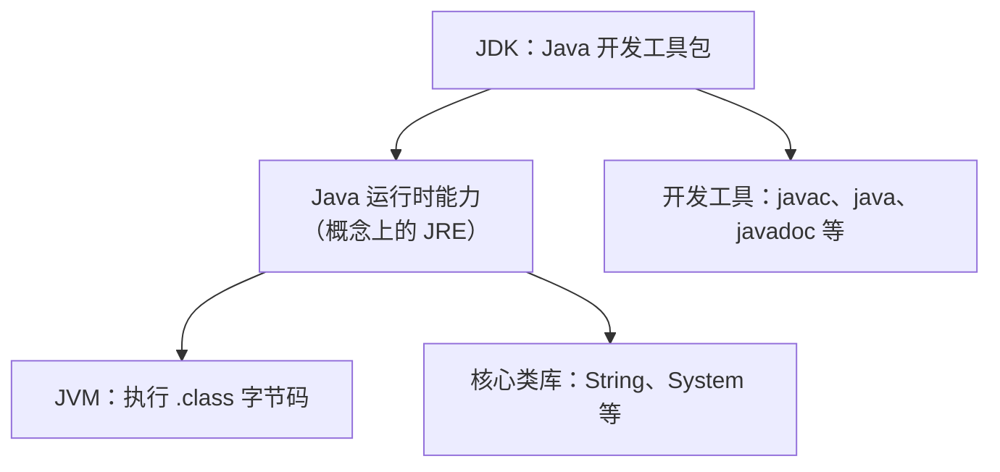
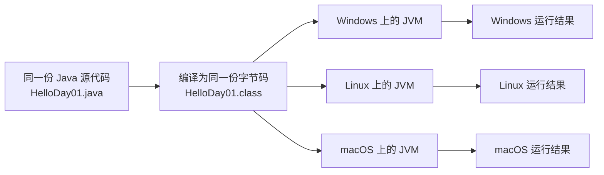

# Day 01：Java 入门学习资料与操作

## 知识点速记（完成当天任务后用于复习）

### 1. Java 程序如何运行

```text
HelloDay01.java（你写的源代码）
        ↓ 编译
HelloDay01.class（Java 字节码）
        ↓ JVM 执行
控制台输出结果
```

- `.java`：程序员阅读和编写的 Java 源文件。
- `.class`：Java 编译后生成的字节码文件。
- JVM：Java Virtual Machine，负责在当前电脑上执行 `.class` 字节码；不同系统各自适配的 JVM，是 Java 程序可跨平台运行的关键机制之一。

### 2. JDK、JRE、JVM 的关系

| 名称 | 一句话解释 | 今天的用途 |
|---|---|---|
| JDK | Java 开发工具包，包含开发工具和运行 Java 所需的运行时能力。 | 用 IDEA 写、编译、运行 Java。 |
| JRE | Java 运行环境（用于理解运行时组成的概念）。 | 指 JVM、标准类库等运行能力。 |
| JVM | 执行 Java 字节码的虚拟机。 | 实际运行 `.class` 文件。 |

初学阶段可以简单记作：**开发装 JDK；程序运行由 JVM 完成。**

> Java 17 补充：这里的 JRE 是帮助理解运行时组成的概念。你已经安装 JDK 17，**不需要另外寻找或安装独立的 JRE，也不需要另外安装独立的 JVM**；JDK 已提供编译工具，并包含运行 Java 程序所需的 JVM 和标准类库等能力。Java 9 以后，通常也不会再看到旧版本那种单独的 `jre` 安装目录。

### 3. Java 类和程序入口

```java
public class HelloDay01 {
    public static void main(String[] args) {
        System.out.println("Hello Java");
    }
}
```

- `public class HelloDay01`：定义一个名为 `HelloDay01` 的公开顶级类；此时文件名必须是 `HelloDay01.java`。
- `main` 方法：普通 Java 程序开始执行的位置。
- `System.out.println(...)`：把括号中的内容输出到控制台，并换行。
- Java 区分大小写；普通语句以英文分号 `;` 结束；字符串必须使用英文双引号 `"`。

### 4. 变量和常用类型

变量是“有名称、能保存数据、并且有固定类型的容器”。声明格式：

```java
数据类型 变量名 = 值;
```

| 类型 | 适合保存 | 本项目示例 |
|---|---|---|
| `String` | 文本（它是引用类型，不是基本类型） | 档案名称、档案编号、密级。 |
| `int` | 没有小数的整数 | 保管年限、档案数量。 |
| `long` | 范围更大的整数 | 附件原始大小（按字节保存）。 |
| `double` | 有小数的数 | 把字节换算为 MB 后用于显示。 |
| `boolean` | 只有真/假 | 是否已借出、是否允许借阅。 |

### 5. Debug 的作用

Debug 不是报错时才使用。它会让程序在断点处暂停，使你看到代码运行到哪里、变量当时是什么值。

| 操作 | 快捷键 | 意义 |
|---|---|---|
| 打断点 | 点击行号左侧 | 指定程序暂停的位置。 |
| Debug 启动 | Shift + F9 | 以可暂停、可观察的方式运行。 |
| 单步跳过 | F8 | 执行当前行，不进入方法内部。 |
| 继续运行 | F9 | 继续到下一个断点或程序结束。 |

## 视频与文档重点整理（完成当天学习后复习）

本节提炼今天指定视频和文档中最值得保留的“结论型知识”。它不是新的学习任务；完成当天视频、文档和练习后回看即可。

### 1. JDK、JRE、JVM 的包含关系

> 这是初学阶段的**概念关系图**，不是 Java 17 安装目录的精确物理结构：JDK 提供开发工具；运行 Java 程序需要 JVM 和标准类库等运行能力。



| 部分 | 你今天应形成的理解 | 项目中的例子 |
|---|---|---|
| JVM | 在当前电脑上执行 `.class` 字节码。 | IDEA 启动若依后端时，JVM 在运行 `RuoYiApplication.class`。 |
| 核心类库 | Java 已经准备好的常用能力。 | `String`、`System.out.println` 都来自类库。 |
| 开发工具 | 把源码编译、运行、生成文档的工具。 | IDEA 底层调用 JDK 能力编译和运行程序。 |

### 2. “JVM 跨平台”是常见但不准确的说法

正确结论是：**能够跨平台的是 Java 程序，不是同一个 JVM 程序本体。** 在目标系统具备兼容的 Java 运行时、且程序没有依赖特定操作系统原生库的前提下，同一份字节码通常可以在不同系统运行。



- Windows、Linux、macOS 各自需要适配本系统的 JVM。
- 同一份 `.class` 字节码可以交给不同系统上的 JVM 运行。
- 所以日常说“Java 跨平台”，意思是 Java 程序通常不必为每个系统重新写一份业务代码。

### 3. 源代码、字节码和运行的分工

| 名称 | 扩展名 | 谁关心它 | 作用 |
|---|---|---|---|
| 源代码 | `.java` | 程序员 | 人可以阅读、修改的代码。 |
| 字节码 | `.class` | JVM | 编译后的中间结果。 |
| 控制台输出 | 无固定扩展名 | 用户/开发者 | 程序实际运行的可见结果。 |

关键命令的概念（IDEA 会替你执行，不要求今天用命令行操作）：

```text
javac HelloDay01.java    # 编译：.java → .class
java HelloDay01          # 运行：JVM 执行 .class
```

### 4. Java 程序最小结构

```java
public class HelloDay01 {       // 公开顶级类：文件名必须是 HelloDay01.java
    public static void main(String[] args) {  // 入口：程序从这里开始
        System.out.println("Hello Java");    // 语句：输出内容
    }
}
```

今天只需先记住：**类名和文件名一致；`main` 是入口；语句末尾有分号；字符串用英文双引号。**

### 5. 变量是“带类型的业务数据”

```java
String archiveName = "采购合同";
int retentionYears = 10;
boolean borrowed = false;
```

| 代码片段 | 含义 | 对应档案业务 |
|---|---|---|
| `String archiveName` | 名为 `archiveName` 的文本变量。 | 档案名称。 |
| `int retentionYears` | 名为 `retentionYears` 的整数变量。 | 保管年限。 |
| `boolean borrowed` | 名为 `borrowed` 的真/假变量。 | 是否借出。 |

### 6. Debug 不是“修错专用”

Debug 的本质是：让程序在你指定的代码行暂停，你再观察当时变量的真实值。今天看到 `archiveName`、`retentionYears`、`borrowed`，以后就能用同一种方式查看若依请求参数、数据库查询条件和业务状态。

### 7. 常量、字面量与 `final`：三个容易混淆的词

教材中“常量”的例子，本质上大多是**字面量（literal）**：直接写在代码里的固定值。字面量本身不能改变；变量可以被重新赋值。

```java
int retentionYears = 10;           // 10 是整数字面量；retentionYears 是变量
retentionYears = 20;               // 变量可以改为 20

final int MAX_RETENTION_YEARS = 30; // final 变量只能赋值一次
// MAX_RETENTION_YEARS = 50;        // 编译错误
```

| 字面量类型 | 写法 | 说明 |
|---|---|---|
| 字符串字面量 | `"采购合同"` | 双引号包裹，类型为 `String`。 |
| 整数字面量 | `10`、`1000` | 默认类型是 `int`。 |
| 小数字面量 | `1.5` | 默认类型是 `double`。 |
| 字符字面量 | `'A'`、`'中'` | 单引号包裹，类型为 `char`；只能表示一个字符。 |
| 布尔字面量 | `true`、`false` | 类型为 `boolean`。 |
| 空字面量 | `null` | 表示空引用；只能赋给引用类型，不能赋给 `int`、`boolean` 等基本类型。 |

**易混点：** `true`、`false`、`null` 不能用作变量名，但严格说它们是字面量，不是 Java 关键字。

### 8. 变量、赋值和作用域

“变量是内存中的存储空间”可以作为入门理解；更准确地说，变量是**有名称、类型和作用域的数据声明**，Java 运行时负责具体内存管理。

```java
int archiveCount = 10;  // 声明并初始化
archiveCount = 11;      // 重新赋值
```

局部变量的三条规则：

1. 同一作用域内不能重复声明同名局部变量。
2. 可以在一条语句中声明多个同类型变量，例如 `int total = 10, borrowed = 2;`；但实际项目推荐一行一个变量，便于阅读和调试。
3. 局部变量在使用前必须已经赋值；否则编译错误。

变量只在自己的作用域内可用。今天先把一对大括号 `{ }` 理解成一个代码范围：

```java
if (true) {
    int overdueCount = 3;
    System.out.println(overdueCount); // 正确：仍在同一对大括号内
}
// System.out.println(overdueCount);  // 错误：变量已超出作用域
```

> 补充：今天写的都是**局部变量**。以后类中的字段有默认值，而局部变量没有默认值；初学阶段统一养成“声明时就赋值”的习惯。

### 9. 标识符、关键字与命名规范

标识符是你给类、变量、方法起的名字，例如 `archiveName`、`ArchiveRecord`。

| 规则 | 正确示例 | 错误示例 | 原因 |
|---|---|---|---|
| 可由字母、数字、下划线组成 | `archive_2026` | `archive-2026` | 连字符 `-` 是减号运算符。 |
| 不能以数字开头 | `archive1` | `1archive` | 变量名开头必须是 Java 字母。 |
| 不能使用关键字、布尔/空字面量 | `archiveType` | `class`、`true`、`null` | 它们已有语言含义。 |
| 区分大小写 | `archiveName`、`ArchiveName` | 不可混为同一个名字 | Java 大小写敏感。 |

- `$` 与 `_` 从语法上可以出现在标识符中，但项目代码中不要用 `$`；JDK 17 中单独一个 `_` 也不能作为变量名。
- 变量、方法：小驼峰，例如 `archiveName`、`calculateOverdueDays`。
- 类：大驼峰，例如 `ArchiveRecord`、`BorrowApplication`。
- 常量（以后学习 `static final`）：全大写 + 下划线，例如 `MAX_FILE_SIZE`。

### 10. Java 的 8 种基本数据类型

Java 是静态类型语言：变量使用前必须先确定类型。基本类型共 8 种；`String` 很常用，但它是引用类型。

| 分类 | 类型 | 位数 | 取值范围/值 | Day 01 选择建议 |
|---|---|---:|---|---|
| 整数 | `byte` | 8 | -128 到 127 | 很少主动使用。 |
| 整数 | `short` | 16 | -32,768 到 32,767 | 很少主动使用。 |
| 整数 | `int` | 32 | -2,147,483,648 到 2,147,483,647 | 普通计数、年限首选。 |
| 整数 | `long` | 64 | -2^63 到 2^63 - 1 | 文件字节数、较大编号或时间戳。 |
| 小数 | `float` | 32 | 绝对值最大约 3.4E38 | 很少主动使用；字面量需加 `F`。 |
| 小数 | `double` | 64 | 绝对值最大约 1.8E308 | 一般小数计算首选。 |
| 字符 | `char` | 16 | 一个 UTF-16 代码单元 | 单个字符，例如 `'A'`。 |
| 布尔 | `boolean` | 由 JVM 实现决定 | 仅 `true` 或 `false` | 是否借出、是否允许。 |

```java
long fileSizeBytes = 1_572_864L; // long 字面量建议加大写 L
float completionRate = 0.8F;     // float 字面量必须加 F 或 f
double displaySizeMb = 1.5;      // 小数字面量默认就是 double
char archiveLevel = 'A';
boolean borrowed = false;
String archiveName = "采购合同"; // String 不是基本类型
```

**类型选择重点：**

- 整数默认先用 `int`；数值可能很大时使用 `long`。
- 小数默认先用 `double`；不要用 `float/double` 保存金额，金额以后使用 `BigDecimal`。
- 文件大小保存“字节数”用 `long`；“1.5 MB”只是界面展示值。
- `char` 是一个字符，`String` 是一串字符；`'A'` 与 `"A"` 的类型不同。

### 11. Day 01 重点、易混点、易面试点

| 类型   | 必须回答的问题                  | 正确答案要点                                                                     |
| ---- | ------------------------ | -------------------------------------------------------------------------- |
| 重点   | JDK、JRE、JVM 的关系？         | JDK 用于开发，且包含运行所需能力；JVM 执行字节码；JRE 用于理解运行环境组成。JDK 17 不需另装独立 JRE，也不需另装独立 JVM。 |
| 重点   | Java 为什么跨平台？             | 同一字节码可交给不同系统上各自适配的 JVM 执行。                                                 |
| 易混   | `String` 是基本类型吗？         | 不是，它是引用类型。                                                                 |
| 易混   | `null` 是什么？              | 空引用字面量，不是字符串，也不能赋给基本类型。                                                    |
| 易混   | `true/false/null` 是关键字吗？ | 严格说是字面量；但都不能作标识符。                                                          |
| 易混   | `char` 和 `String` 区别？    | `char` 用单引号表示一个字符；String 用双引号表示文本。                                         |
| 易混   | `int` 与 `long` 的区别？      | 都是整数；long 范围更大，字面量通常加 `L`。                                                 |
| 面试入门 | 局部变量为什么不能先用后赋值？          | Java 编译器的确定赋值规则会阻止这种代码。                                                    |
| 面试入门 | `double` 能用于金额吗？         | 不建议，浮点数可能有精度问题；金额通常用 `BigDecimal`。                                         |

## 今天只完成什么

今天只学 Java 的最小起步：JDK/JRE/JVM、变量、基本数据类型、输出，并学会在 IDEA 中用断点查看变量。

**今天不学：** 数组、面向对象中的类与对象、构造方法、SQL、Spring Boot、若依源码修改、JVM 内存和垃圾回收。今天会写最小的 `class`，因为每个普通 Java 程序都需要用它承载 `main` 入口。

预计 10 小时；同一个主题贯穿全天。

---

## 0. 开始前：准备工作（09:00–09:20）

### 已知条件

- 已安装 JDK 17。
- 已安装 IDEA。
- 若依项目已经能正常运行，但今天不修改它。

### 操作

1. 打开 IDEA。
2. 选择 **New Project**。
3. 左侧选择 **Java**。
4. JDK 选择 **17**。
5. Name 填 `java-learning`。
6. Location 填 `E:\WorkSpace\java-learning`。
7. 点击 **Create**。
8. 在左侧 `src` 上右键 → **New → Java Class**，输入类名 `HelloDay01`。

> 这个练习项目与 `ruoyi-archive-management` 完全分开。今天不要修改若依项目中的任何文件。

---

## 1. 视频学习（09:20–11:00）

### 视频地址

[黑马 Java 零基础视频](https://www.bilibili.com/video/BV1Ho4y1f7Gd/)

在视频选集内按以下标题顺序观看。不要从头连续播放整套课程。

| 顺序 | 选集标题 | 建议时长 | 今天需要理解什么 | 不需要深入什么 |
|---:|---|---:|---|---|
| 1 | `06-Java背景介绍` | 约 7 分钟 | Java 是一种编程语言。 | Java 历史细节。 |
| 2 | `07-Java跨平台工作原理` | 约 4 分钟 | `.java → .class → JVM 运行`；不同系统上各自适配的 JVM 让同一字节码通常能跨系统运行。 | JVM 内存、垃圾回收。 |
| 3 | `08-JRE和JDK介绍` | 约 7 分钟 | JDK 用于开发且已包含运行能力；JRE/JVM 用于理解运行组成。 | 不同 JDK 厂商差异。 |
| 4 | `10-HelloWorld` | 约 12 分钟 | `class`、`main`、`System.out.println` 的最小作用。 | 命令行编译细节。 |
| 5 | `13-IDEA概述` | 约 2 分钟 | IDEA 是写、运行、调试 Java 的工具。 | 所有菜单功能。 |
| 6 | `16-第一个代码` | 约 6 分钟 | 在 IDEA 新建类并运行。 | 项目配置细节。 |
| 7 | 标题含“关键字、常量、变量、数据类型”的选集 | 约 30 分钟 | 变量保存数据；每个变量有类型。 | 进制和位运算。 |

### 观看规则

每看完一个选集，暂停并在纸上或笔记中写一句自己的解释。不能只播放视频。

必须写下：

```text
JDK：
JRE：
JVM：
.java 文件：
.class 文件：
变量：
```

### 今天对 JVM 的标准

只需记住以下流程：

```text
程序员写 HelloDay01.java
        ↓
Java 编译器把它编译为 HelloDay01.class
        ↓
JVM 读取并运行 .class 文件
        ↓
操作系统显示程序输出
```

你今天能解释这张图，就已经达到 JVM 学习目标。

---

## 2. 文档学习（11:00–12:00）

按顺序打开并只阅读以下页面，不要继续点后面的高级章节：

| 文档 | 需要阅读的内容 | 阅读后要做什么 |
|---|---|---|
| [Java 简介](https://www.runoob.com/java/java-intro.html) | Java 与 C 语法相近、Java 程序的基本结构。 | 写一句：C 的经验能帮助我理解 Java 的什么。 |
| [Java 基础语法](https://www.runoob.com/java/java-basic-syntax.html) | 类名、`main` 方法、大小写敏感、语句结尾分号。 | 圈出 `public class`、`main`、`println`。 |
| [Java 数据类型](https://www.runoob.com/java/java-data-types.html) | `int`、`double`、`boolean`、`char`、引用类型。 | 为下方 5 个业务字段选类型。 |
| [Java 变量](https://www.runoob.com/java/java-variable-types.html) | 变量声明、赋值、作用域的最基本概念。 | 写出 3 个变量声明。 |
| [Java 关键字](https://www.runoob.com/java/java-keywords.html) | 关键字不能作为标识符；重点认识 `class`、`public`、`static`、`void`、`int`、`long`、`boolean`、`final`。 | 在 `HelloDay01` 中标出其中 5 个。 |

### 字段类型小练习

先不写代码，先选择类型：

| 业务信息 | 你选择的 Java 类型 | 原因 |
|---|---|---|
| 档案名称 | `String` | 文字。 |
| 档案保管年限 | `int` | 整数。 |
| 是否已经借出 | `boolean` | 只有是/否。 |
| 档案密级，例如“普通/机密” | `String` | 文字。 |
| 档案文件大小 | `long` | 数据库存原始字节数，避免用浮点数保存精确大小。 |
| 页面显示的文件大小，例如 1.5 MB | `double` | 可由字节数换算得到，用于展示。 |

---

## 3. 编码练习一：第一个 Java 程序（15:00–16:30）

在刚才创建的 `HelloDay01.java` 中输入以下代码。先自己敲一遍，不要复制后直接运行。

```java
public class HelloDay01 {
    public static void main(String[] args) {
        String archiveName = "2026年度采购合同";
        int retentionYears = 10;
        boolean borrowed = false;

        System.out.println("档案名称：" + archiveName);
        System.out.println("保管年限：" + retentionYears + "年");
        System.out.println("是否借出：" + borrowed);
    }
}
```

### 如何运行

1. 看 `main` 方法左侧的绿色三角。
2. 点击绿色三角。
3. 选择 **Run 'HelloDay01.main()'**。
4. 在 IDEA 底部 **Run** 面板查看输出。

### 预期输出

```text
档案名称：2026年度采购合同
保管年限：10年
是否借出：false
```

### 你需要自己修改的内容

将档案名称改成任意一个你想象的企业档案；将保管年限改为其他数字；将 `borrowed` 改为 `true`，重新运行并观察输出。

---

## 4. 编码练习二：数字与计算（16:30–18:00）

在 `src` 上右键 → **New → Java Class** → 名称填 `ArchiveCalculation`。

输入：

```java
public class ArchiveCalculation {
    public static void main(String[] args) {
        int totalArchives = 120;
        int borrowedArchives = 18;
        int availableArchives = totalArchives - borrowedArchives;

        System.out.println("档案总数：" + totalArchives);
        System.out.println("借阅中数量：" + borrowedArchives);
        System.out.println("可借阅数量：" + availableArchives);
    }
}
```

### 操作任务

1. 运行程序。
2. 手算 `120 - 18`，和程序输出比较。
3. 将数字改为 `35` 和 `7`，再次运行。
4. 在笔记写：`int` 适合记录没有小数的数量。

**验收：** 两次输出的可借阅数量均正确。

---

## 5. 编码练习三：常量、类型、作用域与命名（18:00–19:00）

在 `src` 上新建 `VariableRulesDemo`，自己先完成，再与文件末尾答案核对。

必须声明并打印以下变量：

1. `String archiveName`：任意档案名称。
2. `long fileSizeBytes`：文件大小，使用 `1_572_864L`。
3. `char archiveLevel`：设置为 `'A'`。
4. `boolean borrowed`：设置为 `false`。
5. `String attachmentPath`：设置为 `null`。
6. `final int MAX_RETENTION_YEARS`：设置为 `30`，并打印它。

再完成两件事：

- 在一个 `if (true) { ... }` 大括号内声明 `int overdueCount = 3;` 并打印；不要在大括号外使用它。
- 尝试将 `fileSizeBytes` 改名为 `1fileSize`，观察 IDEA 报错后立刻改回正确名称。

**验收：** 能说明 `L`、单引号、双引号、`null`、`final` 分别用于什么。

---

## 6. 第一次 Debug：让程序停下来观察变量（19:00–20:30）

使用 `HelloDay01.java` 完成。

### 打断点

1. 找到这一行：

```java
System.out.println("档案名称：" + archiveName);
```

2. 在这行最左侧的行号旁边单击一次。
3. 出现一个**红色圆点**，代表断点已添加。

### Debug 启动

1. 不点击普通绿色三角。
2. 点击绿色小虫图标，或按 **Shift + F9**。
3. 程序会停在红点所在行，整行会高亮。
4. 打开 IDEA 底部 **Debug** 面板，展开变量区域。
5. 找到并确认：
   - `archiveName` 的值；
   - `retentionYears` 的值；
   - `borrowed` 的值。

### 单步执行

1. 按 **F8**：执行当前行，但不进入其他方法。
2. 连续按 F8，观察每行输出后变量仍存在。
3. 按 **F9**：让程序继续直到结束。
4. 再点击红点，移除断点。

### 今天只记住三个快捷键

| 快捷键 | 作用 |
|---|---|
| Shift + F9 | 用 Debug 模式启动。 |
| F8 | 执行当前行，跳过方法内部。 |
| F9 | 继续运行到下一个断点或程序结束。 |

**验收：** 保存一张程序停在断点、变量面板可见的截图。

---

## 7. 晚间复盘与小测（20:30–23:00）

不再看视频。完成下列任务：

1. 新建 `Day01Review.java`，自己写出三个变量：档案编号、档案名称、是否允许借阅，并打印。
2. 不看资料回答：JDK、JRE、JVM 分别是什么。
3. 不看资料回答：`.java` 与 `.class` 的区别。
4. 不看资料回答：为什么 Java 项目不能直接用 C 语言编译器运行。
5. 不看资料回答：`String`、`char`、`null` 三者分别是什么。
6. 不看资料回答：为什么 `long` 字面量建议加 `L`，为什么文件原始大小应使用 `long`。
7. 在笔记中写 100–200 字：今天写的程序从文件到输出经历了什么。

## 今日完成清单

- [ ] 已看指定的 JVM/JDK/JRE、HelloWorld、变量视频选集。
- [ ] 已读 4 个指定文档页面。
- [ ] `HelloDay01.java` 能正常输出 3 行。
- [ ] `ArchiveCalculation.java` 的计算正确。
- [ ] `VariableRulesDemo.java` 能正确使用 `long`、`char`、`null`、`final` 和局部变量作用域。
- [ ] 至少完成一次 IDEA Debug，看到三个变量。
- [ ] 已完成 Day 1 复盘，能回答重点、易混点和易面试点。

## 卡住时只按这个顺序检查

1. 红色报错在第几行？先读**第一条**错误提示。
2. 类名是否与文件名一致，例如 `HelloDay01` 和 `HelloDay01.java`。
3. 每句 Java 语句末尾是否有英文分号 `;`。
4. 字符串是否使用英文双引号 `"`。
5. 确认 IDEA 的 Project SDK 是 17。

仍无法解决时，截图报错和代码，说明“我运行了什么、期望看到什么、实际看到什么”，再让 AI 或老师协助定位。

---

## 任务参考答案（完成后再查看）

### 1. 字段类型小练习

| 业务信息 | 参考类型 | 原因 |
|---|---|---|
| 档案名称 | `String` | 内容是文字。 |
| 档案保管年限 | `int` | 通常是整数年数。 |
| 是否已经借出 | `boolean` | 结果只有是或否。 |
| 档案密级 | `String` | 例如“普通”“机密”，属于文字。 |
| 档案文件大小 | `long` | 真实项目应保存原始字节数，例如 `1572864L`。 |
| 页面显示的文件大小 | `double` | 将字节换算成 MB 后可能有小数，例如 1.5 MB。 |

### 2. 编码练习一的预期输出

```text
档案名称：2026年度采购合同
保管年限：10年
是否借出：false
```

如果你修改了变量值，输出随之变化就是正确结果；不要求和这三行文字完全相同。

### 3. 编码练习二的答案

当 `totalArchives = 120`，`borrowedArchives = 18` 时：

```text
可借阅数量：102
```

当改为 `totalArchives = 35`，`borrowedArchives = 7` 时：

```text
可借阅数量：28
```

### 4. 晚间复盘题参考答案

**JDK、JRE、JVM 分别是什么？**

- JDK 是开发 Java 程序的工具包，已包含运行 Java 所需的能力。
- JRE 是运行 Java 程序的环境这一概念，包含 JVM 和标准类库等。
- JVM 是实际执行 `.class` 字节码的虚拟机；安装 JDK 17 后不需要单独安装 JVM。

**`.java` 和 `.class` 的区别？**

`.java` 是人写的源代码；`.class` 是 Java 编译器生成、交给 JVM 运行的字节码。

**为什么 Java 程序不能直接用 C 编译器运行？**

Java 和 C 是不同语言，语法、编译器和运行方式不同。Java 源代码由 Java 编译器编译成 `.class`，再由 JVM 运行。

**`String`、`char`、`null` 分别是什么？**

- `String` 是表示文本的引用类型，使用双引号，例如 `"合同"`。
- `char` 是基本类型，表示一个字符，使用单引号，例如 `'A'`。
- `null` 是空引用字面量；它不等于空字符串 `""`，也不能赋给 `int` 或 `boolean`。

**为什么 `long` 字面量建议加 `L`，为什么文件原始大小使用 `long`？**

- 不带后缀的整数值默认是 `int`；大于 `int` 范围或明确要表示 `long` 时，使用大写 `L`，例如 `1_572_864L`。
- 文件原始大小通常以字节保存，应该是精确整数；`long` 范围足够大，`double` 是浮点数，更适合把字节换算成 MB 后展示。

**Day01Review 参考写法：**

```java
public class Day01Review {
    public static void main(String[] args) {
        String archiveNo = "HT-2026-001";
        String archiveName = "办公设备采购合同";
        boolean allowBorrow = true;

        System.out.println("档案编号：" + archiveNo);
        System.out.println("档案名称：" + archiveName);
        System.out.println("允许借阅：" + allowBorrow);
    }
}
```

### 5. 编码练习三参考答案

```java
public class VariableRulesDemo {
    public static void main(String[] args) {
        String archiveName = "采购合同";
        long fileSizeBytes = 1_572_864L;
        char archiveLevel = 'A';
        boolean borrowed = false;
        String attachmentPath = null;
        final int MAX_RETENTION_YEARS = 30;

        System.out.println("档案名称：" + archiveName);
        System.out.println("文件大小（字节）：" + fileSizeBytes);
        System.out.println("档案级别：" + archiveLevel);
        System.out.println("是否借出：" + borrowed);
        System.out.println("附件路径：" + attachmentPath);
        System.out.println("最大保管年限：" + MAX_RETENTION_YEARS);

        if (true) {
            int overdueCount = 3;
            System.out.println("逾期数量：" + overdueCount);
        }
    }
}
```

| 内容 | 参考解释 |
|---|---|
| `L` | 表示这个整数是 `long` 字面量；推荐大写，避免与数字 `1` 混淆。 |
| `'A'` | 单引号表示一个 `char` 字符。 |
| `"采购合同"` | 双引号表示 `String` 文本。 |
| `null` | 代表没有附件路径这个对象/引用，不是文字 `"null"`。 |
| `final` | 该变量只能赋值一次；后续重新赋值会编译错误。 |
| `1fileSize` | 错误，因为标识符不能以数字开头。 |

### 5. 今日验收的正确状态

- `HelloDay01.java` 能输出三行内容。
- `ArchiveCalculation.java` 两次计算分别输出 102 和 28。
- `VariableRulesDemo.java` 能正确输出 `long`、`char`、`boolean`、`null`、`final` 变量。
- Debug 时程序在红点处暂停，Debug 面板能看到三个变量和值。
- 你能不看资料解释 JDK、JRE、JVM、`.java/.class`、字面量、作用域和基本类型。
