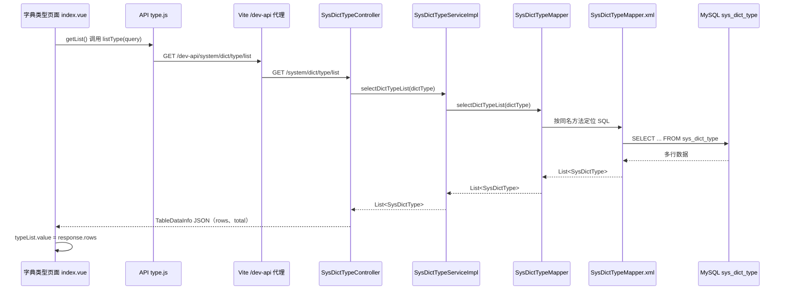

# Day 18：若依第一条完整数据流——字典类型列表

> **今天唯一目标：** 不修改任何若依代码，完整追踪一次“字典类型列表”从前端点击到数据库查询、再返回页面的真实路径。  
> 完成后，你将拥有以后定位绝大多数 CRUD 问题的固定路线：**页面 → API → Controller → Service → Mapper → XML → 数据库 → JSON → 页面。**

## 知识点速记（完成当天任务后复习）

### 1. 本次真实调用链



### 2. 每层只负责什么

| 层 | 本机文件 | 今日理解的职责 | 不是它负责的事 |
|---|---|---|---|
| 页面 | `frontend\src\views\system\dict\index.vue` | 用户操作、保存查询条件、调用 API、把 `response.rows` 放到表格数据。 | 不直接写 SQL。 |
| API 模块 | `frontend\src\api\system\dict\type.js` | 定义接口 URL、HTTP 方法和参数位置。 | 不写页面 HTML。 |
| Controller | `backend\ruoyi-admin\...\SysDictTypeController.java` | 接 HTTP 请求，分页，调用 Service，组织响应。 | 不直接写复杂 SQL。 |
| Service | `backend\ruoyi-system\...\SysDictTypeServiceImpl.java` | 业务层；本列表方法当前只转调 Mapper。 | 不处理浏览器页面。 |
| Mapper 接口 | `backend\ruoyi-system\...\SysDictTypeMapper.java` | 声明 Java 方法与返回类型。 | 不保存 SQL 字符串。 |
| Mapper XML | `backend\ruoyi-system\...\SysDictTypeMapper.xml` | 写 SQL、条件片段、结果字段映射。 | 不接收 HTTP URL。 |
| MySQL | 表 `sys_dict_type` | 保存字典类型数据，执行 SQL。 | 不知道 Vue 页面。 |

### 3. 这条链的四个“名字必须对上”

| 位置 | 必须对上的名称 | 本次实例 |
|---|---|---|
| 前端 URL 与 Controller 路径 | HTTP 路径 | `/system/dict/type/list`。 |
| Controller 与 Service | Java 方法调用 | `selectDictTypeList(dictType)`。 |
| Service 与 Mapper 接口 | Java 方法调用 | `selectDictTypeList(dictType)`。 |
| Mapper 接口与 XML SQL | 方法名/命名空间 | `selectDictTypeList` 对应 XML 的 `<select id="selectDictTypeList">`。 |

### 4. 只理解这些代码即可

前端 API：

```javascript
export function listType(query) {
  return request({
    url: '/system/dict/type/list',
    method: 'get',
    params: query
  })
}
```

- `url` 是代理前的业务路径；请求工具会再加开发环境 `/dev-api` 前缀。
- `method: 'get'` 表示查询。
- `params: query` 会成为 URL 查询参数，例如 `?pageNum=1&pageSize=10`。

后端 Controller：

```java
@RequestMapping("/system/dict/type")
@GetMapping("/list")
public TableDataInfo list(SysDictType dictType) {
    startPage();
    List<SysDictType> list = dictTypeService.selectDictTypeList(dictType);
    return getDataTable(list);
}
```

- 类路径与方法路径相加为 `/system/dict/type/list`。
- 请求参数可绑定到 `SysDictType dictType`；今天只理解“它携带查询条件”，不深入 Spring 绑定机制。
- `startPage()` 为本次查询准备分页；`getDataTable(list)` 把列表包装成前端需要的 `rows`、`total` 等响应结构。

XML 中：

```xml
<select id="selectDictTypeList" parameterType="SysDictType" resultMap="SysDictTypeResult">
  <include refid="selectDictTypeVo"/>
  <where>
    <if test="dictName != null and dictName != ''">
      AND dict_name like concat('%', #{dictName}, '%')
    </if>
  </where>
</select>
```

- `<select id>` 要与 Mapper 接口方法名对应。
- `<if>` 表示“有条件才拼接对应 SQL”；空查询时不会拼 `dict_name` 条件。
- `#{dictName}` 是 MyBatis 参数占位写法，**不是**字符串拼接；它有利于参数安全。
- `resultMap` 把数据库列映射为 `SysDictType` 对象字段。

### 5. Day 18 易混点与面试入门点

| 问题 | 正确答案 |
|---|---|
| 页面直接访问数据库吗？ | 不会；页面通过 HTTP 调 Controller，后端再访问数据库。 |
| XML 为什么没有被 Java 直接 `new`？ | MyBatis 根据 Mapper 接口与 XML 的约定，在运行时生成 Mapper 实现并执行 SQL。 |
| Service 只有一行是否多余？ | 当前很薄，但它提供稳定业务层边界；以后校验、事务、组合多个 Mapper 可放这里。 |
| `rows` 从哪里来？ | Controller 的 `getDataTable(list)` 包装 Service 返回的列表。 |
| URL 有 `/dev-api`，Controller 为什么没有？ | Vite 开发代理转发前移除了它。 |
| 先看哪个文件定位“列表没数据”？ | 先 Network 响应，再按页面→API→Controller→Service→Mapper→XML→数据库追。 |

## 今日资料、文件与边界

| 项目 | 内容 |
|---|---|
| 官方参考 | [若依项目介绍](https://doc.ruoyi.vip/ruoyi-vue/document/xmjs.html)、[若依快速了解](https://doc.ruoyi.vip/ruoyi-vue/document/kslj.html)。 |
| 必读前端文件 | `frontend\src\views\system\dict\index.vue`、`frontend\src\api\system\dict\type.js`。 |
| 必读后端文件 | `SysDictTypeController.java`、`SysDictTypeServiceImpl.java`、`SysDictTypeMapper.java`、`SysDictTypeMapper.xml`。 |
| 必读数据库对象 | `sys_dict_type` 表；今天只在 DBeaver 执行只读 `SELECT`。 |
| 今天禁止 | 修改源码、调用新增/删除接口、执行 INSERT/UPDATE/DELETE、改 XML、改分页、让 AI 生成 CRUD。 |

## 今天照做（09:00–23:00）

### 开始前检查（09:00–09:15）

1. 先完成 D17 的两项前提：后端在 8080 成功启动，前端 `http://localhost/` 可登录。
2. 新建自己的 `D18-notes.md`；使用下方“链路记录表”，每到一层只填真实看到的内容。
3. 打开 IDEA 的 backend、一个前端编辑器窗口、浏览器和 DBeaver；今天不需要同时编辑任何代码。

| 层 | 文件/位置 | 我看到的真实名称或值 | 我自己的解释 |
|---|---|---|---|
| 页面 | `index.vue` |  |  |
| API | `type.js` |  |  |
| Controller | `SysDictTypeController` |  |  |
| Service | `SysDictTypeServiceImpl` |  |  |
| Mapper | `SysDictTypeMapper` |  |  |
| XML | `SysDictTypeMapper.xml` |  |  |
| 数据库 | `sys_dict_type` |  |  |

### 09:15–10:30：先从页面和浏览器证明“请求真的发生了”

1. 前端登录后，进入 **系统管理 → 字典管理 → 字典类型**。
2. F12 → Network，勾选 Preserve log，清空旧请求。
3. 刷新当前字典类型页面；在过滤框输入 `type/list`。
4. 点开对应 GET 请求，按顺序记录：
   - Request URL（它会含 `/dev-api`）；
   - Request Method；
   - Query String Parameters 中的 `pageNum/pageSize`，以及你有填写时的查询条件；
   - Status Code；
   - Response 中 `code`、`rows`、`total`。
5. 在页面查询框输入一个已经存在的字典名称关键字，点击**搜索**；比较第二次请求的 Query String Parameters 与第一次有何不同。
6. 点击**重置**，再看请求条件是否恢复。只做查询，不新增、编辑、删除。

**验收：** 你能说“点击搜索后，页面没有直接查库，而是重新发出 GET 请求，查询条件在 URL 参数中”。

### 10:30–12:00：只读追页面 → API

1. 打开：`E:\WorkSpace\ruoyi-archive-management\frontend\src\views\system\dict\index.vue`。
2. 使用 **Ctrl + F** 搜索 `function getList()`；阅读其内 4 个关键动作：
   - `loading.value = true`；
   - `listType(...)`；
   - `typeList.value = response.rows`；
   - `total.value = response.total`。
3. 用自己的话写：`getList` 发请求，响应回来后把行数据和总数交给页面状态。
4. 按住 Ctrl 点击或手工打开导入路径：
   `frontend\src\api\system\dict\type.js`。
5. 找 `listType(query)`，记录 `url`、`method`、`params` 三项真实值。
6. 打开 `frontend\src\utils\request.js`，只找 `baseURL: import.meta.env.VITE_APP_BASE_API`；把它与 D17 的 `.env.development` 对上。

**不要深挖：** `ref`、`proxy`、Promise、axios 拦截器今天只需知道“它们让页面可以发请求并接收响应”。

### 15:00–16:20：只读追 API → Controller → Service

1. 在后端打开：
   `backend\ruoyi-admin\src\main\java\com\ruoyi\web\controller\system\SysDictTypeController.java`。
2. 找类上的 `@RequestMapping("/system/dict/type")` 和 `list` 方法上的 `@GetMapping("/list")`，把两者拼成完整后端路径。
3. 读 `list(SysDictType dictType)`，逐行只解释四句话：
   - `dictType`：查询条件对象；
   - `startPage()`：准备分页；
   - `dictTypeService.selectDictTypeList(dictType)`：交给业务层查；
   - `getDataTable(list)`：把结果变成表格响应。
4. 注意同一方法上还有 `@PreAuthorize(...)`；今天只写“权限检查在 Controller 方法执行前发生”，不研究表达式。
5. Ctrl+点击 `selectDictTypeList`（若跳到接口也正常），继续到：
   `backend\ruoyi-system\src\main\java\com\ruoyi\system\service\impl\SysDictTypeServiceImpl.java`。
6. 找实现方法，记录它当前只做：`return dictTypeMapper.selectDictTypeList(dictType);`。

### 16:20–18:00：只读追 Service → Mapper → XML → 表

1. Ctrl+点击 `dictTypeMapper.selectDictTypeList`，打开：
   `backend\ruoyi-system\src\main\java\com\ruoyi\system\mapper\SysDictTypeMapper.java`。
2. 记录方法签名的三个部分：返回 `List<SysDictType>`、方法名、参数 `SysDictType dictType`。
3. 打开：
   `backend\ruoyi-system\src\main\resources\mapper\system\SysDictTypeMapper.xml`。
4. Ctrl+F 搜索 `<select id="selectDictTypeList"`；确认 id 与接口方法同名。
5. 找 `<sql id="selectDictTypeVo">`，写下它从 `sys_dict_type` 查询的字段；不要求背字段。
6. 在 `<where>` 内观察至少两个 `<if>`：`dictName`、`status`。理解“页面没填就不加条件，填了才加 SQL 条件”。
7. 在 DBeaver 打开当前若依数据库，**只执行**：

```sql
SELECT dict_id, dict_name, dict_type, status, create_time
FROM sys_dict_type
ORDER BY dict_id
LIMIT 10;
```

8. 对比查询结果中的一行字段，和页面表格的一行内容是否是同一类数据。不要执行任何写操作。

### 19:00–20:30：第一次后端 Debug——从浏览器打到 Controller

1. 停止后端普通 Run（红色方块），在 `SysDictTypeController.list` 内这一行左侧打断点：

```java
List<SysDictType> list = dictTypeService.selectDictTypeList(dictType);
```

2. 右键 `RuoYiApplication` → **Debug**，等待启动成功。
3. 浏览器刷新“字典类型”页面，IDEA 应暂停在断点。
4. Variables 中展开 `dictType`，观察页面传来的 `dictName`、`dictType`、`status` 是否为空或为你搜索时输入的值。
5. 按 **F7** 进入 Service；确认进入 `SysDictTypeServiceImpl.selectDictTypeList`。
6. 在 Service 的 `return dictTypeMapper...` 行：**不要执着 F7 进入 XML**。Mapper 的实现由 MyBatis 在运行时生成，F7 可能进入框架代理；今天按 F8 执行并回到 Controller。
7. 在 Controller 的 `return getDataTable(list)` 行打断点，继续后观察 `list` 的大小及其中一条 `SysDictType` 的字段。
8. 按 F9 放行，回浏览器确认页面正常显示；移除两个断点。

### 20:30–22:00：用“搜索条件”验证动态 SQL 思维

1. 页面按字典名称搜索一个确定存在的关键字；Network 记录该参数。
2. 重新按上节 Debug，断点观察 `dictType.dictName` 不再为空。
3. 回 XML 找 `dictName` 对应 `<if>`，用箭头在笔记画：

```text
页面输入 dictName
→ GET 查询参数
→ SysDictType.dictName
→ XML <if test="dictName ...">
→ AND dict_name like ...
```

4. 点击重置，重复一次；确认 `dictName` 为空时 XML 条件不会参与。
5. 不要为了看 SQL 去修改日志级别。若启动日志已经显示 SQL/参数，可只读观察；否则以 XML、断点变量、DBeaver SELECT 三类证据为准。

### 22:00–23:00：复盘、故障分类与 AI 使用

不看本文完成下表：

| 假设现象 | 最先看哪里 | 之后追到哪里 |
|---|---|---|
| Network 根本没有 `type/list` |  |  |
| URL 是 404 |  |  |
| Controller 断点从不停 |  |  |
| Controller 的 `list` 为空 |  |  |
| `list` 有数据但页面空 |  |  |

AI 提问模板：

```text
我在追踪若依字典类型列表，未修改源码。
浏览器 Network：URL=…，状态码=…，Response 的 rows/total=…（已遮挡 token）。
后端断点：Controller 是否命中；dictType 的字段值=…；list 大小=…。
我已经比对：type.js URL、Controller 路径、Mapper 方法名、XML select id。
请只帮我判断链路断在哪一层，并给下一步只读验证，不要生成或修改业务代码。
```

## 今日量化验收

- [ ] 能不看资料写出 7 层链路及每层文件名。
- [ ] Network 中完成“首次列表、带条件搜索、重置后列表”3 次请求对比。
- [ ] 已在 `index.vue` 找到 `getList`，在 `type.js` 找到 `listType`。
- [ ] 已在 Controller/Service/Mapper/XML 找到同名 `selectDictTypeList` 链路。
- [ ] 已执行 1 条只读 DBeaver SQL，并与页面字段核对。
- [ ] 已完成 Controller → Service → 返回 Controller 的 Debug；能解释为何不强求 F7 进入 XML。
- [ ] 已写完链路记录表、动态 SQL 箭头和至少 1 张脱敏断点截图。

## 卡住时只按这个顺序检查

1. 先确认 D17 的前后端均在运行；不要改代码。
2. 浏览器 Network 是否有真实请求？记录 URL、状态码、响应。
3. 前端是否调用 `getList → listType`，URL 是否与 Controller 拼接路径一致？
4. Controller 断点是否命中？命中则看 `dictType` 和 `list`，不猜数据库。
5. Service/Mapper 方法名是否一致？Mapper XML 的 `<select id>` 是否同名？
6. 最后才在 DBeaver 执行只读 SELECT 验证表数据。
7. 有完整证据再向 AI 求助；不要让 AI 直接改 Controller 或 XML。

---

## 任务参考答案（完成后再查看）

| 假设现象 | 最先看哪里 | 合理下一步 |
|---|---|---|
| 没有 `type/list` 请求 | 页面操作与前端 Console/Network | 检查是否进入正确页面、`getList` 是否被触发。 |
| URL 404 | Network URL 与 Controller 路径 | 比对 `/dev-api` 代理后路径、类/方法 `RequestMapping`。 |
| Controller 断点不命中 | 后端是否以 Debug 运行、Network 状态 | 确认请求是否真正到 8080，再看路径/权限。 |
| Controller 的 `list` 为空 | `dictType` 条件、Service/Mapper/XML | 看搜索条件是否过严，再查 XML 动态条件和表数据。 |
| `list` 有数据但页面空 | Network Response、`index.vue` 的 `response.rows` | 检查响应是否有 rows，以及页面是否赋给 `typeList.value`。 |

**今日通过标准：** 你能对着一次 Network 请求，用文件名和方法名讲完“页面到 `sys_dict_type` 再回页面”；下次遇到任何列表接口异常，都能先按这条链定位，而不是盲目搜索整个项目。
