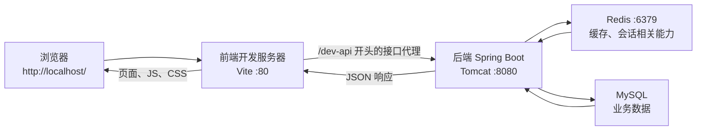

# Day 17：若依整体运行架构、启动与问题定位

> **今天唯一目标：** 不写业务功能，不修改源码；亲手启动前端、后端，画出一次浏览器访问从页面到数据库的完整路径，并知道每一层出问题时先查哪里。  
> **你可以直接做本日。** 不会的 Java、Vue、MyBatis 名词先按本文的一句话理解，不要求回头补完 Day01–D16 才能开始。

## 知识点速记（完成当天任务后用于复习）

### 1. 这是一个前后端分离项目



| 部分 | 本机位置/端口 | 今天只需理解 |
|---|---|---|
| 前端 | `E:\WorkSpace\ruoyi-archive-management\frontend`，开发端口 `80` | Vue 页面在浏览器显示；它通过 API 请求数据。 |
| 后端 | `...\backend`，端口 `8080` | Spring Boot 接收接口请求，执行业务，访问 Redis/MySQL，返回 JSON。 |
| MySQL | 后端 `application-druid.yml` 的数据源配置 | 长期保存用户、字典、档案等数据。今天不执行 SQL。 |
| Redis | 后端 `application.yml` 的 Redis 配置 | 内存中的缓存/辅助数据；今天只确认后端能连接。 |
| Vite 代理 | 前端 `vite.config.js` | 浏览器请求 `/dev-api/...`，开发服务器转发到后端，避免前端直接处理跨域。 |

**重要：** `http://localhost:8080` 能打开“请通过前端地址访问”只证明后端 Web 服务已启动；真正的管理页面应从前端 `http://localhost/` 打开。若依官方也明确说明前后端需要分别启动。[环境部署说明](https://doc.ruoyi.vip/ruoyi-vue/document/hjbs.html)

### 2. 本机已确认的真实配置

| 文件                                                             | 已确认内容                                    | 你今天要做什么                          |
| -------------------------------------------------------------- | ---------------------------------------- | -------------------------------- |
| `backend\ruoyi-admin\src\main\resources\application.yml`       | `server.port: 8080`；Redis 为本机地址、端口 6379。 | 只定位和阅读，绝不复制/提交敏感配置。              |
| `backend\ruoyi-admin\src\main\resources\application-druid.yml` | MySQL 数据源配置。                             | 只确认“后端需要数据源”；不在文档、截图或 Git 中记录密码。 |
| `frontend\.env.development`                                    | `VITE_APP_BASE_API = '/dev-api'`。        | 理解所有开发环境接口的公共前缀。                 |
| `frontend\vite.config.js`                                      | Vite 端口 `80`；`/dev-api` 代理到后端并去掉此前缀。     | 理解“浏览器路径”和“后端实际路径”不同。            |
| `frontend\package.json`                                        | `npm run dev` 对应 `vite`。                 | 用它启动前端，不改脚本。                     |

### 3. 今日必须能说出的端口与路径转换

```text
浏览器看到的请求：GET http://localhost/dev-api/system/dict/type/list
                           │
                           └─ Vite 代理删掉 /dev-api
后端实际收到的路径：GET http://localhost:8080/system/dict/type/list
```

- `/dev-api` 是**开发环境前端代理前缀**，不是后端 Controller 写的路径。
- 后端配置了 `context-path: /`，所以 Controller 路径直接从 `/system/...` 开始。
- 页面打不开时，不要立刻改端口；先分层验证“前端服务 → 后端服务 → 数据源”。

### 4. 固定定位顺序（以后每次问题都用）

| 现象                    | 第一检查位置                  | 证据                               | 常见结论             |
| --------------------- | ----------------------- | -------------------------------- | ---------------- |
| `localhost` 打不开       | 前端终端                    | 是否有 Vite 启动地址/报错。                | 前端未启动或端口被占用。     |
| 页面能开但登录/列表报接口错误       | 浏览器 F12 → Network       | 请求 URL、状态码、响应体。                  | 代理、后端、权限或业务接口问题。 |
| `localhost:8080` 不能打开 | IDEA 后端 Run/Debug 控制台   | 是否出现 `Started RuoYiApplication`。 | 后端未启动或启动失败。      |
| 后端启动时报数据库错误           | 后端控制台第一条 Caused by      | 数据源配置/数据库服务。                     | 不要猜，先读第一条根因。     |
| 后端报 Redis 连接错误        | 后端控制台第一条错误              | Redis 服务与端口。                     | Redis 未启动或配置不一致。 |
| 接口 200 但页面无数据         | Network Response + 前端代码 | `rows/total` 是否存在，控制台是否报错。       | 前端数据绑定或响应结构问题。   |

## 资料与源码地图

| 资源                                                           | 今天只看什么                                                                         |
| ------------------------------------------------------------ | ------------------------------------------------------------------------------ |
| [若依快速了解](https://doc.ruoyi.vip/ruoyi-vue/document/kslj.html) | 前后端分离、Spring Boot/Security/MyBatis/JWT/Vue 的技术组合。                              |
| [若依环境部署](https://doc.ruoyi.vip/ruoyi-vue/document/hjbs.html) | 后端启动成功标志、`npm run dev`、前端地址。                                                   |
| [Vite 代理文档](https://vite.dev/config/server-options)          | 只理解“匹配代理前缀的请求会转发到 target”，不学习全部配置。                                             |
| 本机后端入口                                                       | `backend\ruoyi-admin\src\main\java\com\ruoyi\RuoYiApplication.java`。           |
| 本机前端入口配置                                                     | `frontend\.env.development`、`frontend\vite.config.js`、`frontend\package.json`。 |

## 今天照做（09:00–23:00）

### 开始前：建立今天的学习记录（09:00–09:15）

1. 在自己的笔记或 `E:\WorkSpace\java-learning` 下新建 `D17-notes.md`；不要在若依项目里新建临时文件。
2. 抄写今日目标：**我能从端口、代理、日志判断问题属于前端、后端、Redis、MySQL 还是业务代码。**
3. 准备三张最终证据截图：后端启动成功、前端启动成功、浏览器 Network 的一次接口请求。
4. 今天禁止操作：升级依赖、修改 `application*.yml`、修改 `vite.config.js`、清空数据库、执行 AI 生成的配置命令。

### 09:15–10:10：只读认识后端如何启动

1. 在 IDEA 中打开 `E:\WorkSpace\ruoyi-archive-management\backend`。
2. 用左侧 Project 搜索 `RuoYiApplication`，打开：
   `ruoyi-admin/src/main/java/com/ruoyi/RuoYiApplication.java`。
3. 只读三处：
   - `@SpringBootApplication`：把这个类标记为 Spring Boot 启动入口；今天不深入注解原理。
   - `public static void main(...)`：Java 入口。
   - `SpringApplication.run(RuoYiApplication.class, args)`：启动 Spring Boot 应用。
4. 打开 `application.yml`，只找到 `server.port`、`spring.data.redis`；写下端口 8080、6379。**不要展示或抄写账号、密码、token secret。**
5. 打开 `application-druid.yml`，只确认它包含数据源配置；立刻关闭，不记录任何凭据。

**验收：** 能口头说明：`RuoYiApplication` 是后端启动入口；后端 HTTP 端口是 8080；MySQL 和 Redis 都是后端运行所依赖的外部服务。

### 10:10–11:10：启动并验证后端

1. 在 `RuoYiApplication.java` 类名左侧点击绿色三角，选择 **Run 'RuoYiApplication'**。今天先用 Run，不设置断点。
2. 等待 IDEA 下方 Run 控制台停止滚动；首次启动可能较慢。
3. 只以以下两类文字判断成功：
   - `Started RuoYiApplication in ... seconds`；
   - `若依启动成功` 图案文字。
4. 若启动失败：滚到控制台最下面，寻找最早出现的 `Caused by:` 或第一条明显异常；复制该段到 `D17-notes.md`，**不要自行修改配置**。
5. 浏览器新标签打开 `http://localhost:8080`：预期看到“请通过前端地址访问”一类提示，而不是登录页。
6. 截图保存为“D17-后端启动成功”。

### 11:10–12:00：只读认识前端如何启动与代理

1. 打开 `frontend\.env.development`，记录 `VITE_APP_BASE_API = '/dev-api'`。
2. 打开 `frontend\vite.config.js`，找到：
   - `server.port: 80`；
   - `proxy` 中的 `'/dev-api'`；
   - `target: baseUrl`；
   - `rewrite: ... replace(/^/dev-api/, '')`。
3. 用自己的话写出：浏览器发 `/dev-api/xxx`，Vite 代理给后端的 `/xxx`。
4. 打开 `frontend\package.json`，在 `scripts` 中确认 `dev` 是 `vite`；不编辑文件。

### 15:00–16:00：启动并验证前端

1. 在 Git Bash 或 IDEA Terminal 新开一个终端。**不要关闭正在运行后端的 IDEA 进程。**
2. 依次输入：

```bash
cd /e/WorkSpace/ruoyi-archive-management/frontend
npm run dev
```

3. 等终端显示本地访问地址；本机配置预期为 `http://localhost/`（端口 80）。
4. 浏览器若未自动打开，手工访问 `http://localhost/`。
5. 看到若依登录页即前端成功；使用你已知的本地测试账号登录。不要把密码写进笔记、截图、Git 或 AI 提问中。
6. 截图保存为“D17-前端启动成功”。

**如果 `npm run dev` 失败：** 只记录完整第一条报错；常见可查点是终端是否位于 `frontend`、Node 是否可用、依赖目录是否存在。今天不执行 `npm update`、不删除 `node_modules`。

### 16:00–18:00：用浏览器 Network 验证代理真实工作

1. 在已登录的前端页面按 **F12**，打开开发者工具；选择 **Network（网络）**。
2. 勾选 **Preserve log（保留日志）**；点击 Network 面板中的清空按钮。
3. 在页面左侧进入：**系统管理 → 字典管理 → 字典类型**。若菜单名称略有不同，搜索“字典类型”，不要改菜单。
4. 在 Network 的过滤框输入 `type/list`；点击该请求。
5. 依次查看并记录：
   - **Headers → Request URL**：浏览器是否请求了 `/dev-api/system/dict/type/list`；
   - **Request Method**：应为 `GET`；
   - **Status Code**：正常应为 `200`；
   - **Response/Preview**：是否有 `rows`、`total`、`code` 等 JSON 字段。
6. 截图保存为“D17-Network 字典接口”。注意遮挡 token、Cookie、个人信息；不要截图请求头中的敏感内容。

### 19:00–20:30：画架构图并做四次定位演练（不破坏环境）

1. 不看本文速记，手画“浏览器 → 前端 :80 → `/dev-api` 代理 → 后端 :8080 → Redis/MySQL”的图。
2. 用以下“现象 → 首查位置”填空，不需要制造故障：
   - `localhost` 无法打开 → ______。
   - 后端 Run 控制台出现数据库连接异常 → ______。
   - 页面列表请求状态为 401/403 → ______。
   - 请求 200 但表格空 → ______。
3. 回到本文第 4 节核对答案。
4. 在 `D17-notes.md` 记录：前端、后端、MySQL、Redis、代理各自一句职责。

### 20:30–23:00：复盘、Debug 入口与 AI 使用

1. 在 `RuoYiApplication.main` 的 `SpringApplication.run` 行打断点，按 **Shift + F9** 启动一次后端；观察程序先停在 Java 入口。不要尝试单步进入 Spring 内部；按 **F9** 继续，确认仍能启动成功，然后停止 Debug。
2. 不看资料回答：为什么 8080 没有登录页不代表后端失败？为什么浏览器 URL 有 `/dev-api` 而 Controller 未来没有？前后端哪一个先启动？
3. 正确的 AI 提问格式：

```text
我正在执行若依 D17，只做启动定位，没有修改配置。
现象：<完整第一条报错或 Network 状态码>。
我已确认：前端/后端是否启动、访问的 URL、端口、控制台最后 30 行（已遮挡密码和 token）。
请按“问题属于哪一层 → 如何验证 → 最小安全操作”给排查顺序；不要建议升级依赖、删除目录或修改密码。
```

## 今日量化验收

- [ ] 能指出后端启动入口、前端启动脚本和两个端口（80、8080）。
- [ ] 后端日志出现 `Started RuoYiApplication` 和“若依启动成功”。
- [ ] `http://localhost:8080` 显示后端提示；`http://localhost/` 显示并可登录前端。
- [ ] Network 中找到一次 `GET .../dev-api/system/dict/type/list`，状态为 200，并看到了响应结构。
- [ ] 能画出路径转换，且说明 `/dev-api` 会在 Vite 代理处被移除。
- [ ] 有 3 张脱敏截图和一份 D17 学习笔记。

## 卡住时只按这个顺序检查

1. 不要改任何文件；记录完整第一条报错。
2. 判断问题发生在启动前端、启动后端，还是浏览器请求时。
3. 对照端口：前端 80、后端 8080、Redis 6379；不要假设端口冲突。
4. 用浏览器 Network 看真实 URL 和状态码，不凭页面提示猜。
5. 用后端控制台最早的 `Caused by` 定位数据库/Redis/配置问题。
6. 证据不足时再按模板求助 AI。

---

## 任务参考答案（完成后再查看）

| 填空 | 答案 |
|---|---|
| `localhost` 无法打开 | 前端终端/Vite 是否成功启动。 |
| 数据库连接异常 | 后端控制台第一条根因和数据源服务状态；不直接改账号密码。 |
| 接口 401/403 | Network 的响应、登录状态/权限；D23 才深入 Security。 |
| 接口 200、表格空 | Response 是否有数据，再查前端接收与绑定；D18 实操。 |
| 8080 为什么不显示登录页 | 它是后端接口服务；登录页面由前端开发服务器提供。 |
| `/dev-api` 为什么会消失 | Vite 的 `rewrite` 在代理转发前去掉它，Controller 收到 `/system/...`。 |

**今日通过标准：** 你能不看资料从浏览器 URL 一直讲到后端、Redis/MySQL，再讲回 JSON 响应；不能做到则重复 D17，不进入 D18。
