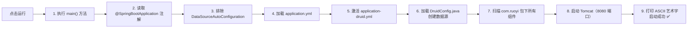
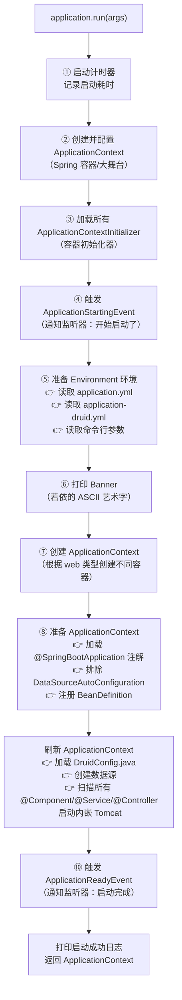

## `RuoYiApplication` 关联关系流程图

```mermaid
graph TD
    A["RuoYiApplication.java<br/>启动类（总开关）"]

    A -->|"@SpringBootApplication<br/>自动扫描 com.ruoyi 包下所有类"| B["所有 com.ruoyi 包下的类<br/>Controller / Service / Mapper 等"]

    A -->|"SpringApplication.run()<br/>启动时自动读取"| C["application.yml<br/>端口号、Redis、日志等配置"]

    C -->|"spring.profiles.active: druid<br/>激活 druid 配置"| D["application-druid.yml<br/>数据库地址、账号、密码"]

    A -->|"exclude 排除默认数据源<br/>改用自定义配置"| E["DruidConfig.java<br/>自定义 Druid 数据源配置"]

    D -->|"读取数据库连接信息"| E

    E -->|"创建主/从数据源<br/>组装动态数据源"| F["DynamicDataSource.java<br/>运行时动态切换数据库"]

    A -->|"同一个包下的兄弟类<br/>WAR 包部署时使用"| G["RuoYiServletInitializer.java<br/>传统容器部署入口"]

    G -->|"application.sources()<br/>引用启动类"| A

    E -->|"读取 Druid 连接池参数"| H["DruidProperties.java<br/>连接池具体参数配置"]

    F -->|"获取当前数据源类型"| I["DynamicDataSourceContextHolder.java<br/>线程级别的数据源切换上下文"]
```



---

## 启动时的执行顺序（时间线）



---

## 一句话概括关联关系

> `RuoYiApplication` 是**总开关**——它通过注解告诉 Spring Boot "扫描哪些类、排除哪些配置"，通过 `run()` 方法触发"读取配置文件 → 创建数据源 → 加载所有组件 → 启动 Web 服务器"这一整条流水线。其他所有文件都是这条流水线上的"工位"，各干各的活，但都由这个总开关统一启动。


---


## 第一步：你看到的这个 `run()` 只是个"前台接待"

```java
public static ConfigurableApplicationContext run(Class<?> primarySource, String... args) {
    return run(new Class<?>[]{primarySource}, args);  // ← 把参数包装成数组，转交给真正的 run()
    /*创建一个数组，数组里每个元素的类型是 Class<?>（任何类），数组里放了 1 个元素——就是 primarySource（即 RuoYiApplication.class）。*/
}
```

它做了两件事：
1. 把你传的 `RuoYiApplication.class` 包装成数组 `new Class<?>[]{primarySource}`
2. 调用另一个 `run(Class<?>[] primarySources, String[] args)` 方法

> 类比：就像酒店前台——你递给他一张名片（`RuoYiApplication.class`），他帮你复印一份（包装成数组），然后交给后台经理（真正的 `run()` 方法）去处理。

---

## 第二步：真正的 `run()` 方法内部做了什么？

真正的 `run()` 方法源码大致如下（简化版）：

```java
public static ConfigurableApplicationContext run(Class<?>[] primarySources, String[] args) {
    //  创建 SpringApplication 对象
    SpringApplication application = new SpringApplication(primarySources);

    // ② 执行启动
    return application.run(args);
}
```

**关键在 `application.run(args)` 这一行**，它内部按顺序执行了以下流水线：

---

## 第三步：`application.run()` 内部的完整流水线



---

## 第四步：关键步骤通俗解释

### ⑤ 准备 Environment —— 读取配置文件

```
application.yml          → 端口 8080、Redis 配置、日志级别...
application-druid.yml    → 数据库地址、账号、密码、连接池参数...
命令行参数（如果有）       → 可以覆盖上面的配置
```

> 类比：就像开业前翻阅"工作手册"——手册上写着"大门开在 8080 号"、"仓库密码是 xxx"。

### ⑧ 准备 ApplicationContext —— 处理注解

```
读取 @SpringBootApplication 注解
    ↓
发现 exclude = { DataSourceAutoConfiguration.class }
    ↓
从自动配置列表中移除 DataSourceAutoConfiguration
    ↓
加载 DruidConfig.java（自定义数据源配置）
```

> 类比：就像"智能管家"翻开自动安装清单，发现"数据源"那项被划掉了，就跳过它，改用自己买的高级水龙头（Druid）。

### ⑨ 刷新 ApplicationContext —— 最核心的一步

这一步做了最多的事情：

| 子步骤 | 做了什么 | 类比 |
|--------|---------|------|
| 加载 `DruidConfig` | 创建主数据源、从数据源、动态数据源 | 安装水管系统 |
| 扫描 `@Component` 等 | 找到所有 Controller、Service、Mapper | 把所有员工叫来登记 |
| 创建 Bean | 实例化所有被扫描到的类 | 给每个员工发工牌 |
| 启动内嵌 Tomcat | 在 8080 端口监听 HTTP 请求 | 打开酒店大门，开始接客 |

---

## 总结：一张图看懂全貌

```
你写的代码                          Spring Boot 内部
─────────────                      ──────────────────
RuoYiApplication.main()
    │
    ── SpringApplication.run(RuoYiApplication.class, args)
            │
            ├── ① 创建 SpringApplication 对象
            │       └── 记录：启动类是 RuoYiApplication
            │
            └── ② application.run(args)
                    │
                    ├── 读取 application.yml        ← 你的配置文件
                    ├── 读取 application-druid.yml  ← 你的配置文件
                    ├── 处理 @SpringBootApplication  ← 你的注解
                    │       └── exclude 数据源自动配置
                    ├── 加载 DruidConfig             ← 你的配置类
                    │       └── 创建动态数据源
                    ├── 扫描 com.ruoyi 包            ← 你的所有代码
                    │       └── 注册所有 Bean
                    └── 启动 Tomcat:8080             ← 开始对外服务
```

> 一句话总结：`run()` 方法就像一个**自动化流水线控制器**——你只需要告诉它"启动类是谁"，它就按照固定的顺序把"读配置 → 处理注解 → 创建数据源 → 扫描组件 → 启动服务器"这一整套流程全部自动执行完。你写的代码越少，它帮你做的就越多——这就是 Spring Boot "约定优于配置"的核心思想。