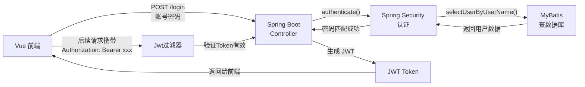

## 基于本项目解释五大技术

### 1. Spring Boot — 后端的"骨架"

**是什么：** Java Web 应用的快速开发框架，帮你自动配置好各种组件，让你不用写一堆 XML 就能跑起来。

**在本项目中：**
- 入口类 `RuoYiApplication.java`，一个 `@SpringBootApplication` 注解 + `main` 方法就启动了整个后端
- 内嵌了 Tomcat 服务器（端口 8080），不需要额外部署
- 通过 `pom.xml` 统一管理所有依赖版本（Spring Boot 4.1.0）
- 各个模块（`ruoyi-admin`、`ruoyi-framework`、`ruoyi-system` 等）通过 Maven 多模块组织，Spring Boot 负责把它们组装起来

> **一句话：** Spring Boot 是后端的大管家，负责启动服务器、加载配置、管理 Bean。

---

### 2. Spring Security — 后端的"门卫"

**是什么：** 安全框架，负责"你是谁"（认证）和"你能干什么"（授权）。

**在本项目中的完整流程：**

```
前端请求 → JwtAuthenticationTokenFilter → SecurityConfig 规则 → Controller
```

- **`SecurityConfig.java`**：配置了哪些 URL 可以匿名访问（`/login`、`/register`、`/captchaImage`），哪些需要认证
- **`JwtAuthenticationTokenFilter.java`**：每个请求进来时，从请求头提取 Token，解析出用户身份，放入安全上下文
- **`UserDetailsServiceImpl.java`**：实现 `UserDetailsService` 接口，根据用户名从数据库查用户，交给 Spring Security 做密码比对
- **`SysLoginService.java`**：调用 `authenticationManager.authenticate()` 完成认证，认证成功后生成 JWT Token

> **一句话：** Spring Security 是后端的门卫系统，拦截每个请求，验证 Token 和权限。

---

### 3. MyBatis — 后端的"翻译官"

**是什么：** ORM 框架，把 Java 对象和数据库 SQL 之间做映射，让你不用手写 JDBC 代码。

**在本项目中：**

- **Mapper 接口**（如 `SysUserMapper.java`）：定义方法签名，如 `selectUserList()`、`insertUser()`
- **XML 映射文件**（如 `SysUserMapper.xml`）：写具体的 SQL 语句，通过 `namespace` 绑定到 Mapper 接口
- **`MyBatisConfig.java`**：配置 `SqlSessionFactory`，告诉 MyBatis 去哪里扫描 Mapper 和 XML

```
Controller → Service → Mapper接口 → XML中的SQL → 数据库
```

例如前端请求"查询用户列表"时：
1. `SysUserController.selectUserList()` 被调用
2. 调用 `userService.selectUserList(user)`
3. 调用 `userMapper.selectUserList(user)`
4. MyBatis 找到 `SysUserMapper.xml` 中 `id="selectUserList"` 的 SQL 执行
5. 结果自动映射回 `SysUser` 对象

> **一句话：** MyBatis 把 Java 方法调用翻译成 SQL 执行，再把数据库结果翻译回 Java 对象。

---

### 4. JWT — 前后端的"通行证"

**是什么：** JSON Web Token，一种无状态的认证方案。登录后服务器签发一个加密字符串，前端每次请求都带上它。

**在本项目中的完整流程：**

```
登录 → 后端签发Token → 前端存储 → 每次请求携带 → 后端验证
```

1. **签发**（`TokenService.createToken()`）：
   - 用户登录成功后，生成一个 UUID
   - 用 `Jwts.builder()` 创建 JWT，包含用户标识和用户名，用密钥签名
   - 同时把用户信息存入 Redis（带过期时间）

2. **携带**（`request.js` 请求拦截器）：
   ```js
   config.headers['Authorization'] = 'Bearer ' + getToken()
   ```

3. **验证**（`JwtAuthenticationTokenFilter.doFilterInternal()`）：
   - 从请求头取出 Token
   - 用 `Jwts.parser()` 解析，取出 UUID
   - 从 Redis 中查出用户信息
   - 放入 Spring Security 上下文

> **一句话：** JWT 是一张加密的"临时身份证"，前端拿着它证明"我是谁"，后端每次请求都验证它。

---

### 5. Vue — 前端的"画布"

**是什么：** 前端 JavaScript 框架，用组件化的方式构建用户界面。

**在本项目中：**

- **版本：** Vue 3.5.26，使用 `<script setup>` 语法
- **UI 组件库：** Element Plus（`el-input`、`el-button`、`el-table` 等）
- **路由：** Vue Router（`router/index.js`）控制页面跳转
- **状态管理：** Pinia（`store/modules/user.js`）管理全局状态
- **HTTP 请求：** Axios（`utils/request.js`）与后端通信

以登录页面 `login.vue` 为例：
```
用户输入账号密码 → 点击登录按钮
  → userStore.login() 调用 API
    → request.js 发送 POST /login
      → 后端验证，返回 JWT Token
        → Token 存入 localStorage
          → 路由跳转到首页
```

> **一句话：** Vue 是前端的画布，用组件拼出页面，用数据驱动界面更新。

---

## 五者的协作关系



**总结一句话：** Vue 画界面，Spring Boot 跑服务，Spring Security 管安全，MyBatis 操作数据库，JWT 做前后端的身份凭证。