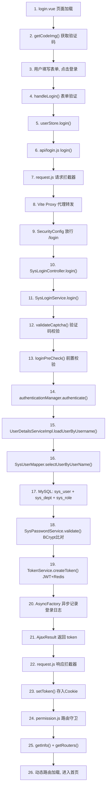

# 🔐 若依(RuoYi)完整登录流程 — 逐行数据流分析

## 📊 全局流程图



---

## 阶段一：前端页面加载与验证码获取

### 1.1 页面初始化 — `login.vue`

**📁 文件：** `frontend/src/views/login.vue`

```javascript
// 第81-87行：定义登录表单的响应式数据
const loginForm = ref({
  username: "admin",      // 默认用户名（开发方便）
  password: "admin123",   // 默认密码
  rememberMe: false,       // 不记住密码
  code: "",                // 验证码（用户手动输入）
  uuid: ""                 // 验证码的唯一标识（从后端获取）
})
```

**📁 文件：`frontend/src/views/login.vue` 第164-165行**
```javascript
// 页面加载时立即执行这两个函数
getCode()     // 获取验证码
getCookie()   // 读取Cookie中记住的账号密码
```

### 1.2 获取验证码 — `getCode()` → `getCodeImg()` → Axios → Vite Proxy → 后端

**📁 文件：`frontend/src/views/login.vue` 第143-151行**
```javascript
function getCode() {
  getCodeImg().then(res => {
    // captchaEnabled 控制是否显示验证码输入框
    captchaEnabled.value = res.captchaEnabled === undefined ? true : res.captchaEnabled
    if (captchaEnabled.value) {
      // 将后端返回的 base64 图片赋值给 img 的 src
      codeUrl.value = "data:image/gif;base64," + res.img
      // 保存 uuid，登录时需要原样传回后端
      loginForm.value.uuid = res.uuid
    }
  })
}
```

**📁 文件：`frontend/src/api/login.js` 第60-69行**
```javascript
// 获取验证码 API
export function getCodeImg() {
  return request({
    url: '/captchaImage',
    headers: {
      isToken: false   // ← 关键！验证码接口不需要 token（此时还没有 token）
    },
    method: 'get',
    timeout: 20000
  })
}
```

**📁 文件：`frontend/src/utils/request.js` 第16-21行**
```javascript
// Axios 实例创建
const service = axios.create({
  baseURL: import.meta.env.VITE_APP_BASE_API,  // = '/dev-api'（来自 .env.development）
  timeout: 10000
})
```

> **此时实际请求路径：** `GET /dev-api/captchaImage`

**📁 文件：`frontend/vite.config.js` 第48-54行**
```javascript
proxy: {
  '/dev-api': {
    target: baseUrl,           // = 'http://localhost:8080'
    changeOrigin: true,        // 修改请求头 Origin
    rewrite: (p) => p.replace(/^\/dev-api/, '')  // 去掉 /dev-api 前缀
  }
}
```

> **Vite Proxy 转发后：** `GET http://localhost:8080/captchaImage`

**📁 文件：`frontend/src/utils/request.js` 第24-33行（请求拦截器）**
```javascript
service.interceptors.request.use(config => {
  const isToken = (config.headers || {}).isToken === false  // → true（验证码请求设了 isToken: false）
  if (getToken() && !isToken) {  // isToken=true → !isToken=false → 不执行
    config.headers['Authorization'] = 'Bearer ' + getToken()
  }
  // 登录前没有 token，且 isToken=false 跳过了 token 注入
  return config
})
```

---

## 阶段二：用户提交登录表单

### 2.1 点击登录按钮 — `handleLogin()`

**📁 文件：`frontend/src/views/login.vue` 第107-141行**

以 `admin` / `admin123` / 验证码 `abcd` / uuid `xxx-yyy` 为例：

```javascript
function handleLogin() {
  // 第108行：Element Plus 表单校验（检查 username/password/code 是否为空）
  proxy.$refs.loginRef.validate(valid => {
    if (valid) {
      loading.value = true   // 按钮显示"登录中..."，禁用点击

      // 第112-121行：如果勾选了"记住密码"，存入 Cookie（30天有效）
      if (loginForm.value.rememberMe) {
        Cookies.set("username", loginForm.value.username, { expires: 30 })
        Cookies.set("password", encrypt(loginForm.value.password), { expires: 30 })  // JSEncrypt 加密
        Cookies.set("rememberMe", loginForm.value.rememberMe, { expires: 30 })
      } else {
        Cookies.remove("username")
        Cookies.remove("password")
        Cookies.remove("rememberMe")
      }

      // 第123行：★ 核心调用 ★ 调用 Pinia store 的 login action
      userStore.login(loginForm.value).then(() => {
        // 登录成功 → 跳转到目标页面（默认首页 "/"）
        router.push({ path: redirect.value || "/", query: otherQueryParams })
      }).catch(() => {
        loading.value = false   // 登录失败 → 恢复按钮
        if (captchaEnabled.value) {
          getCode()             // 重新获取验证码
        }
      })
    }
  })
}
```

### 2.2 Pinia Store — `userStore.login()`

**📁 文件：`frontend/src/store/modules/user.js` 第24-38行**

```javascript
login(userInfo) {
  const username = userInfo.username.trim()  // → "admin"
  const password = userInfo.password          // → "admin123"
  const code = userInfo.code                  // → "abcd"
  const uuid = userInfo.uuid                  // → "xxx-yyy"
  return new Promise((resolve, reject) => {
    // ★ 调用 api/login.js 的 login 函数 ★
    login(username, password, code, uuid).then(res => {
      // res = { code: 200, msg: "操作成功", token: "eyJhbGciOi..." }
      setToken(res.token)    // 将 token 存入 Cookie
      this.token = res.token // 更新 Pinia state
      useLockStore().unlockScreen()
      resolve()
    }).catch(error => {
      reject(error)
    })
  })
}
```

### 2.3 API 层 — `login()` 函数

**📁 文件：`frontend/src/api/login.js` 第4-20行**

```javascript
export function login(username, password, code, uuid) {
  const data = {
    username,   // "admin"
    password,   // "admin123"
    code,       // "abcd"
    uuid        // "xxx-yyy"
  }
  return request({
    url: '/login',          // 最终路径：/dev-api/login
    headers: {
      isToken: false,       // 登录接口不需要 token
      repeatSubmit: false   // 登录接口不做防重复提交
    },
    method: 'post',
    data: data              // POST body: {username:"admin",password:"admin123",code:"abcd",uuid:"xxx-yyy"}
  })
}
```

### 2.4 Axios 请求拦截器处理

**📁 文件：`frontend/src/utils/request.js` 第24-69行**

```javascript
service.interceptors.request.use(config => {
  const isToken = (config.headers || {}).isToken === false       // → true
  const isRepeatSubmit = (config.headers || {}).repeatSubmit === false  // → true

  if (getToken() && !isToken) {
    // getToken() 返回空（还没登录），且 isToken=true → 不执行
  }

  // isRepeatSubmit=true → !isRepeatSubmit=false → 跳过防重复提交检查
  // 直接返回 config
  return config
})
```

> **此时请求：** `POST /dev-api/login`，Body = `{"username":"admin","password":"admin123","code":"abcd","uuid":"xxx-yyy"}`

### 2.5 Vite Proxy 转发

**📁 文件：`frontend/vite.config.js` 第50-54行**

```
/dev-api/login  →  rewrite去掉前缀  →  http://localhost:8080/login
```

---

## 阶段三：后端接收请求（Spring Security 过滤链）

### 3.1 Spring Security 过滤链执行顺序

**📁 文件：`backend/ruoyi-framework/src/main/java/com/ruoyi/framework/config/SecurityConfig.java` 第86-117行**

```java
protected SecurityFilterChain filterChain(HttpSecurity httpSecurity) throws Exception {
    return httpSecurity
        .csrf(csrf -> csrf.disable())                                    // ① 禁用 CSRF
        .sessionManagement(session -> session
            .sessionCreationPolicy(SessionCreationPolicy.STATELESS))     // ② 无状态 Session
        .authorizeHttpRequests((requests) -> {
            requests.requestMatchers("/login", "/register", "/captchaImage").permitAll()  // ③ /login 允许匿名访问！
                  .anyRequest().authenticated()                          // ④ 其他请求需要认证
        })
        // 过滤器链顺序：
        .addFilterBefore(authenticationTokenFilter, UsernamePasswordAuthenticationFilter.class)  // ⑤ JWT 过滤器
        .addFilterBefore(corsFilter, JwtAuthenticationTokenFilter.class)                         // ⑥ CORS 过滤器（最先执行）
        .build()
}
```

**过滤链执行顺序：**
```
请求进入 → CorsFilter → JwtAuthenticationTokenFilter → UsernamePasswordAuthenticationFilter → Controller
```

### 3.2 JwtAuthenticationTokenFilter — 登录请求直接跳过

**📁 文件：`backend/ruoyi-framework/src/main/java/com/ruoyi/framework/security/filter/JwtAuthenticationTokenFilter.java` 第30-43行**

```java
@Override
protected void doFilterInternal(HttpServletRequest request, HttpServletResponse response, FilterChain chain)
        throws ServletException, IOException {
    // 尝试从请求头获取 token
    LoginUser loginUser = tokenService.getLoginUser(request);
    // loginUser == null（登录请求没有 token），条件不满足，跳过
    if (StringUtils.isNotNull(loginUser) && StringUtils.isNull(SecurityUtils.getAuthentication())) {
        tokenService.verifyToken(loginUser);
        UsernamePasswordAuthenticationToken authenticationToken = 
            new UsernamePasswordAuthenticationToken(loginUser, null, loginUser.getAuthorities());
        authenticationToken.setDetails(new WebAuthenticationDetailsSource().buildDetails(request));
        SecurityContextHolder.getContext().setAuthentication(authenticationToken);
    }
    // 继续执行后续过滤器
    chain.doFilter(request, response);
}
```

> **关键点：** `/login` 接口在 SecurityConfig 中被 `permitAll()` 放行，且此时请求头没有 `Authorization`，所以 `getLoginUser()` 返回 null，JWT 过滤器直接放行。

### 3.3 到达 Controller

**📁 文件：`backend/ruoyi-admin/src/main/java/com/ruoyi/web/controller/system/SysLoginController.java` 第56-65行**

```java
@PostMapping("/login")
public AjaxResult login(@RequestBody LoginBody loginBody) {
    // @RequestBody 将 JSON 自动反序列化为 LoginBody 对象
    // loginBody = { username: "admin", password: "admin123", code: "abcd", uuid: "xxx-yyy" }
    
    AjaxResult ajax = AjaxResult.success();  // 创建成功响应 { code: 200, msg: "操作成功" }
    
    // ★ 核心：调用登录服务 ★
    String token = loginService.login(
        loginBody.getUsername(),   // "admin"
        loginBody.getPassword(),   // "admin123"
        loginBody.getCode(),       // "abcd"
        loginBody.getUuid()        // "xxx-yyy"
    );
    
    ajax.put(Constants.TOKEN, token);  // 将 token 放入响应体 { code: 200, msg: "操作成功", token: "eyJ..." }
    return ajax;
}
```

**📁 文件：`backend/ruoyi-common/src/main/java/com/ruoyi/common/core/domain/model/LoginBody.java`**

```java
// 登录请求体 — 4个字段
public class LoginBody {
    private String username;  // 用户名
    private String password;  // 密码
    private String code;      // 验证码
    private String uuid;      // 验证码唯一标识
}
```

---

## 阶段四：登录核心业务逻辑

### 4.1 SysLoginService.login() — 登录总调度

**📁 文件：`backend/ruoyi-framework/src/main/java/com/ruoyi/framework/web/service/SysLoginService.java` 第63-100行**

```java
public String login(String username, String password, String code, String uuid) {
    // ========== 第1步：验证码校验 ==========
    validateCaptcha(username, code, uuid);
    
    // ========== 第2步：登录前置校验 ==========
    loginPreCheck(username, password);
    
    // ========== 第3步：Spring Security 认证 ==========
    Authentication authentication = null;
    try {
        // 创建用户名密码认证 Token（Spring Security 的类，不是 JWT）
        UsernamePasswordAuthenticationToken authenticationToken = 
            new UsernamePasswordAuthenticationToken(username, password);
        
        // 将认证 Token 放入线程上下文（供后续 SysPasswordService 取出用户名密码）
        AuthenticationContextHolder.setContext(authenticationToken);
        
        // ★ 核心认证方法 ★ 会触发 UserDetailsServiceImpl.loadUserByUsername()
        authentication = authenticationManager.authenticate(authenticationToken);
    } catch (Exception e) {
        if (e instanceof BadCredentialsException) {
            // 密码错误 → 异步记录失败日志 → 抛异常
            AsyncManager.me().execute(AsyncFactory.recordLogininfor(username, Constants.LOGIN_FAIL, ...));
            throw new UserPasswordNotMatchException();
        }
    } finally {
        AuthenticationContextHolder.clearContext();  // 清理线程上下文
    }
    
    // ========== 第4步：认证成功后续处理 ==========
    // 异步记录登录成功日志
    AsyncManager.me().execute(AsyncFactory.recordLogininfor(username, Constants.LOGIN_SUCCESS, ...));
    
    LoginUser loginUser = (LoginUser) authentication.getPrincipal();  // 获取认证后的用户信息
    
    // 更新用户的登录IP和登录时间到数据库
    recordLoginInfo(loginUser.getUserId());
    
    // ========== 第5步：生成 JWT Token ==========
    return tokenService.createToken(loginUser);
}
```

### 4.2 验证码校验 — `validateCaptcha()`

**📁 文件：`SysLoginService.java` 第110-129行**

```java
public void validateCaptcha(String username, String code, String uuid) {
    // 检查验证码功能是否开启（从 sys_config 表读取配置）
    boolean captchaEnabled = configService.selectCaptchaEnabled();
    if (captchaEnabled) {
        // 拼接 Redis Key: "captcha_codes:" + uuid
        String verifyKey = CacheConstants.CAPTCHA_CODE_KEY + StringUtils.nvl(uuid, "");
        // 从 Redis 获取之前存储的验证码
        // 获取验证码时，后端生成随机验证码 → 图片转 base64 返回前端 → 同时以 uuid 为 key 存入 Redis
        String captcha = redisCache.getCacheObject(verifyKey);
        
        if (captcha == null) {
            throw new CaptchaExpireException();  // 验证码过期
        }
        // 验证码用一次即删除（防止重放攻击）
        redisCache.deleteObject(verifyKey);
        
        // 忽略大小写比对
        if (!code.equalsIgnoreCase(captcha)) {
            throw new CaptchaException();  // 验证码错误
        }
    }
}
```

> **数据流：** 用户输入 `abcd` → 拼接 key = `captcha_codes:xxx-yyy` → Redis GET → 得到 `abcd` → 比对成功 → Redis DELETE 该 key

### 4.3 前置校验 — `loginPreCheck()`

**📁 文件：`SysLoginService.java` 第136-165行**

```java
public void loginPreCheck(String username, String password) {
    // ① 用户名/密码是否为空
    if (StringUtils.isEmpty(username) || StringUtils.isEmpty(password)) {
        throw new UserNotExistsException();
    }
    // ② 密码长度是否在 5~20 范围内
    if (password.length() < 5 || password.length() > 20) {
        throw new UserPasswordNotMatchException();
    }
    // ③ 用户名长度是否在 2~20 范围内
    if (username.length() < 2 || username.length() > 20) {
        throw new UserPasswordNotMatchException();
    }
    // ④ IP 黑名单校验
    String blackStr = configService.selectConfigByKey("sys.login.blackIPList");
    if (IpUtils.isMatchedIp(blackStr, IpUtils.getIpAddr())) {
        throw new BlackListException();
    }
}
```

> **以 admin/admin123 为例：** username="admin"(长度5 ✓), password="admin123"(长度8 ✓), IP不在黑名单 ✓ → 全部通过

### 4.4 Spring Security 认证 — `authenticationManager.authenticate()`

这一步是 Spring Security 的核心，调用链如下：

```
authenticationManager.authenticate(authenticationToken)
    ↓
DaoAuthenticationProvider.authenticate()
    ↓
UserDetailsServiceImpl.loadUserByUsername("admin")   ← 从数据库查用户
    ↓
SysPasswordService.validate(user)                     ← BCrypt 密码比对
```

### 4.5 从数据库查询用户 — `UserDetailsServiceImpl`

**📁 文件：`backend/ruoyi-framework/src/main/java/com/ruoyi/framework/web/service/UserDetailsServiceImpl.java` 第37-65行**

```java
@Override
public UserDetails loadUserByUsername(String username) throws UsernameNotFoundException {
    // ★ 调用 MyBatis 查询数据库 ★
    SysUser user = userService.selectUserByUserName(username);
    
    // 用户不存在
    if (StringUtils.isNull(user)) {
        throw new ServiceException("用户不存在");
    }
    // 用户已删除（逻辑删除 del_flag='2'）
    else if (UserStatus.DELETED.getCode().equals(user.getDelFlag())) {
        throw new ServiceException("用户已删除");
    }
    // 用户已停用（status='1'）
    else if (UserStatus.DISABLE.getCode().equals(user.getStatus())) {
        throw new ServiceException("用户已停用");
    }

    // ★ 密码校验 ★
    passwordService.validate(user);

    // 创建 LoginUser 对象（包含用户信息 + 权限列表）
    return createLoginUser(user);
}

public UserDetails createLoginUser(SysUser user) {
    return new LoginUser(
        user.getUserId(),           // 用户ID → 1
        user.getDeptId(),           // 部门ID → 100
        user,                       // SysUser 完整对象
        permissionService.getMenuPermission(user)  // 权限集合 → ["*:*:*"]（管理员拥有所有权限）
    );
}
```

### 4.6 MyBatis 查询 — `SysUserMapper.selectUserByUserName()`

**📁 文件：`backend/ruoyi-system/src/main/java/com/ruoyi/system/mapper/SysUserMapper.java` 第45行**

```java
public SysUser selectUserByUserName(String userName);
```

**📁 文件：`backend/ruoyi-system/src/main/resources/mapper/system/SysUserMapper.xml` 第124-127行**

```xml
<select id="selectUserByUserName" parameterType="String" resultMap="SysUserResult">
    <include refid="selectUserVo"/>
    where u.user_name = #{userName} and u.del_flag = '0'
</select>
```

**📁 文件：`SysUserMapper.xml` 第50-58行（`selectUserVo` SQL 片段）**

```sql
SELECT 
    u.user_id, u.dept_id, u.user_name, u.nick_name, u.email, u.avatar, 
    u.phonenumber, u.password, u.sex, u.status, u.del_flag, u.login_ip, 
    u.login_date, u.pwd_update_date, u.create_by, u.create_time, ...
    d.dept_id, d.parent_id, d.ancestors, d.dept_name, d.order_num, d.leader, ...
    r.role_id, r.role_name, r.role_key, r.role_sort, r.data_scope, ...
FROM sys_user u
    LEFT JOIN sys_dept d ON u.dept_id = d.dept_id
    LEFT JOIN sys_user_role ur ON u.user_id = ur.user_id
    LEFT JOIN sys_role r ON r.role_id = ur.role_id
WHERE u.user_name = 'admin' AND u.del_flag = '0'
```

> **数据库查询结果（admin 用户）：**
> 
> | 字段 | 值 |
> |------|------|
> | user_id | 1 |
> | dept_id | 100 |
> | user_name | admin |
> | nick_name | 若依 |
> | password | $2a$10$7JB720yubVS...（BCrypt 加密值）|
> | status | 0（正常）|
> | del_flag | 0（未删除）|
> | dept_name | 若依科技 |
> | role_key | admin |

**MyBatis 结果映射（第7-28行）：**

```xml
<resultMap type="SysUser" id="SysUserResult">
    <id     property="userId"    column="user_id"    />
    <result property="userName"  column="user_name"  />
    <result property="password"  column="password"   />
    ...
    <!-- 关联查询部门信息 -->
    <association property="dept"  javaType="SysDept"  resultMap="deptResult" />
    <!-- 关联查询角色列表（一对多） -->
    <collection property="roles"  javaType="java.util.List" resultMap="RoleResult" />
</resultMap>
```

> **返回的 Java 对象：** `SysUser { userId=1, userName="admin", password="$2a$10$...", dept=SysDept{...}, roles=[SysRole{roleId=1, roleKey="admin"}] }`

### 4.7 密码校验 — `SysPasswordService.validate()`

**📁 文件：`backend/ruoyi-framework/src/main/java/com/ruoyi/framework/web/service/SysPasswordService.java` 第44-72行**

```java
public void validate(SysUser user) {
    // 从线程上下文获取之前设置的用户名和密码
    Authentication usernamePasswordAuthenticationToken = AuthenticationContextHolder.getContext();
    String username = usernamePasswordAuthenticationToken.getName();          // → "admin"
    String password = usernamePasswordAuthenticationToken.getCredentials().toString();  // → "admin123"

    // 从 Redis 获取密码错误重试次数
    Integer retryCount = redisCache.getCacheObject(getCacheKey(username));
    // key = "pwd_err_cnt:admin"
    // 首次登录 → retryCount = null → 设为 0

    if (retryCount == null) {
        retryCount = 0;
    }

    // 检查是否超过最大重试次数（默认5次）
    if (retryCount >= 5) {
        throw new UserPasswordRetryLimitExceedException(5, 10);  // 锁定10分钟
    }

    // ★ BCrypt 密码比对 ★
    if (!matches(user, password)) {
        // 密码错误 → 重试次数 +1，存入 Redis，10分钟过期
        retryCount = retryCount + 1;
        redisCache.setCacheObject(getCacheKey(username), retryCount, 10, TimeUnit.MINUTES);
        throw new UserPasswordNotMatchException();
    } else {
        // 密码正确 → 清除错误计数缓存
        clearLoginRecordCache(username);
    }
}

public boolean matches(SysUser user, String rawPassword) {
    // 调用 SecurityUtils.matchesPassword
    return SecurityUtils.matchesPassword(rawPassword, user.getPassword());
}
```

**📁 文件：`backend/ruoyi-common/src/main/java/com/ruoyi/common/utils/SecurityUtils.java` 第111-115行**

```java
public static boolean matchesPassword(String rawPassword, String encodedPassword) {
    BCryptPasswordEncoder passwordEncoder = new BCryptPasswordEncoder();
    // rawPassword = "admin123"（明文）
    // encodedPassword = "$2a$10$7JB720yubVS..."（数据库中的 BCrypt 哈希值）
    // BCrypt 会从 encodedPassword 中提取 salt，对 rawPassword 做哈希，然后比较
    return passwordEncoder.matches(rawPassword, encodedPassword);
    // → true（密码正确）
}
```

> **BCrypt 验证原理：** 数据库存的密码格式为 `$2a$10$[salt][hash]`，BCrypt 从中提取 salt，对用户输入的明文密码做同样的哈希运算，然后比较结果是否一致。

---

## 阶段五：Token 生成与登录日志

### 5.1 创建 JWT Token — `TokenService.createToken()`

**📁 文件：`backend/ruoyi-framework/src/main/java/com/ruoyi/framework/web/service/TokenService.java` 第115-126行**

```java
public String createToken(LoginUser loginUser) {
    // ① 生成 UUID 作为用户标识（不是 JWT 本身，而是 Redis key 的一部分）
    String token = IdUtils.fastUUID();           // → "a1b2c3d4-e5f6-7890-abcd-ef1234567890"
    loginUser.setToken(token);
    
    // ② 记录用户代理信息（IP、浏览器、操作系统、登录地点）
    setUserAgent(loginUser);
    // loginUser.ipaddr = "127.0.0.1"
    // loginUser.loginLocation = "内网IP"
    // loginUser.browser = "Chrome 12"
    // loginUser.os = "Windows 10"
    
    // ③ 将 LoginUser 对象缓存到 Redis（key = "login_tokens:" + uuid，有效期30分钟）
    refreshToken(loginUser);
    
    // ④ 构建 JWT 的 claims（数据声明）
    Map<String, Object> claims = new HashMap<>();
    claims.put(Constants.LOGIN_USER_KEY, token);  // "login_user_key" → "a1b2c3d4-..."
    claims.put(Constants.JWT_USERNAME, loginUser.getUsername());  // "username" → "admin"
    
    // ⑤ 用 JWT 签名生成最终的 token 字符串
    return createToken(claims);
}
```

**📁 文件：`TokenService.java` 第149-156行（`refreshToken` — Redis 缓存）**

```java
public void refreshToken(LoginUser loginUser) {
    loginUser.setLoginTime(System.currentTimeMillis());     // 当前时间戳
    loginUser.setExpireTime(loginUser.getLoginTime() + expireTime * MILLIS_MINUTE);
    // expireTime = 30（application.yml 配置）
    // MILLIS_MINUTE = 60 * 1000 = 60000
    // 过期时间 = 当前时间 + 30 * 60000 = 30分钟后

    String userKey = getTokenKey(loginUser.getToken());
    // userKey = "login_tokens:a1b2c3d4-e5f6-7890-abcd-ef1234567890"

    // 存入 Redis，设置 30 分钟过期
    redisCache.setCacheObject(userKey, loginUser, expireTime, TimeUnit.MINUTES);
}
```

**📁 文件：`TokenService.java` 第179-185行（JWT 签名）**

```java
private String createToken(Map<String, Object> claims) {
    String token = Jwts.builder()
            .setClaims(claims)                                    // 设置数据：{login_user_key: "uuid", username: "admin"}
            .signWith(SignatureAlgorithm.HS512, secret).compact(); // 用 HS512 算法 + 密钥签名
    return token;
    // secret = "abcdefghijklmnopqrstuvwxyz"（application.yml 配置）
    // 最终生成类似：eyJhbGciOiJIUzUxMiJ9.eyJsb2dpbl91c2VyX2tleSI6ImExYjJjM2Q0...signature
}
```

### 5.2 异步记录登录日志 — `AsyncFactory.recordLogininfor()`

**📁 文件：`backend/ruoyi-framework/src/main/java/com/ruoyi/framework/manager/factory/AsyncFactory.java` 第37-81行**

```java
public static TimerTask recordLogininfor(final String username, final String status, final String message, ...) {
    final String userAgent = ServletUtils.getRequest().getHeader("User-Agent");
    final String ip = IpUtils.getIpAddr();   // → "127.0.0.1"
    
    return new TimerTask() {
        @Override
        public void run() {  // 异步执行，不阻塞主线程
            String address = AddressUtils.getRealAddressByIP(ip);  // → "内网IP"
            
            // 封装登录日志对象
            SysLogininfor logininfor = new SysLogininfor();
            logininfor.setUserName(username);        // "admin"
            logininfor.setIpaddr(ip);                // "127.0.0.1"
            logininfor.setLoginLocation(address);    // "内网IP"
            logininfor.setBrowser(browser);          // "Chrome 12"
            logininfor.setOs(os);                    // "Windows 10"
            logininfor.setMsg(message);              // "用户登录成功"
            logininfor.setStatus(Constants.SUCCESS); // "0"（成功）
            
            // ★ 插入数据库 ★
            SpringUtils.getBean(ISysLogininforService.class).insertLogininfor(logininfor);
        }
    };
}
```

> **对应 SQL（`SysLogininforMapper.xml`）：**
> ```sql
> INSERT INTO sys_logininfor (user_name, status, ipaddr, login_location, browser, os, msg, login_time)
> VALUES ('admin', '0', '127.0.0.1', '内网IP', 'Chrome 12', 'Windows 10', '用户登录成功', NOW())
> ```

### 5.3 更新登录信息 — `recordLoginInfo()`

**📁 文件：`SysLoginService.java` 第172-175行**

```java
public void recordLoginInfo(Long userId) {
    userService.updateLoginInfo(userId, IpUtils.getIpAddr(), DateUtils.getNowDate());
}
```

**📁 文件：`SysUserMapper.xml` 第208-210行**

```sql
UPDATE sys_user SET login_ip = '127.0.0.1', login_date = '2026-09-03 19:30:00' WHERE user_id = 1
```

### 5.4 返回 Token

**📁 文件：`SysLoginController.java` 第59-64行**

```java
AjaxResult ajax = AjaxResult.success();     // { code: 200, msg: "操作成功" }
ajax.put(Constants.TOKEN, token);           // { code: 200, msg: "操作成功", token: "eyJhbGciOiJIUzUxMiJ9..." }
return ajax;
```

---

## 阶段六：前端接收 Token 并进入系统

### 6.1 Axios 响应拦截器

**📁 文件：`frontend/src/utils/request.js` 第76-109行**

```javascript
service.interceptors.response.use(res => {
    const code = res.data.code || 200   // → 200
    const msg = errorCode[code] || res.data.msg || errorCode['default']  // → "操作成功"

    // code === 200 → 走 else 分支
    return Promise.resolve(res.data)
    // 返回：{ code: 200, msg: "操作成功", token: "eyJhbGciOiJIUzUxMiJ9..." }
})
```

### 6.2 Token 存储到 Cookie

**📁 文件：`frontend/src/store/modules/user.js` 第30-34行**

```javascript
login(username, password, code, uuid).then(res => {
    // res = { code: 200, msg: "操作成功", token: "eyJhbGciOi..." }
    setToken(res.token)    // → 存入 Cookie
    this.token = res.token // → 更新 Pinia state
})
```

**📁 文件：`frontend/src/utils/auth.js` 第9-11行**

```javascript
export function setToken(token) {
    return Cookies.set('Admin-Token', token)
    // Cookie: Admin-Token=eyJhbGciOiJIUzUxMiJ9...
    // 注意：没有设置 expires，这是会话级 Cookie，浏览器关闭即失效
}
```

### 6.3 路由跳转

**📁 文件：`frontend/src/views/login.vue` 第123-131行**

```javascript
userStore.login(loginForm.value).then(() => {
    // 登录成功！
    const query = route.query
    const otherQueryParams = Object.keys(query).reduce((acc, cur) => {
        if (cur !== "redirect") { acc[cur] = query[cur] }
        return acc
    }, {})
    // 跳转到首页（或 redirect 指定的页面）
    router.push({ path: redirect.value || "/", query: otherQueryParams })
})
```

### 6.4 路由守卫 — 加载用户信息和动态路由

**📁 文件：`frontend/src/permission.js` 第21-61行**

```javascript
router.beforeEach(async (to, from) => {
    NProgress.start()
    if (getToken()) {  // Cookie 中已有 Admin-Token → true
        if (to.path === '/login') {
            return { path: '/' }  // 已登录访问登录页 → 重定向到首页
        }
        
        // ★ 关键判断：roles 为空说明是刚登录，还没拉取用户信息 ★
        if (useUserStore().roles.length === 0) {
            // ① 获取用户信息（角色、权限）
            await useUserStore().getInfo()
            // → GET /dev-api/getInfo → 后端返回 { user, roles, permissions }

            // ② 根据角色生成动态路由
            const accessRoutes = await usePermissionStore().generateRoutes()
            // → GET /dev-api/getRouters → 后端返回菜单树
            
            // ③ 动态注册路由
            accessRoutes.forEach(route => {
                router.addRoute(route)
            })
            
            // ④ 重新导航到目标路由（此时动态路由已注册）
            return { ...to, replace: true }
        }
        return true
    } else {
        // 没有 token → 重定向到登录页
        return `/login?redirect=${to.fullPath}`
    }
})
```

### 6.5 获取用户信息 — `getInfo()`

**📁 文件：`frontend/src/store/modules/user.js` 第41-77行**

```javascript
getInfo() {
    return new Promise((resolve, reject) => {
        getInfo().then(res => {
            // res = {
            //   user: { userId:1, userName:"admin", nickName:"若依", ... },
            //   roles: ["admin"],
            //   permissions: ["*:*:*"],
            //   pwdChrtype: "0",
            //   isDefaultModifyPwd: false,
            //   isPasswordExpired: false
            // }
            const user = res.user
            this.roles = res.roles             // → ["admin"]
            this.permissions = res.permissions  // → ["*:*:*"]
            this.id = user.userId              // → 1
            this.name = user.userName          // → "admin"
            this.nickName = user.nickName      // → "若依"
            resolve(res)
        })
    })
}
```

**后端对应接口：**

**📁 文件：`SysLoginController.java` 第72-94行**

```java
@GetMapping("getInfo")
public AjaxResult getInfo() {
    // 从 SecurityContext 获取已认证的 LoginUser（由 JwtAuthenticationTokenFilter 设置）
    LoginUser loginUser = SecurityUtils.getLoginUser();
    SysUser user = loginUser.getUser();
    
    // 获取角色集合 → ["admin"]
    Set<String> roles = permissionService.getRolePermission(user);
    // 获取权限集合 → ["*:*:*"]（管理员拥有所有权限）
    Set<String> permissions = permissionService.getMenuPermission(user);
    
    AjaxResult ajax = AjaxResult.success();
    ajax.put("user", user);
    ajax.put("roles", roles);
    ajax.put("permissions", permissions);
    return ajax;
}
```

### 6.6 获取路由菜单 — `generateRoutes()`

**📁 文件：`frontend/src/store/modules/permission.js` 第35-54行**

```javascript
generateRoutes(roles) {
    return new Promise(resolve => {
        // 向后端请求路由数据
        getRouters().then(res => {
            // res.data = [
            //   { name:"System", path:"/system", component:"Layout", children:[
            //     { name:"User", path:"user", component:"system/user/index", meta:{title:"用户管理"} },
            //     ...
            //   ]},
            //   ...
            // ]
            
            // 将后端路由字符串转换为 Vue 组件对象
            const sidebarRoutes = filterAsyncRouter(sdata)
            const rewriteRoutes = filterAsyncRouter(rdata, false, true)
            
            this.setRoutes(rewriteRoutes)
            this.setSidebarRouters(constantRoutes.concat(sidebarRoutes))
            resolve(rewriteRoutes)
        })
    })
}
```

**`filterAsyncRouter` 核心转换逻辑（第59-84行）：**

```javascript
function filterAsyncRouter(asyncRouterMap, lastRouter = false, type = false) {
    return asyncRouterMap.filter(route => {
        if (route.component) {
            if (route.component === 'Layout') {
                route.component = Layout         // 字符串 "Layout" → 导入的 Layout 组件
            } else if (route.component === 'ParentView') {
                route.component = ParentView
            } else {
                route.component = loadView(route.component)
                // "system/user/index" → () => import('@/views/system/user/index.vue')
            }
        }
        // 递归处理子路由
        if (route.children && route.children.length) {
            route.children = filterAsyncRouter(route.children, route, type)
        }
        return true
    })
}
```

**后端对应接口：**

**📁 文件：`SysLoginController.java` 第101-107行**

```java
@GetMapping("getRouters")
public AjaxResult getRouters() {
    Long userId = SecurityUtils.getUserId();  // → 1（admin）
    // 查询菜单树（admin 查全部菜单）
    List<SysMenu> menus = menuService.selectMenuTreeByUserId(userId);
    // 将 SysMenu 列表转换为前端路由格式（RouterVo）
    return AjaxResult.success(menuService.buildMenus(menus));
}
```

---

## 📋 完整数据流总结表

| 步骤 | 位置 | 文件 | 函数 | 数据变化 |
|------|------|------|------|----------|
| 1 | 前端页面 | `login.vue` | `getCode()` | 获取验证码图片和 uuid |
| 2 | 前端 API | `api/login.js` | `getCodeImg()` | `GET /captchaImage` |
| 3 | 前端 HTTP | `utils/request.js` | 请求拦截器 | baseURL 拼接 `/dev-api` |
| 4 | 前端代理 | `vite.config.js` | proxy | `/dev-api/captchaImage` → `localhost:8080/captchaImage` |
| 5 | 前端页面 | `login.vue` | `handleLogin()` | 表单校验，组装 loginForm |
| 6 | 前端 Store | `store/modules/user.js` | `login()` | 解构出 username/password/code/uuid |
| 7 | 前端 API | `api/login.js` | `login()` | `POST /login`，body = `{username, password, code, uuid}` |
| 8 | 前端 HTTP | `utils/request.js` | 请求拦截器 | isToken=false，不添加 Authorization |
| 9 | 前端代理 | `vite.config.js` | proxy | `/dev-api/login` → `localhost:8080/login` |
| 10 | 后端过滤 | `SecurityConfig.java` | `filterChain()` | `/login` 被 `permitAll()` 放行 |
| 11 | 后端过滤 | `JwtAuthenticationTokenFilter.java` | `doFilterInternal()` | 无 token → loginUser=null → 跳过 |
| 12 | 后端控制器 | `SysLoginController.java` | `login()` | 接收 `LoginBody`，调用 `loginService.login()` |
| 13 | 后端服务 | `SysLoginService.java` | `validateCaptcha()` | Redis GET `captcha_codes:uuid` → 比对验证码 |
| 14 | 后端服务 | `SysLoginService.java` | `loginPreCheck()` | 校验用户名/密码长度、IP 黑名单 |
| 15 | 后端框架 | Spring Security | `authenticate()` | 触发 `UserDetailsServiceImpl` |
| 16 | 后端服务 | `UserDetailsServiceImpl.java` | `loadUserByUsername()` | 调用 MyBatis 查数据库 |
| 17 | 后端数据 | `SysUserMapper.xml` | `selectUserByUserName` | SQL: 4表 JOIN 查询用户+部门+角色 |
| 18 | MySQL | `sys_user` 等表 | — | 返回 admin 用户数据 |
| 19 | 后端服务 | `SysPasswordService.java` | `validate()` | Redis 检查重试次数 → BCrypt 比对密码 |
| 20 | 后端工具 | `SecurityUtils.java` | `matchesPassword()` | `BCrypt.matches("admin123", "$2a$10$...")` → true |
| 21 | 后端服务 | `TokenService.java` | `createToken()` | 生成 UUID → Redis 缓存 LoginUser → JWT 签名 |
| 22 | Redis | — | `setCacheObject()` | key=`login_tokens:uuid`, value=LoginUser, TTL=30min |
| 23 | 后端异步 | `AsyncFactory.java` | `recordLogininfor()` | 异步插入登录日志到 `sys_logininfor` 表 |
| 24 | 后端服务 | `SysLoginService.java` | `recordLoginInfo()` | UPDATE `sys_user` SET login_ip, login_date |
| 25 | 后端控制器 | `SysLoginController.java` | `login()` | 返回 `{code:200, token:"eyJhbG..."}` |
| 26 | 前端 HTTP | `utils/request.js` | 响应拦截器 | code=200 → `Promise.resolve(res.data)` |
| 27 | 前端 Store | `store/modules/user.js` | `login()` | `setToken(token)` → Cookie 存储 |
| 28 | 前端工具 | `utils/auth.js` | `setToken()` | `Cookies.set('Admin-Token', token)` |
| 29 | 前端路由 | `permission.js` | `beforeEach()` | 检测到 token 存在，roles 为空 |
| 30 | 前端 Store | `store/modules/user.js` | `getInfo()` | `GET /getInfo` → 获取 roles/permissions |
| 31 | 前端 Store | `store/modules/permission.js` | `generateRoutes()` | `GET /getRouters` → 动态注册路由 |
| 32 | 前端页面 | `login.vue` | `router.push()` | 跳转到首页 `/`，登录完成 ✅ |

---

## 🔑 关键数据库表交互汇总

| 表名 | 操作 | 时机 |
|------|------|------|
| `sys_user` | SELECT（查用户） | `loadUserByUsername` |
| `sys_dept` | SELECT（关联查部门） | 与 sys_user JOIN |
| `sys_user_role` | SELECT（关联查角色） | 与 sys_user JOIN |
| `sys_role` | SELECT（关联查角色信息） | 与 sys_user_role JOIN |
| `sys_logininfor` | INSERT（登录日志） | 异步记录 |
| `sys_user` | UPDATE（登录IP和时间） | `recordLoginInfo` |
| `sys_config` | SELECT（验证码开关等配置） | `validateCaptcha`/`loginPreCheck` |

## 🔴 Redis 交互汇总

| Key 模式 | 操作 | 时机 |
|----------|------|------|
| `captcha_codes:{uuid}` | SET → GET → DELETE | 验证码存取校验（一次性） |
| `pwd_err_cnt:{username}` | GET → SET | 密码错误计数（失败+1，成功清除） |
| `login_tokens:{uuid}` | SET | 登录成功后缓存 LoginUser（30分钟） |