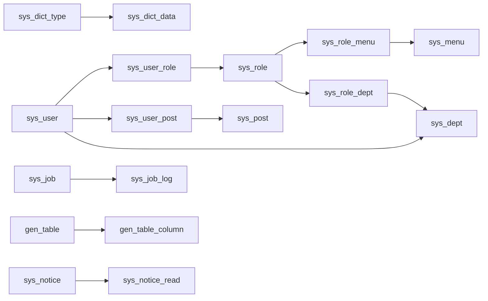

## 📊 项目数据库表总览

本项目基于 **若依（RuoYi）框架**，共有 **20 张数据库表**，可以分为 **5 大类**：

---

### 一、🏢 组织架构类（4 张表 + 3 张关联表）

> 想象一个公司，需要有部门、员工、岗位、角色这些概念，这一类表就是管理这些的。

| 表名 | 说明 | 核心字段 |
|------|------|---------|
| `sys_dept` | **部门表** — 公司的组织架构树 | 部门名、父部门ID、负责人、状态 |
| `sys_user` | **用户信息表** — 系统里的每个人 | 账号、昵称、密码、部门、手机、状态 |
| `sys_post` | **岗位信息表** — 如"董事长""项目经理" | 岗位编码、岗位名称、排序、状态 |
| `sys_role` | **角色信息表** — 如"超级管理员""普通角色" | 角色名、权限字符串、数据范围、状态 |

**关联表**（用来建立多对多关系，就像"桥梁"）：

| 表名 | 说明 | 关系 |
|------|------|------|
| `sys_user_role` | 用户 ↔ 角色 | 一个用户可以有多个角色 |
| `sys_user_post` | 用户 ↔ 岗位 | 一个用户可以担任多个岗位 |
| `sys_role_dept` | 角色 ↔ 部门 | 一个角色可以管理多个部门（数据权限） |

---

### 二、🔐 权限与菜单类（1 张表 + 1 张关联表）

> 控制"谁能看到什么页面、能点什么按钮"。

| 表名 | 说明 | 核心字段 |
|------|------|---------|
| `sys_menu` | **菜单权限表** — 侧边栏菜单 + 按钮 | 菜单名、路由地址、组件路径、权限标识、菜单类型（M目录/C菜单/F按钮） |
| `sys_role_menu` | 角色 ↔ 菜单 | 一个角色可以拥有多个菜单/按钮权限 |

---

### 三、📝 字典与配置类（3 张表）

> **字典**就像一个"翻译对照表"，比如数据库里存的是 `0`，页面上显示"男"。

| 表名 | 说明 | 核心字段 |
|------|------|---------|
| `sys_dict_type` | **字典类型表** — 定义有哪些字典 | 字典名称、字典类型（如 `sys_user_sex`） |
| `sys_dict_data` | **字典数据表** — 每个字典的具体选项 | 字典标签、字典键值、所属字典类型 |
| `sys_config` | **参数配置表** — 系统全局参数 | 如初始密码、验证码开关、皮肤样式等 |

---

### 四、📋 日志与通知类（4 张表）

> 记录"谁在什么时候做了什么"，以及系统公告。

| 表名 | 说明 | 核心字段 |
|------|------|---------|
| `sys_oper_log` | **操作日志** — 记录增删改查等操作 | 模块标题、操作人、请求URL、参数、状态、耗时 |
| `sys_logininfor` | **登录日志** — 记录每次登录 | 用户账号、IP、浏览器、操作系统、状态 |
| `sys_notice` | **通知公告表** — 系统内的通知/公告 | 公告标题、类型（通知/公告）、内容、状态 |
| `sys_notice_read` | **公告已读记录** — 谁看了哪条公告 | 公告ID、用户ID、阅读时间 |

---

### 五、⏰ 定时任务类（2 张表）

> 让系统自动定期执行某些任务，比如每10秒执行一次。

| 表名 | 说明 | 核心字段 |
|------|------|---------|
| `sys_job` | **定时任务调度表** | 任务名、调用目标、cron表达式、并发、状态 |
| `sys_job_log` | **定时任务日志表** | 任务名、执行结果、异常信息、开始/结束时间 |

---

### 六、🔧 代码生成类（2 张表）

> 若依的"代码生成器"功能用的表，可以根据数据库表自动生成 CRUD 代码。

| 表名 | 说明 | 核心字段 |
|------|------|---------|
| `gen_table` | **代码生成业务表** — 记录哪些表需要生成代码 | 表名、实体类名、模板类型、包路径 |
| `gen_table_column` | **代码生成字段表** — 每个表的字段配置 | 列名、Java类型、是否查询/列表/编辑字段 |

---

### 🔗 表关系图

---

### 💡 几个关键设计模式（初学者须知）

1. **逻辑删除**：很多表有 `del_flag` 字段（`0`=存在，`2`=删除），删除数据时不是真删，而是标记为已删除，防止数据丢失。

2. **审计字段**：几乎所有业务表都有 `create_by`、`create_time`、`update_by`、`update_time` 四个字段，记录"谁在什么时候创建/修改的"。

3. **状态字段**：大量使用 `status` 字段，通常 `0`=正常，`1`=停用，用字典来翻译显示文字。

4. **多对多关系**：通过中间关联表实现，比如用户和角色之间通过 `sys_user_role` 表连接。

这些表构成了整个后台管理系统的基础骨架，后续的业务功能（如档案管理）就是在这个基础上扩展新的业务表。