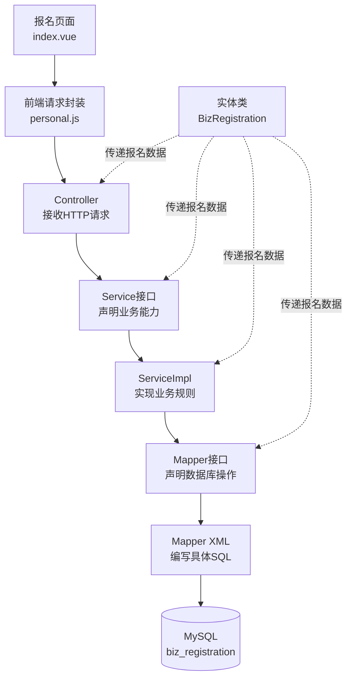
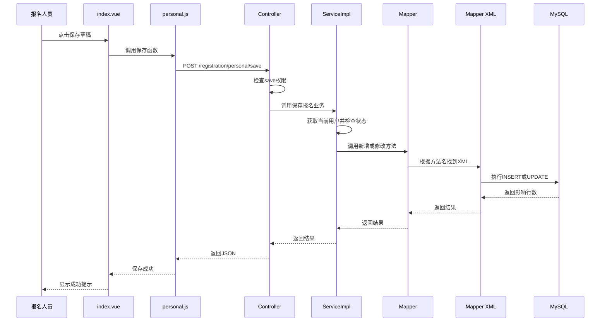

代码生成器生成的文件不是8个互相独立的功能，而是同一个“报名功能”在不同层的组成部分。

最核心的调用链是：

````

````

## 一、8类代码文件

按照当前配置，主要包含下面8类。

### 1. 实体类：BizRegistration.java

大致位置：

```
backend/.../com/ruoyi/system/domain/BizRegistration.java
```

作用是把数据库的一行报名记录表示成一个 Java对象。

数据库字段：

```
registration_id
registration_year
real_name
phone_number
```

对应Java属性：

```
private Long registrationId;
private Integer registrationYear;
private String realName;
private String phoneNumber;
```

可以把实体类理解成一张“报名数据表格”在 Java中的表现形式。

它不负责：

- 接收网页请求；
- 判断能不能提交；
- 执行SQL。

它主要负责在不同层之间携带数据。

---

### 2. Mapper接口：BizRegistrationMapper.java

大致位置：

```
backend/.../com/ruoyi/system/mapper/BizRegistrationMapper.java
```

它声明系统需要哪些数据库操作，例如：

```
public BizRegistration selectBizRegistrationByRegistrationId(Long registrationId);

public List<BizRegistration> selectBizRegistrationList(
    BizRegistration bizRegistration
);

public int insertBizRegistration(BizRegistration bizRegistration);

public int updateBizRegistration(BizRegistration bizRegistration);

public int deleteBizRegistrationByRegistrationId(Long registrationId);
```

这里通常只有方法定义，没有具体SQL。

可以理解为：

> Mapper接口向Java代码说明“数据库能做哪些事情”。

---

### 3. Mapper XML：BizRegistrationMapper.xml

大致位置：

```
backend/.../resources/mapper/registration/BizRegistrationMapper.xml
```

这里编写真正执行的SQL：

```
<select id="selectBizRegistrationByRegistrationId"
        resultMap="BizRegistrationResult">
    select registration_id,
           registration_year,
           user_id,
           real_name
    from biz_registration
    where registration_id = #{registrationId}
</select>
```

Mapper接口和Mapper XML通过两个位置关联。

接口完整名称：

```
com.ruoyi.system.mapper.BizRegistrationMapper
```

XML：

```
<mapper namespace="com.ruoyi.system.mapper.BizRegistrationMapper">
```

接口方法：

```
selectBizRegistrationByRegistrationId
```

XML语句ID：

```
<select id="selectBizRegistrationByRegistrationId">
```

两边必须对应：

```
Mapper接口完整类名 = XML namespace
Mapper接口方法名   = XML id
```

---

### 4. Service接口：IBizRegistrationService.java

大致位置：

```
backend/.../com/ruoyi/system/service/IBizRegistrationService.java
```

它声明业务层能够提供哪些功能：

```
public BizRegistration selectBizRegistrationByRegistrationId(Long registrationId);

public int insertBizRegistration(BizRegistration bizRegistration);

public int updateBizRegistration(BizRegistration bizRegistration);
```

Service接口和Mapper接口看起来可能很像，但含义不同：

```
Mapper  → 数据库能进行什么操作
Service → 系统提供什么业务功能
```

生成器刚生成时，两层通常很相似。后续加入提交、撤回等业务规则后，区别会逐渐明显。

---

### 5. Service实现类：BizRegistrationServiceImpl.java

大致位置：

```
backend/.../com/ruoyi/system/service/impl/BizRegistrationServiceImpl.java
```

它真正实现Service接口：

```
@Service
public class BizRegistrationServiceImpl
        implements IBizRegistrationService
{
    @Autowired
    private BizRegistrationMapper bizRegistrationMapper;

    @Override
    public int insertBizRegistration(BizRegistration registration)
    {
        return bizRegistrationMapper.insertBizRegistration(registration);
    }
}
```

它与Service接口通过：

```
implements IBizRegistrationService
```

建立关系。

它与Mapper通过：

```
@Autowired
private BizRegistrationMapper bizRegistrationMapper;
```

建立关系。

以后下面这些规则主要写在Service实现类：

- 当前用户一年只能报名一次；
- 当前登录人员只能操作自己的报名；
- 草稿可以修改；
- 待审核不能修改；
- 只有待审核可以撤回；
- 提交时检查姓名、手机号和职位；
- 提交后修改报名状态。

---

### 6. Controller：BizRegistrationController.java

大致位置：

```
backend/.../com/ruoyi/system/controller/BizRegistrationController.java
```

Controller是前端进入后端的入口。

标准生成代码可能类似：

```
@RestController
@RequestMapping("/registration/personal")
public class BizRegistrationController
{
    @Autowired
    private IBizRegistrationService bizRegistrationService;

    @GetMapping("/list")
    public TableDataInfo list(BizRegistration registration)
    {
        return getDataTable(
            bizRegistrationService.selectBizRegistrationList(registration)
        );
    }
}
```

它与Service通过注入建立联系：

```
@Autowired
private IBizRegistrationService bizRegistrationService;
```

Controller主要负责：

- 接收前端请求；
- 读取请求参数；
- 检查权限；
- 调用Service；
- 把结果返回给前端。

业务判断不应该全部堆在Controller里。

---

### 7. 前端API：personal.js

位置比较确定：

```
frontend/src/api/registration/personal.js
```

它负责封装浏览器向后端发送的请求：

```
export function listPersonal(query) {
  return request({
    url: '/registration/personal/list',
    method: 'get',
    params: query
  })
}
```

前端页面不直接到处编写请求地址，而是调用：

```
listPersonal(query)
```

关系是：

```
personal.js中的URL
        ↓
Controller中的@RequestMapping和@GetMapping
```

例如：

```
url: '/registration/personal/list'
```

对应：

```
@RequestMapping("/registration/personal")
@GetMapping("/list")
```

组合后就是同一个地址。

---

### 8. 前端页面：index.vue

按照当前生成配置，位置是：

```
frontend/src/views/registration/personal/index.vue
```

它负责用户能看到和操作的界面：

- 姓名输入框；
- 手机号输入框；
- 报考职位下拉框；
- 保存草稿按钮；
- 提交报名按钮；
- 撤回报名按钮；
- 报名状态显示。

页面通过导入前端API与后端通信：

```
import {
  listPersonal,
  getPersonal,
  addPersonal,
  updatePersonal
} from '@/api/registration/personal'
```

所以：

```
index.vue
   ↓ import
personal.js
   ↓ HTTP
Controller
```

## 二、还有一份菜单SQL

严格来说，ZIP里通常还会包含菜单SQL：

```
personalMenu.sql
```

所以可以理解成：

```
8类业务代码文件
+ 1份菜单SQL
```

这份菜单SQL不属于运行时调用链，它只是用于向：

```
sys_menu
```

添加菜单和权限。

你的菜单已经手工创建，所以不要再执行代码生成器生成的菜单SQL。

## 三、一次“保存草稿”如何经过所有层？

完整流程如下：

````

````

## 四、它们与若依其他功能的关联

### 1. 与用户登录的关联

报名记录中的：

```
user_id
```

关联：

```
sys_user.user_id
```

后端通过：

```
SecurityUtils.getUserId()
```

取得当前登录用户，而不是相信前端传来的 `userId`。

---

### 2. 与菜单的关联

数据库：

```
sys_menu.component = registration/personal/index
```

前端加载：

```
frontend/src/views/registration/personal/index.vue
```

两者路径必须一致。

你当前菜单还是：

```
registration/index
```

生成代码后需要将菜单组件路径调整成：

```
registration/personal/index
```

---

### 3. 与权限的关联

后端Controller：

```
@PreAuthorize(
    "@ss.hasPermi('registration:personal:save')"
)
```

前端按钮：

```
v-hasPermi="['registration:personal:save']"
```

数据库：

```
sys_menu.perms = registration:personal:save
```

三处权限字符串必须完全一致：

```
数据库权限
= 前端按钮权限
= 后端接口权限
```

---

### 4. 与字典的关联

报名状态：

```
registration_status
```

报考职位：

```
registration_position
```

前端通过若依字典功能查询 `sys_dict_data`，把：

```
0
```

显示为：

```
草稿
```

把职位值：

```
0
```

显示为：

```
一级主任科员
```

---

### 5. 与日志的关联

Controller方法以后可以使用：

```
@Log(
    title = "保存报名草稿",
    businessType = BusinessType.UPDATE
)
```

操作信息会进入若依操作日志，通常保存到：

```
sys_oper_log
```

第一遍可以先保留生成器的日志注解，不需要深入修改。

## 五、记住最关键的一条线

你暂时不需要一次记住所有文件，只要记住：

```
Vue页面
→ 前端API
→ Controller
→ Service
→ Mapper
→ Mapper XML
→ 数据库
```

实体类 `BizRegistration` 像一个装报名数据的盒子，会在后端各层之间传递。

第一遍建议先观察代码生成器生成的标准查询如何沿着这条链路运行，再改造保存草稿、提交和撤回，不要同时修改8类文件。